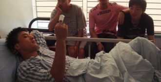
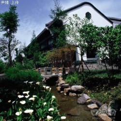

# 拳王

可能很多朋友不知道，我的朋友王睿一不仅仅是一个证券从业者和历史学家，他还是一个破落的拳王。三年前，我在成都新动力拳馆学习泰拳，那时的王睿一比现在重至少20公斤，被称作洗面桥杜海涛。他一直想减肥，可又想从事一些除了跑步之外的有氧运动。于是我就让他和我一起去了泰拳馆，要知道训练课光是热身运动就能把他瘦成洗面桥何炅。我信心满满地把这个拳馆史上个子最高的学员推荐给了我的教练，教练让王睿一原地捡了个东西，摇摇头跟我说，他屁股太大了，不适合泰拳。

王睿一听见这句话就来气，他告诉教练，他这辈子因为屁股而受到的不公正待遇太多：去健身房骑动感单车，教练怕他把单车坐垫给坐坏；去夜店喝酒，服务员强迫我们多花钱选择沙发卡座，因为怕他压坏散台的高脚凳；甚至去酒店开房，前台都要求他比普通人多交300块的押金。

他说他对这些歧视一直是淡然处之，因为他知道自己会增加人家的固定资产折旧率，但是为什么连拳馆都要拒绝他？

“在这里我就算练坏了屁股，那也是我自己的固定资产，这个用不着你们担心。”他豪气干云地说道，“教练，我想打泰拳。”

王睿一的诚贯金石打动了教练，他终于得以进入了我们的拳馆，和我一起冬练三伏，在成都湿冷透骨的严冬，我们在拳馆里挥汗如雨，丝毫感觉不到一丝凉意。一开始的时候，他的大屁股成为了他练习扫踢和顶膝的累赘，令他的出腿频率明显低于其他拳友。但是大屁股同时也给他带来了无与伦比的爆发力，他就像郭靖的降龙十八掌一样拳拳到肉，每一次击中沙袋都能把拳馆震得像是经历了地震，这种一力降十会的方法很好地弥补了他在速度上的欠缺。

苦练之余，我和王睿一喜欢进行一些理论层面的研习，以谋求共同进步。我练习泰拳以来一直存在一个难以改正的问题，就是实战训练中，当对方出拳击打我头部时，我总是会本能地闭眼，虽然也就是那么零点几秒，但是这足以影响我对拳路的判断以及之后的反击。我因此向王睿一讨教解决方案，我知道他是一个奇谋迭出的男人，这点从他日后走矮子步锻炼臀部、自制王水炸马桶就能看出来。王睿一沉思良久，给我想出了一个怪招：他说他小时候在少体校练习羽毛球时，因为眼神不好，总是跟不上对方的扣杀，觉得羽毛球向自己飞来，比天马流星拳还吓人。教练当时教他一个偏方，说平时在家时可以同时看书和看电视，并且每隔两秒钟就切换一次。也就是说，看两秒钟书就立即看电视，看两秒钟电视又把视线切换回书上，这样做的目的是让眼球的焦距不停变换，以适应球场上羽毛球的远近之变。这样做虽然痛苦，而且会留下公共场合不停转动眼球的后遗症，就像一个弱智，但效果卓然，一个月之后王睿一就能对羽毛球扣杀应付自如了，那些山呼海啸的羽毛球，此时在他的眼球成像中就像是一只飞翔的蜗牛。王睿一说如果林丹也学会了这种方法，打李宗伟就和打李宗盛没什么区别了。所以他建议我把这套羽球场上的奇门怪招运用到拳台上去，平时没事就不停看远--看近--看远--看近，无论身在何时何方，都可以勤练不辍。

我半信半疑地采纳了他的建议，开始了漫长而枯燥的眼球训练，每天在拳馆里做拉伸运动时，大家都在漫不经心地聊天，而我却把目光对准了拳友们的屁股，从最远一个开始，十秒钟内看完所有屁股，然后再由近及远，周而复始。在大街上我也依葫芦画瓢，不管是美女翘臀，还是悍妇豪腚，我都一视同仁地尽收眼底，百炼成钢。一个月后我正式出师，达成了两项技能：1. 我再也不会在对方出拳时闭眼了，对于我来说，一切移动的物体都是低速的屁股而已，根本对我构不成威胁。2. 如果我们拳馆举办摸屁股猜老公的比赛，我一定不费吹灰之力就夺冠，他们的屁股现在对来说我比毛主席还带亲。

当然，我们的拳馆不可能举办摸屁股猜老公比赛，我们只会举办泰拳比赛，所以我还是更加感激王睿一让我成为了一个不避艰险，迎着拳头怒目直视的男人。虽然我也留下了一看见屁股就聚精会神的后遗症，但是总的来说还是得大于失。

同时我也投桃报李，积极为王睿一出谋划策。王睿一最大的困扰也是在防守方面，当对手使出扫踢时，教科书的做法是屈腿并抬高，用膝盖进行格挡，由于泰拳的扫踢是用胫骨迎面骨进行杀伤，而胫骨和膝盖发生撞击的后果可想而知，所以这是经典而实用的格挡方式。但王睿一由于屁股太大，抬腿的速度太慢，往往膝盖还没抬起来就被踢个半死。所以我根据他的实际情况因材施教，教他要扬长避短，你的速度慢，那就不和对方拼腿，把你全身最坚韧的部位留给他。从那以后，每次遇见对手扫踢，王睿一就慵懒地略略转身，把自己的屁股迎向对方的攻击方向。由于扭动腰肢的线速度远比踢腿快，所以他每次都能做到后发先至，对方的腿才踢了一半，他的屁股已经漫不经心地等在了那里，脸上一副“你快踢，哥赶时间”的表情。

扫踢在散打中被称作鞭腿，顾名思义，就是把腿像鞭子一样抽打在沙袋或者对手身上。而王睿一的屁股却敢于直面惨淡的人生，每次实战训练时，拳馆外不明真相的群众都以为里面是梅超风在和人打架。其实那不是鞭子，只是拳友们的扫踢击中王睿一屁股的声音，那声音就像巅峰丁武在香港红馆演唱《飞翔鸟》，在高亢的极致将空气撕裂。一堂训练课下来，王睿一的屁股被踢得黑里透红，就像刚接受了一场性侵。教练心疼地抚摸着他的屁股，说你为什么选择了这样一条与众不同的路，王睿一问他听过美国诗人佛罗斯特的名作《路》没有，教练说他只听过韩红的名作《天路》，王睿一也不嫌弃教练没共同语言，他当场给教练吟了一遍：

黄色的树林里分出两条路 可惜我不能同时去涉足 我在那路口久久伫立 我向着一条路极目望去 直到它消失在丛林深处

但我却选择了另外一条路 它荒草萋萋，十分幽寂 显得更诱人，更美丽 虽然在这两条小路上 都很少留下旅人的足迹 虽然那天清晨落叶满地 两条路都未经脚印污染 呵，留下一条路等改日再见

但我知道路径延绵无尽头 恐怕我难以再回返 也许多少年后在某一个地方 我将轻声叹息把往事回顾 一片森林里分出两条路 而我却选择了人迹更少的一条 从此决定了我一生的道路

王睿一吟毕，揉揉自己通红的屁股，对着似乎还陶醉在诗歌意境中的教练说，我习惯选择另一种道路，这就是我的人生。

冬去春来，王睿一从一个高胖憨练成了高瘦秀。五一节时，我们拳馆承办了首届新加坡国际武术锦标赛的泰拳比赛，我和王睿一都没有报名，因为拳馆的推荐参赛者都是练习了四五年的高手。我们本来只打算去现场观战，但是比赛前一天，拳馆80公斤级的一名参赛师兄在训练时扭伤了踝关节，脚肿得像萝卜，难以坚持比赛，他想打封闭参赛，不然我们拳馆就失去了一个重量级的挑战机会，教练还在犹豫，这时王睿一竟然站了出来，他说他来替补。

教练说，从来没有只练过半年的学员就参加这种正式比赛的，这可不是表演赛或者拳馆之间的交流比赛。王睿一说，四川大学篮球校队历史上从来没有非体育专业的大一新生入选过，教练说这和你有什么关系？

王睿一说我入选了。表情轻松得就像在夜店坐坏一个高脚凳。

“我的本科专业是历史，我比谁都清楚，所有的历史都是人创造的。”他告诉教练。

就这样，教练半推半就地把他替补了上去。比赛是在成都龙泉驿区的体育馆进行，现场除了各个拳馆的学员以及选手亲友以外，并没有来多少观众，人们稀稀落落地分散在看台上，宁静盖过了喧嚣，这让现场的气氛变得更加肃杀。

王睿一在第五场比赛出战，他的对手是一个四川西昌来的彝族人，身高比王睿一矮半个头，但是极其强壮，我师兄指着他的背影跟我讲，瞧那背阔肌，就像一个海龟壳。我纠正他说，应该是象龟。

比赛开始了，裁判把二人叫在一起，重复比赛规则，比赛只有四个回合，每回合2分钟。没练过格斗的人可能觉得拢共8分钟的时间，也就跑一个2000米的长度。实际上让你去擂台上试试，保证你到第二个回合就累得连胳膊都抬不起来。所以我很是担心王睿一的体力问题，毕竟他的体格和体重摆在那里的，我师兄安慰我说，你放心，那象龟壮成这样，能有多好的体力？

我警告他别小觑异民族兵种，我朋友在西昌玩时遇到彝族三兄弟，两杯酒下肚就要和他喝血酒结拜，那三兄弟老大叫大胆，老二叫胆大，老三叫冒险王。冒险王结拜时一激动，本来应该割手指给割成了手腕，血汩汩地流了一晚上都止不住，他非但屁事没有，还为了不浪费血，跑去隔壁包间跟别人也结拜了几次。你说这种人王睿一惹得起么？

擂台上的这位彝族选手艺高人胆大，竟然向裁判提出不佩戴护具，头盔和护腿都不要，至于王睿一戴不戴，由他自己决定。“这人他妈的就是冒险王吧？”我师兄问我，我说我也没见过冒险王，不知道是不是他。

我看见王睿一的凤眼微闭，面无表情，这下长得更像关羽了，他似乎没有被对手的怪物体格所唬住，他淡淡地摘下来自己原本戴好的护具，表情轻描淡写得就像在脱掉情人的胸罩。师兄在一旁不住口交称赞，说这半年都只顾去关注王睿一的屁股了，没想到他还真是条汉子。

钟声一响，比赛开始，我的心提到了嗓子眼，似乎站在擂台上的是我自己，我发现那个疑似冒险王根本就没什么格斗技巧，完全是挥着王八拳乱打，两只象腿毫无章法地乱踢。王睿一一开始还文绉绉地防守，后来也开始不顾形象地和他对攻。我想，这种打法对王睿一是利弊参半，他的强项是后手拳和重扫腿的雄浑力量，弱势是格斗经验和技巧，这样的乱战让他无法有足够的出拳距离去击打重拳，但是也反而不用去顾及什么技巧和闪避，兵来将挡就行了，反正他有的是大屁股。

疑似冒险王的扫踢不像鞭子，倒更像是铁棍，结结实实地踢在王睿一的屁股上，虽然毫无美感，但是击中臀部后沉重的响声，每一下都打在我的心上，让我心惊肉跳。第一回合的两分钟对我来说就像两个小时一样漫长，好不容易结束了，我去绳角给王睿一递毛巾，看见他的汗水就像泥浆一样布满全身。他说其他还行，就是屁股有点痛，尤其是出拳的时候，感觉臀大肌就像被一颗大钉子钉住了一样，疼得难以发力。

第二回合，王睿一的屁股就像春晚的开场歌舞一样被疑似冒险王敲打得锣鼓喧天，但他也回敬了两记后手直拳，其中第二次甚至击倒了对方。我听疑似冒险王的教练说，那哥们从来没被KO过，我想难道王睿一要像他大一入选篮球校队那样创造奇迹？

第三回合，王睿一渐渐找准了套路，每每是疑似冒险王一通乱打乱踢，他就兵来腚挡，然后等疑似冒险王打累了，瞅准空隙就是一个后手拳。他就像张无忌的九阳神功那样，他强自他强，明月照大江，我第一次觉得金庸这小白脸还是懂点格斗的。我听见身后的看台上有观众指着王睿一窃窃私语，说他简直就是，就是什么来着，那个成语。

我回过头替他补充：重剑无锋。

第四回合开始了，我想如果双方都没有KO, 那么记点数的话王睿一必输，毕竟那疑似冒险王的王八拳打得太欢快，每一轮总能有几次有效的击中。我在台下大叫，让王睿一多出重拳，照着下巴打，争取把他KO了。

王睿一似乎听见了我的指点，他右手重拳频出，对方也不含糊，竟然当场偷师学艺，把自己象龟一般的背脊对准了王睿一的重拳，进行格挡。王睿一似乎是打累了，右手缩了回来护住头部，只用左手刺拳，靠着臂展优势不停地点击对方的脑门，就像鼠标箭头在调戏一个文件夹。

第四回合结束，我看见王睿一表情狰狞地坐在绳角，大口大口地喝水，感觉就像是在灌自己烈酒。我凑过去问他怎么样？他低声跟我说，右手绷带没有缠好，有些松，刚才出拳的时候听见中指一声脆响，好像是断了。我问他痛不痛，他说没什么感觉，但是无法弯曲，右手不能握拳，相当于废了。

我举起白毛巾，说我去找裁判，让他终止比赛，王睿一一把拉住我，说千万别跟裁判和教练说，别说中指，就算是中腿断了，他也要坚持完这场比赛。我说你这样打下去一定会被KO的，你完全无法反击。他看着我沉默了半响，然后问我，你还记得那首《路》吗？

我不知道他问这个有何用意，我还没来得及回答，第五回合的钟声就敲响了，这声音在我耳里听起来就像是丧钟，我不知道接下来会发生什么，我只看见王睿一不管不顾地走回了擂台。如果说疑似冒险王的背影像一只象龟，那么王睿一此时的背影就像一只被猎枪击中的阿拉斯加棕熊，高大而蹒跚。他的屁股已经被踢得麻木，完全无法抬腿扫踢，右手也成为了摆设，只能护住脸部，用左手一下一下地点击对方，那点击更像是推搡，毫无力度。我们当时一致认为，他只是想一次次地把对手推开，仿佛只想勉强支撑到比赛结束，而不被KO。

我们这辈子总是在低估王睿一，看轻他所有的努力，看不到他的坚韧，一次又一次。

包括这一次。

王睿一突然迈开右脚，朝前跨了一大步，身体向左侧倾去，他改变了拳架，从所有右撇子惯用的右手拳改成了左手拳。换句话说，他把断指的右手从重拳手变成了刺拳和格挡手，而左手变成了重拳。

我在脑海里中搜索着，上一个完成这样转变的人是，勒布朗詹姆斯，他高中时因为左手手指骨折，在恢复期里改练右手运球和投篮，活生生从一个左撇子变成了篮球场上的右撇子。

但詹姆斯用了几个月的时间摸索和训练，而王睿一只用了不到一场比赛的时间。在我见过的拳友里，还没人用过左手拳，他果然总是选择一条人迹罕至的道路，哪怕是在拳台上。我感叹道。

王睿一的随机应变让疑似冒险王很不适应，他早已习惯王睿一的右侧后手拳，这下突然变成了左手，他以一只象龟的移动速度，完全无法完成防守上的转变，他连续被王睿一的左手重拳击中，好几次都险些倒下。只可惜王睿一毕竟是个26年的右撇子，左手拳终究欠缺力度，无法完成KO。

这转变来得太突然，顿时逆转了一边倒的形势，大家都被王睿一的擂台智慧所打动，掌声连绵不绝，却没有人知道他这是出于迫不得已，他的右手中指已经断了。我觉得我的眼里有东西在打转，我努力不让它们滴下来，我要和王睿一一起撑到比赛结束，然后带他回家。

终场的钟声响起，王睿一没有击倒对方，但也没有倒下。裁判宣布点数结果，胜利者仍然是王八拳大师、疑似冒险王，但谁胜谁负对于我和王睿一来说，一点也不重要了。我们都知道，他完成了比当年以菜鸟身份入选校队更了不起的奇迹。

我扶着王睿一，他的左侧屁股已经难以动弹，脸被打得肥头大耳，眼睛肿成了一条线。我告诉他，你再也不像关羽了，更像是董卓。然后我俩缠抱着哈哈大笑，只是他不知道我其实更想哭。

我们直接去了医院，X光结果显示他中指没有骨折，于是去做核磁共振，发现肌腱断了。从某种意义上说，肌腱断裂比骨折更加糟糕，刘翔就是最好的例子，还有一个月前的科比。

王睿一拍完手指的核磁共振，赖在房间里不走，医生问他赖在这里干嘛，王睿一脱下裤子说，你给我振振屁股，我屁股也受伤了。

那男医生呆呆地盯着他的屁股，足足盯了一首《路》的时间，然后才告诉王睿一，做核磁共振不用脱裤子，除非你的内裤上有金属。

“他内裤上没有金属，但他的胯下有金属。”我对医生说，“他是我见过的卵蛋最硬的男人。”

医生觉得遇到了两个疯子，把我们轰了出去。王睿一后来还是做了臀部的核磁共振，幸亏只是一般的肌肉拉伤，加上中指的肌腱修复手术， 在住院部里躺了一周就饥渴难耐地出院了（见下图）。我问他干嘛这么猴急，他说他还要训练呢，我说你现在屁股没好不能跑步，手指没好不能打拳，你还能练啥？

他摆出一个左手拳的拳架，说我还可以练习左手重拳。我说你的臀部不允许你打沙袋，医生建议你减少站立，他说我还可以空击，哪怕是坐着。

空击还有一个更加文艺的名称，叫做“击影”，就是对着空气出拳，想象着眼前有一个无形的假想敌。这是练习拳击的必备训练科目，但是很多人更愿意打沙袋，甚至被人打，也不愿意练习击影。因为和空气过招实在是太过枯燥无聊，远比打飞机更孤独。

王睿一就这样空击了半年，他一直在等着医生的大赦，随时准备回归拳馆，那感觉就像一个生殖器受伤的嫖客准备回归洗浴中心一样，每一根阴毛都在整戈待旦。在这漫长的等待中，发生了本系列开篇的那一幕，王睿一练习走矮子步导致臀部结构性损伤，再也不能回归擂台。因为屁股本是爆发力之源，没有了屁股，人就失去了击出重拳的力量。

王睿一就此正式从拳馆退役，我们教练说，他是自己见过的最好的重量级苗子，实在太过可惜，为了一个女人连屁股都不要了，值得吗？

王睿一反问我，不值得吗？我的屁股不是为了女人存在的，难道还是为了你们男人存在的？

我俩又没心没肺地笑了起来。

再后来，我因为颈椎椎间盘突出，也只能告别了泰拳，而王睿一已经在芙蓉古城了。那是成都西郊的一个民俗风景区，那里依山傍水，风景如画。王睿一的白富美姑姑在那里有大片的房产，所以他干脆搬去了那里办公。（见下图，我找的图片版权属于尹婧）

他说他的小楼外就是农田，种着无公害的庄稼和花草。那里的天比成都市区蓝得多，空气清新得就像童年。

他说在这样的环境里一天能大便六次，你们这些成都人是体会不到的。

我说你这样岂不是与世隔绝了，他说他是大隐隐于市，回成都只要两小时的车程。他只是喜欢这个地方而已，宁静盖过喧嚣，就像他在黑暗中的每一次击影，就像他站上擂台的那一刻。

我明白王睿一热爱这样的生活，这种不被常人理解的，人迹罕至的生活，就像那首《路》里吟诵的：

但我选择了另外一条路 它荒草萋萋，十分幽寂 但却更诱人，更美丽

我只是祈祷所有的道路最后都能交汇在一起，就像我和你在洗面桥、在九茹村、在拳馆里共同留下的每一个足迹。

再见王睿一。

（采编：刘大宁；责编：王卜玄）
