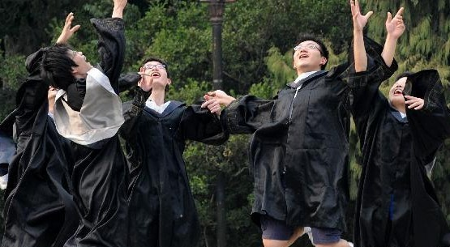

# 毕业祭

零、

这是一个短暂，仓促却又冗长的故事，或许它并不需要用一个过分悲伤的语调来叙述，谨以此文献给所有我用dota英雄化名的人。

一、

毕业答辩结束的时候，我一个人缓缓地挪回寝室，一路上阳光明媚，鸟语花香，湖边还有三五成群的游客在饶有兴致地拍着照，一切都是那么的恬静而慵懒，给人一种美好的错觉，就好像这个世界上未曾有过战乱，饥荒与贫穷一般。

然而只有我默默地在想，得了，差不多就这么回事儿了。

前一天晚上为了准备今天这个该死的答辩，我坐在电脑前弄了整个通宵的PPT，最后只做出来三张幻灯片，而且第一张还是论文题目，最后一张是"thank you''，恰似一片两面都撒了点面包屑，却依然大言不惭坚称自己是个三明治的烂火腿。尽管我在太阳刚升起的时候用word写了一份答辩稿，连"good morning everyone"都一丝不苟地加了上去，但最后很遗憾的是，这点作料并没有让我的这份毕业大餐变得可口，反倒把我自己给噎得不行。

我记得自己用三分钟说完自己的命题后，答辩老师一个劲儿地问我，"what's your point"，你论文中所提到的"metaphor(隐喻)"究竟是什么，搞得我一头汗，心中暗叫不妙，毕竟稿已念完，弹药已尽，现在拒敌不成，革命大业尚不能成功。既然兵临城下，只得以刺刀肉搏之，我情急之下弱弱地问老师一句：“我能用中文回答么？”老师点点头，我心中一喜，从裤裆掏出一把AK47来，突突突发表一通高论，最后终于把老师说舒服了，遂昂首挺胸下台，深藏功与名。

坐在台下后的我一阵晕眩，颇有上完厕所提起裤子那一瞬间的空虚感，我一脸嫌弃地低头望了我的毕业论文一眼，心想这坨屎的历史使命终于结束了，可以随着青春一并被冲进下水道了，而我今天为它所做的辩护，并不能增加它多少价值，反倒徒增了摁下冲水键那一刻的悲伤，就仿佛准备告别所有那些你曾为其努力付出了很久，最后却落得没啥屁用的东西一般。

我歪着脑袋想，作为史上最渣的英语系毕业生，当我站在台上和自己的学术生涯告别的时候，说的竟然是中文，实在是太给老师们丢脸的。不过好在老师们在毕业的季节，对于学渣往往都会保几分最后的温存，不然刚才那个曾经挂过我科的老师，缘何多看了我两眼呢。

我绕过林荫道，拐到食堂去买了瓶水，坐在路边咕咕咕地喝了几口，心想这个夏天终于还是不可逆转地来了，就像我们终将逝去的大姨妈那样。犹记得去年夏天看着学长学姐们卷铺盖的时候，我趴在窗口和小Y说，你知道嘛，当夏天再来的时候，我们也要骨碌碌地滚蛋了，然后他就开始咿咿呀呀地唱起那首不着调的《wake me up when September ends》，像是在提醒我，你的离情别绪预防针打早了，不妨等到九月末再叫床。

然而在经历了那个无人叫床的夏天秋天以及冬天后，我终究还是再次嗅到了水泥马路的焦糊味儿，听到了蝉鸣声，感受到了从树下走过时被这些小贱货们尿一脸的清凉，于是我猛然意识到，时间的齿轮终于还是无情地把我们推到这么个咬合处，而所有人都将在这个六月完成救赎，被捣碎成块，再研磨成精细的粉，撒向那一个个未知的未来。

可是此刻的我却没有丝毫的悲悯或是怅然，更多的是一种迟滞的酥麻感，像是被硬物刚刚击中时还没来得及尖锐起来的钝痛。我记得之前看过一个笑谈，说恐龙之所以灭绝，是因为它们的反应太过迟钝，被石头砸到后要过两天才能感受到疼痛，因此在交配的时候，雄恐龙不能XX，而是在两天后才觉得爽，于是就这样冷不防地射在了草地上，小溪中，泥土里，或者是基友的脊背上。

我想我或许就是这么一只恐龙吧，至少当我明白自己今后再也不会以这样的身份坐在教室里的时候，还没有开始酝酿起这深沉而庞大的悲伤。

二、

答辩结束后的日子开始变得兵荒马乱起来，颇有一种树倒猢狲散的即视感。

我除了宅在宿舍里打打游戏看看电影外，脑袋里也一直盘算着究竟还有几个基友学妹旧情人毕业之前要见最后一面吃个饭这样的事情。尽管我向来不喜欢这种形式主义，但一想到也许有些人就像传说中那样，毕业了之后就真的一辈子也不会再见到的时候，我也难免忍不住要去做这样煽情而矫情的事情，冒着不知道哪天又在去食堂吃饭的路上和昨天刚刚声泪俱下告别的人尴尬地撞个正着的风险。

那天在宿舍里的时候，小Y问我，你真的打算每个妹子都要挨个见一遍么。我悻悻然地挠了挠后脑勺说，太多了，见不过来，只能挑几个重要的见见。然后这个时候蓝胖在一旁冷不丁地插了一句：“你知道嘛，我前几天在宿舍楼下看到Lina了，她男朋友骑车载着她。”于是我便被哽住了，站在那里一时不知道该说些什么话，表达怎样的思想感情。

那晚我迟迟没睡，凌晨两点多一个人坐在湖边抽着烟对着屌丝鹅唱歌，然后自顾自地说着话，它也很配合我地一直叫个不停，像是在跟我说：“嗯嗯，你继续说”。芙蓉湖边对我来说向来是个意义非凡的地方，我曾在这里遇到Lina，唱《且听风吟》给她听，第一次吻她，牵她的手，也是她离开我后的那段最艰难的日子我最经常在半夜游荡的地方。

我时常想，如果不是她，我也许不会拥有现在的这所有一切，她是我这四年来最爱的人，改变我生活最多的人，却也是我唯一一个不可能去告别的人，我忍住了一次次想在毕业前给她打个电话，写一封邮件的冲动，直到最后把她寄给我的明信片小心地放进旅行箱。很多人和我说，都过去这么久了，还有什么是过不去的呢，你们俩完全可以坐在一起像朋友一样好好谈谈，但只有我自己明白，我们俩都已改变了太多，我不想把彼此仅剩的回忆毁掉。

我深情地对屌丝鹅说：“我知道你为啥还不睡，站在这里听我废话，你一定也爱过黑天鹅对不对，现在她很幸福，你也很幸福，所以你必须move on懂吗……啥？你听不懂英语？好吧，这个词组我不知道该怎么用中文表达。”

然后我似乎是戳到了他的痛处，他非常赞同地点了点脑袋，当我挥手和他告别，表示困得不行要回宿舍睡觉的时候，他竟然屁颠屁颠地跟了过来，好像听上瘾了似的，无论我怎么说“行了你不用送我了快回去吧”都没用，吓得我拔腿就跑，生怕他一路跟我到宿舍，为此我还差点摔了个狗吃屎，于是，原本挺好的气氛就这样跌跌撞撞地给破坏了。

回到宿舍我很小心地往门外张望了一下，心想这货都快成精了，看他刚才那个欠抽的矫情样，似乎是真的很伤感的样子。

不过，至少他永远也不用从这里毕业。

三、

学院毕业典礼是一个燥热的下午，我睡到中午从床上爬起来望了望窗外，这大太阳似乎有势必要融化掉一切的决心。

原本我和辅导员商量好要在毕业典礼上唱两首歌，作为大学最后舞台的告别，为此我还很认真地准备了两个月，怎料打电话一问，辅导员告诉我毕业典礼时间太紧了，恐怕没有时间给我唱歌了，我如果想上的话可以考虑帮忙伴奏一首《凤凰花开的路口》云云。

这首歌我记得当年大一的时候弹过，似乎是在漳校校区欢送学长学姐回本部时候的一个晚会上，当时我也伴奏了这首歌。没想到时隔多年，我又要再次弹起这首歌，而且是在送别自己的舞台上。我心里很不情愿的是，本来我不仅可以自己唱两首歌，还能借机在开唱前煞有介事地说几句话，这下全都泡汤了，不仅话没法说了，歌也不给唱了，沦落成了个纯伴奏的，而且这首歌还网络上到处都是伴奏。

我抓着学士服一脸怨气地顶着太阳去了科艺中心，排练完找了个最靠后的位置坐着，然后毕业典礼就在学院领导的讲话声中开始了，紧接着就是各种优秀毕业生的颁奖仪式，这个素来与我没什么关系的环节。我想起之前所有学院的演讲口译之类的比赛，我都是以这样的一种姿势坐在最后一排默默地看着，等待自己中场休息上去唱唱歌，所以当他们在简历上写下一个个比赛获奖的时候，我填的却是“校园十佳歌手”，我偶尔也会为这种格格不入感到些许失落，不过好在我也混毕业了，就像在战场上脚底一滑不小心扑到了敌人的枪口上一般，虽然算不上光荣牺牲，但至少也算个烈士，死得其所。

临上场的时候，唱歌的几个同学和我商量了一下，觉得我只伴奏实在是太可怜了，让我可以在开始的时候唱唱主歌，然后我就像捡了个宝似的欣然接受了。没想到上台之后曾经有无数舞台经验的我却有些怯场了，在这些平时抬头不见低头见的四年同学面前，我生硬地鞠了个躬，然后第一个音就给弹错了。之后的整个过程我一直都没有看台下观众的表情，而是自顾自地弹着，一直到最后掌声响起，鞠躬下台，我很难从自己的脸上挤出些许的笑容来。

也正是在这样一个时候，我发现自己原来并没有想象中那么的洒脱，面对告别这种事情，没有人可以做到毫不在意，无论是告别一个人，一个物品，还是告别一个看不见摸不着的东西。毕业典礼结束后，我把吉他装好，穿上学士服，然后融入人群中开始嬉笑怒骂，试图表达一下自己对于毕业的一些情绪，不过很遗憾的是，这样一个燥热的天气将所有用来表达悲伤的体液都转化成了黏湿而腥臭的汗，我没有任何想哭的冲动，连尿意都变得很淡很淡。

随后拍集体毕业照的场面就显得更加不堪了，一群被热蔫了的残兵败将被串成一溜拉到了上弦场，在烈日下等待被弄上一张张彩色纸片。我和小Y饶有兴致地去和不同的妹子拍单独合照，我很认真地告诉他，都快毕业了再不都尝尝，就没有机会了，于是我将不同的妹子一个个搂了过去，摆出各种得意而猥琐的笑容，像极了一只三月不识肉味的野狼。后来拍集体照的时候，我环顾了一下身边少得可怜的几个汉子，再看看对面齐刷刷的几排妹子，心中不禁悲从中来，没想到混了四年，如此多活色生香的肉体，一个也没有得到或者曾经得到过，真是可悲到不能自已，再想到这些妹子早晚全都会是别人的，更是难过到捶胸顿足仰天长啸，如果那天有人看到过我哭，那么一定是因为这个事儿。

大家都站队完毕，摆好了造型，露出僵硬的笑容后，趁着摄影师在调焦距的间隙，我眯起眼睛看到远处的太阳已然落山了，我心想这真是一个好隐喻，09级13届毕业生到今天终于算是日落西山了，最美不过夕阳红。

晚上吃散伙饭的时候，由于我提前回去洗了个澡，到那里已经没有位置了，只好和别班同学拼了一桌。

不过小Y比我更惨，他今晚要补考双学位的一门课，为了一个早已无关痛痒的证书连最后一顿也吃不上了，而且今晚的饭菜看起来似乎还不错。被饿了一天又晒昏头的我顾不得院长唱歌什么的插曲，埋头一阵猛吃，最后吃得差不多了才想起应该到处走走敬敬酒，搞出一点散伙饭的气氛来，要是能流出几滴眼泪来就更妙了。

不过很遗憾的是，连干了十几二十杯，喝得一脸通红的我，依然不能在这种喧闹嘈杂的场面中找到什么情绪来。我看见自己的初恋女友在那里，便上去和她喝了一杯，并问她能不能和自己拍张照片，她答应了以后，我的手竟然局促地不知该往哪里放好，遂弱弱地问了人家一句，能不能搂着你，拍完后还做贼心虚似地左右张望看她男朋友在不在附近。

后来我找了个安静的角落，有些失落地和毕业论文的导师聊天，他非常淡定地在一旁抽着烟，像是早已看惯了这种无谓而无聊的躁动一般，那表情像极了冷眼漠视临死前在锅里玩命蹦跶的活虾一般。

他问我道：“毕业后去哪儿？”

“广州。”

“你女朋友呢？”

“就是在广州找的。”

然后他就瞪了我好一会儿才缓缓说道：“哪个姑娘这么倒霉看上了你啊。”

于是我便瘫在椅子上释然了，至少这是这一整天来我听到的最实在的一句话，好过所有“前程似锦”“一帆风顺”以及“后会有期”。

四、

学校的毕业典礼结束后，我们在宿舍开始整理行李。

这种场面恰如两年前在漳州准备搬回本部时的情境，但略有不同的是，当时只是告别一个地方，这次要顺带告别所有和这个地方相关的人和事。学校里开始了末日般的撤离行动，路边摆满了贱卖生活用品的摊位，各种私家车停满了宿舍门口，路上不时有抱着箱子拉着行李的人在走着，还有人后知后觉地还穿着学士服拍着毕业照。

原本就不怎么整洁的这层楼开始变得脏乱差起来，像是城市角落里的贫民窟一般。我们宿舍内部的情况也不容乐观，原本藏得很好的垃圾们被翻出来，醒目地丢在任何你可以看到的地方，一些多年未见甚至素未谋面的小玩意开始在你的脚边时不时绊你一下以示耀武扬威，再加上寝室的空调不知何时开始漏水，需要用两个脸盆放在底下筑起一道防洪堤，一切都渐渐变得如此潮湿而滑腻，就像青春期时的被褥。

蓝胖是我们宿舍最早要走的人，最后一夜一向很早睡的他迟迟都没有上床，他毕业后要去内蒙古支教一年，这次毕业他准备一个人一路北上玩回山东老家，第一站选择的是杭州。他整理完毕上床后，我看了一眼他的书桌，比他没有整理之前还要乱。而和蓝胖一样第二天要去深圳的SK，他的行李更是堆了有好几箱子，他之前还非常无耻地喊了个学妹来宿舍，把各种不要的东西甚至是垃圾当做是礼物送给人家，让人不得不感慨有的人真的是一直到毕业了也读不懂妹子的心。

那天晚上我和小Y无故都失眠了，反而是那两个第二天要走的货睡得跟死猪似的，小Y凌晨五点爬上床去，而我则看着《Friends》努力打消自己的睡意，到7点还去食堂吃了早餐，就是怕自己这一睡就睡过了，没法醒来和这两个讨厌却又让人不舍的傻逼说再见。

蓝胖和SK都起床后，我看了看床上的小Y，摇摇头说这家伙估计是起不来了，没想到他“腾”地就坐起来，打着哈欠说“能起来”，莫名让人又好笑又难过。蓝胖走的时候我们三个在宿舍门口和他拥抱告别，看着他拉着箱子屁颠屁颠地消失在楼道拐角。虽然这家伙四年来没少给我们寝室添乱，但他终归是个可爱的人，毕竟胖子都有着柔软的肚皮，和一颗柔软的心。

之后送SK的情节就有些喜剧色彩了，我之前和小Y计划了很久，一定要在SK走到园区大门的时候，告诉他一个隐瞒了他两年的秘密，我们送他下楼的时候小Y还特意带了个相机，准备录下SK当时的表情。当我告诉他我曾经在他桌子上和Lina嘿咻的时候，他的表情果然没有让我和小Y失望，不过当把他送走了以后，小Y却有些失落的告诉我，他等这一天等得太久了，以至于现在这个心愿达成了，反而没觉得很开心，酝酿了这么久的事情一眨眼功夫就没了，像是剥了半天的螃蟹，一口就吃完了一般。

那天晚上，我和小Y两个人坐在寝室里相依为命，我们组队打了最后一把LOL，一场耗时50分钟的艰难比赛，最后我们在劣势中奇迹般地翻盘成功，兴奋地从椅子上跳起来。我问小Y，离熄灯还早，要不要再撸一把，他摇摇头说还是算了，他不想以失败来结束大学，还是带着胜利凯旋比较吉利。

但熄灯后的我还是失眠了，我抽完最后一根中南海，跑去其他宿舍借烟抽，然后独自蹲在走廊看星星，想着自己这四年来所经历的得到的失去的，觉得时间快得真是令人不可思议，猝不及防给你一记闷棍，四年的一场大梦就这么苏醒了，那些故事那些人都是曾经的自己所不敢想不敢预计的，但到现在，一切的一切都却都已经成为过眼云烟，变得不再重要了。

五、

我和小Y买的都是第二天下午的动车票，在送走了无数基友之后，终于我们也要踏上征程了。

由于是最后离开宿舍的，我们两个务必非常谨慎，毕竟钥匙已经还了，一旦我们把门关上，就不可能再进来了，这感觉像极了科幻电影里看守时光隧道的守护者，颇有几分如果大门关上了就要再等几个世纪之类的情节。

我们把所有剩下的东西都重新翻看了一遍，把所有能带走的都尽量塞进行李箱，就连卫生纸水杯之类的玩意也不落下。但诸如热水瓶之类的东西终归还是无法带走，我们只好含泪把一些陪伴了我们四年的东西遗弃在宿舍里，等待被人收走或是扔进垃圾桶。但为了表达我们的感激之情，我和小Y非常蛋疼地把宿舍里每一样东西都摸了个遍，还煞有介事地各说一句“保重”，然后非常沉重地和他们挥手道别。

当我们俩最后走出宿舍，关上大门的时候，一切往事与回忆也就这样随着“咣当”一声被永远锁在了里面。

随后我们一间一间宿舍地敲门，寻找依然没有离开的“幸存者”，和他们一一拥抱告别，而直到这样一个时刻，我才真的觉得有些眼眶泛红鼻子酸，尤其当我回头看到他们光着膀子抽着烟在走廊上和我们说再见的时候，这样的画面更是让我有些不能自已。

再然后我从南门出来，坐上了去火车站的公交车，和小Y分别，在麦当劳呆呆坐了一个小时，再独自过了验票口走向站台，一切都变得平静而缓慢了下来，我的脑袋里一片空白，像是陷入了创世前的混沌与空虚之中。

而当列车进站的时候，我听着耳机里的《Desperado》，拖着行李，却无端开始哭得像个傻逼一样，我靠着站台的柱子，身边的旅客脚步匆匆，没有任何人在看我。

于是在故事的结尾，这只恐龙最终还是得到了救赎，他感觉到了疼痛，也感觉到了前所未有的畅快，他将自己的青春射在了这片他曾经深爱过的热土上，搭上了这班永不回头的列车，驶向一个叫做未知的终点站。

岁月啊，就这样吧，你好，再见。

2013年7月3日凌晨于福州

（采编：孙晓天，责编：佛冉）

[【你总说毕业遥遥无期】为什么你找不到工作？](/archives/38905)——一边是高贵冷艳的工作机会，一边是不知走向何方的迷茫青年；一面是艰难的就业形势，另一面是庞大的劳动力大军。为什么你找不到工作？且听作者慢慢分析。 

[【你总说毕业遥遥无期】茶山刘的腿 ](/archives/38979)——最是那一抹宝蓝，至今令人难忘。其实茶山刘的腿在质量规格上无甚突出，说茶山刘的腿好，好不在腿，好在九孔桥、文泰楼，好在茶山刘。 
