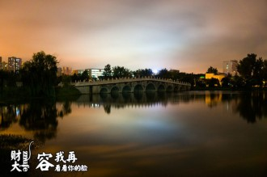

# 茶山刘的腿

少年大约是没尝过丰乳的妙处，大都爱看腿。我还记得高三暑期补课，一个课间里毕业生们回来看望老师，一个个傲然走过走廊，我趴在窗户边上，一个一个仔细看，不忍错过。一个姑娘穿着宝蓝色的丝袜，脚踝极细，小腿肌肉渐渐隆起，没有一丝突兀，角度收得极俏，大约隆起至一个最为调皮的角度，媚然回收。黑裙及膝，但靠近膝盖的景象我却已经忘记了。在那之后，但凡有人问我“你觉得什么颜色的丝袜最好看”（别惊讶，时常被问到这样的问题），我就会不自觉地回忆起那个烈日当头的无聊夏日，一抹宝蓝色流进我的额叶，天鹅绒包裹着大理石膏。“宝蓝色。”“宝蓝色？”“你们没见过，你们不懂的。”

茶山刘是我学校所在地的名字，中南财经政法大学，坐公交车就坐到民族大道茶山刘或者是民族大道东山头，但本文不能叫东山头的腿，否则给人一种清晨里背着竹篓上山采摘菌菇的感觉。所以，是茶山刘的腿。茶山刘这名字不雅，但很有风韵，琢磨下茶山刘这样的名字，我就想起东门外剪神理发店那位声音沙哑的老板娘，腰肢细，皮肤白嫩得泛光，腿，自然也是上佳的。我躺在躺椅上，她的手指触及我的头皮，摩挲起来，就这样，觉得亲昵来得太突然了，不由得害羞。住在滨湖的男生许多都知道东门理发女神，常客很多，但我不好意思指定老板娘，有时会轮到一个貌似涂着胭脂的奇怪大叔给我理发，他理成什么样我都觉得失败，合同目的都不能实现了。茶山刘，俗，但不闹腾，山茶花的颜色，有风韵。

东门过马路往里走，就看到九孔桥。阳澄湖的大闸蟹、太湖的三白，然后，九孔桥的腿。茶山刘的腿这一概念其实太宽泛，最好是叫九孔桥上的腿，品牌群里最为突出的一个。卢沟桥的狮子、九孔桥的腿。九孔桥也有狮子，两端桥头各有一个，桥自然有九孔，跨在晓南湖上，其实就是十年前挖的一个不小的鱼塘。但想起来，花费这么多钱挖一个鱼塘，给九孔桥的出现创造可能，实在是功德一件，点赞。

九孔桥的狮子没什么生气，整天傻乎乎地望着对面的同伴，我想他们大约就像夜店门口的保安一样，刚一来眼珠子躺在油肉绵香里，时间久了，顿觉人生来之不平等，看的腿太多，审美疲劳了，可怜。而九孔桥头的我却是充满着朝气，快乐而又自信，就如同我时常不厌其烦地描述那样：在五六月还不算爆烈的阳光下，我眯着眼睛站在桥的一端，时间大概是11点40，姑娘们下了课正好走上那座必经的九孔桥。妖灼的光抓住桥顶不放，玉藕相连。疾步的迈得很开，缓步的一步一顿，我的视力不好，遗憾不能体察那一顿的风情。说桥上的腿，有的极细，称“仙鹤腿”，其实并不好看，脚掌压过上坡的隔离带，就觉得会像上桥的校车一样浑身一震，惹人怜爱；至于粗的，单拿出来自然不美，但在五月的阳光之下，最能反射日光，走在烈日之下总是显白，一叠叠剔透的玉笋，连成“腿晕”，粗壮的小腿终于扬眉吐气，做了一回主力军，超强的反射板，楼顶的太阳能电池。至于剩下的，“层层的叶子中间，零星地点缀着些白花，有袅娜地开着的，有羞涩地打着朵儿的；正如一粒粒的明珠，又如碧天里的星星，又如刚出浴的美人”，自然有那鬼匠天工雕琢的极品，我的额头滴下一滴汗水，额叶中那一抹宝蓝隐隐作痒。

有时难免想变成桥下那条黄黑相间，颜色颇为戏谑的减速板，摆出一个似他颜色一样的猥琐表情，一窥裙底风光。但说到底，裙底的所谓风光在烈日下的九孔桥上，实在是不值一提。更多的时候，我并不带眼镜，500度近视的眼睛自动附带美图秀秀功能，感光能力却要比带上眼镜强太多。一般在桥头作等待状、彷徨状、平静状，也会不忍露出感叹的表情，“腿晕”泛起，多想拿着喷壶上前洒水，造一条美好的彩虹。

骑车从九孔桥上过，低眼只看路面。两手自然紧握龙头，切蒜蓉一般固执，定要极巧妙又温柔地躲开一双双腿，手不自觉地拨着铃，类似在天桥路口吹口哨。下坡，前方又有可恶的减速板，不得已刹车，臀部微抬以减震，但臀部不急着放下，左拐，湖边的树荫还美腿本色，上坡，阳光再冲出来在我眼前挥手，快到食堂了，人越来越多，“腿晕”近在眼前，潇洒停车，人群中避让，又是一顿好饭菜。饭不多，二两，但吃很多菜。

过去看见一双好腿，腰肢摇曳，长发飘飘，常常快步向侧边走，无数次练习绝技“不经意转头看”，但往往失望。有时是一群人，派出一个代表，看着背影风华绝代的姑娘长得如何，多半是撇撇嘴摇摇头，回一个苦恼的表情，众人泄气。有几次我做代表，其实是常作代表的，侧头，唉，戴着眼镜，面容呆滞，戾气在鼻眼间打转，就和看我自己一样。久而久之才感悟：对于腿来说，好便是好，看脸就算亵玩。想到这里挺起腰杆，觉得自己又成长了几分，在这世界里快乐自在地长大，真好。背影如此美，为何要执着于那一掌之间，可笑的执念。

文泰一进正门，每层楼编号01到06的教室都能看腿，在里侧的窗户，坐在后排，抬头就有，轻松惬意，不见脸，人都看不见，只看腿，享受。为什么要看脸，人要是倒立着走路，血液倒灌大脑，眼红脑热，哪有时间估计彼此的脸屁股，狭隘。不如抬头看腿，或许有一双好腿就可称“女神”。其实吧，看腿和看脸一样，还是执念，或许有一天我会爬到希贤岭上，看少女的脖颈，会坐在旧体的木椅上，看跑步的少女扬起的发辫。

不过写到这里，想起自己三年来竟没正经触过茶山刘的腿，只能强作不遗憾，但写这篇文章总惜素材太少。不论文笔质量，我的这篇《茶山刘的腿》只能力求成为《陶然亭的雪》，但对于许多人来说，茶山刘的腿却似那壶口的瀑布、如泰山般巍峨。

坐在床上瞎写，写茶山刘的腿，其实茶山刘的腿在质量规格上又无甚突出，无非是来自五湖四海的女学生罢了。所以说茶山刘的腿好，好不在腿，好在九孔桥、文泰楼，好在茶山刘。

来吧，会有一天，我再乘公交到茶山刘，找那时徐娘半老的东门老板娘剃一个利落的发型，期盼她风韵还犹犹豫豫地残存着，发型一定要狂拽酷炫霸。二十年后同学会，武大赏樱，磨山鉴梅，不如一起到茶山刘，看茶山刘新一季的腿。

不知谁与我同看啊，和我一起看吧，至于身边人的腿，无暇顾其粗细，只要你与我同看。想你了。

（采编：佛冉，责编：佛冉）

[【你总说毕业遥遥无期】毕业祭 ](/archives/38730)——大学生活相信很多人都体验过，我们在学校里感受了无法概括的情感，浓厚的友谊，爱情。也正是如此，才让离别显得这样无可奈何，作者寥寥几笔但愿写尽离愁。 

[【你总说毕业遥遥无期】为什么你找不到工作？](/archives/38905)——一边是高贵冷艳的工作机会，一边是不知走向何方的迷茫青年；一面是艰难的就业形势，另一面是庞大的劳动力大军。为什么你找不到工作？且听作者慢慢分析。 
