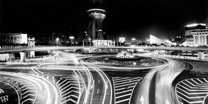
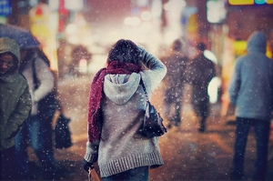
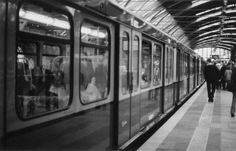

# 上海•印象

上海，这座中国最大的城市，似乎也能冠以其他“最”之名的城市，是一座非常有意思的城市，从清代末年开始发展，作为租借地，也作为中国对外交往最前沿的平台。它孕育了东方巴黎的繁荣，也孕育了以此为中心的海派文化。众所周知，海派文化在近代中国享有盛名，名人雅士在此聚汇，近代革命也以此为发源地，因而上海也给中国近代史留下了浓墨重彩的一笔。之前从来没写过什么东西加以概观，这次正好有个机会对思路加以梳理。

大学本科四年在上海度过，就读的学校位于美丽的松江大学城。这是一个逢年过节就成为空城的大学城，在上海郊区松江，一个环境优雅的地方。四年的时间里，大体领略了上海的文化气息，市民生活，街头巷尾。期间自然经历了许许多多变化，许许多多大事情。当然，一个重要的主题就是上海世博会。围绕着世博这个主题，上海市的规划和建设进行了很大的调整，包括老城区改造，地铁线路建设，市民文化培养等等，丰富多彩。当然，在这个介绍里，世博会不是主题，在此就不多谈。还有其他一些众所周知的或者可以通过网络搜索来的内容，也不赘言。只谈一谈我自己在这里生活的一些感知和点滴。

**本地人—****外地人**

上海人本外地的划分十分明显，方言是主要的标志。吴越方言发音与之相近，且历史上上海人也大多是这两地移民的后代，所以江浙人在上海基本上不会被当做外地人，但其他省份则例外。不能说全部，至少有相当一部分上海人喜欢打地图炮。这也不能怪他们，其他城市我们也不少见，中国人似乎都有“欺生”的习惯。确实，不同群体的居民有着不同的生活习惯，十里不同俗，就说的是这个道理。不同的习惯容易使人产生隔阂，也容易产生误会乃至怨恨。外来的民工被看做城市的“漂泊者”，没有固定的住所，素质低下，地位低下等等，加上一些时而不理智的行为，更加深了这种刻板的误解。而面对其他职业的外来者（高收入的一些职业），本地人则是害怕饭碗被抢走，或者担心语言和文化被稀释乃至消亡。

有一个词来形容—“共同体乡愁”，我觉得再恰当不过了。至少在中国，传统的乡土观念远未消亡。虽然大城市者诸如京沪广，有着开放的经济文化环境，多元文化也在此孕育出来，职业流动规模巨大，似乎已经进入了陌生人社会。但实际上，乡土观念只是换了一种表达方式，延伸成为一种更为广泛的观念实体，或者以语言来展现，或者以地域来展现。我们张口说话，可能瞬间就会被对方认出：你是东北人？你是北方人？南方人？简单的划分，就已经揭示了所属群体的差异，确定了基本的群体界限。乡土社会中的运行逻辑也大抵如此。

**城里人—****乡下人**

有一个说法很流行：不到北京不知道官小；不到东北不知道胆小；不到上海不知道钱少。善意的谈一谈应该无伤大雅。上海人心中都有一种莫名的情愫，认为自己才是“城里人”，而乡下人自然就是要低人一等的。城里人住在市区，乡下人住在郊区，或者除了他们之外，全国都是乡下—当然这是夸张的说法。我2010年在松江区一个社区实习，从户籍上来说，工作人员都是土生土长的“上海人”，但很有意思的是，一位干事跟我说：我们松江人怎样怎样，“他们”上海人总瞧不起我们。

在居住格局上看，一些富裕的人就喜欢郊区的别墅，一些高档别墅也都是外地人在居住。而市区里，有大片的旧式里弄（算得上是贫民区了），生活设施很不完善，好多老人在里面居住，也有一些吃低保的中年人，年轻人很少（应该是都搬出去住了）。但是，和他们交谈中，这种优越感仍然会不停的表达出来。这是为什么呢？我觉得可能和身份有关，这两者的区分自然也不是单纯靠物质和金钱划分的。城里人一般很早都受过良好的教育，有着以前老上海的文化积淀；而新上海人或者其他地区的人，则没有。穷到底也是个贵族，再富也只是暴发户，也只是下里巴人，不及他们的阳春白雪。它同样代表了一种认同，一种本土文化的自豪感。这在老北京，广州这些城市，原住居民们也都很珍视自己的文化，这代表了一种共性吧，虽然外在方式不一样。

**南京路—****淮海路**

近年来旅行成为一种生活时尚。年轻人们通常会以此为自己的爱好，带上各种装备，结伴出行或者一人独行，去游览所谓的风景名胜，大城市等等。攻略在这个环节中自然是不可或缺的因素。例如，到了广州，我们可能就会按照攻略上讲的去上下九步行街看看；到了北京，可能就要到八达岭，故宫，王府井看看；到了上海呢，大多数人都会到外滩、南京路步行街转转。我想说的是，攻略上的都是骗人的。酷爱旅游的人可能会批评我乱讲，但我有理由。

在上海，本地人一般不会去南京路，这里大都是外来游客去的地方，东西很贵（即使所谓“打折”），人很拥挤，景点也单一；同样，他们也不会去豫园，城隍庙，田子坊，那里同样是游客被宰的天堂—东西很难吃，不地道而且贵得离谱。十里洋场被改名为延安东路，基本都是商业设施、各种公司；人民广场也是四季不停，人潮涌动。

一般说来，具有本地特色的，就是老式里弄，可能环境真的不太好，但这是原汁原味的上海老城风貌，保存比较好的在闸北区和黄浦区。阿姨老大爷们三五成群，一起打牌聊天，自有一番味道。走在狭窄的里弄里，可能真的能回到百十年前的老上海。另外一个地方，就是淮海路。这里是一条比较有海派特色的商业街，有着上海味道的时尚，也有静谧的咖啡馆，西餐厅，还有外国领事馆的办事处，单纯从文化的角度来讲，这里似乎才是一个代表。

**上海地铁**

话题转到上海的一些设施。

谈到地铁，不知道有多少人抱怨过上海地铁的昂贵。在北京待习惯了，来到上海真的会为交通费感到心疼。但话说回来，上海地铁的设计确实有显著的优势。

一号线很早就开建了，当时是按照德国人的设计方案，结果，运行到现在，虽然年代久远，但仍然是最可靠的一条线。其他的线路都是自己建设运营的，二号线作为试验品就首当其冲的不及格。舒适性和可靠性都不及一号线，虽然用的是同样的设计图纸。其他的线路则有意识的避开了这些问题，就舒适了许多。

中国许多大城市都有地铁，对比下来，广州地铁最接近上海的设计。北京地铁呢，站内空间十分狭窄，车内冬冷夏热，全然没有空调，无论多么拥挤。深圳地铁，就只能用“山寨”来形容了—四不像，换乘经常出状况。

之所以专门辟出一段话介绍上海地铁，自然有道理可循。第一，它确实方便，作为世界最大的地铁运营网络，市区内十几分钟之内可以到附近任何一个地铁站，步行都不会太远，郊区也是有公交车接驳；第二，设计合理。站内设计基本都是统一的格调，空间充裕，不会出现换乘列车时出错了站或者走错了方向进入死胡同的情况；第三，上海地铁周边形成了完善的产业链—生活区，消费区，地上地下都发展的井井有条，比如二号线江苏路站，静安寺站，七号线—九号线肇嘉浜路站，一号线徐家汇站，附近都有完善的设施，而不仅仅是一个标示：地铁入口。有效利用了空间，也带动了周边的经济，一举多得。

**大学城**

上海市在21世纪初设计了几个大学城—松江，南汇，闵行。怎么讲呢，基本上都是不太科学的，但运营还确实不错。松江七校，闵行是交大和华东师大，都形成了自己独特的大学城文化圈。离校学生谈起来，也都是一段很有意思的共同经历。就像我们离开深圳大学成之后，也会有这种情愫在。不足之处就是，寒暑假基本上都会成为空城，因为设在郊区的远郊，周围都是农田，生活设施极少，可能也是期望以后的发展吧，能够覆盖这些地区。

这似乎也是中国大力发展大学城的通病：远在郊区，与世隔绝，基础设施不完备。

**结语**

零零碎碎谈了这么多，没有什么专业知识，也没有什么学术价值，其实就是想单纯的介绍一些不为外人所知的上海风貌，很有意思。因为这里记载着我四年的印象，也很值得回忆。江南好，风景旧曾谙，日出江花红胜火，春来江水绿如蓝，能不忆江南？

（荐稿：周拙恒，责编：佛冉）

[【你的城市，我的故事】枪炮北方，玫瑰南方](/archives/36216)——就是那样的时代，那样的海南，居然整个岛都划为经济特区，敞开大门让所有民间爱好者们都进来搞经济实验。自然诞生了一片热土，无数个资本草莽在这片热土上狂奔。

[【你的城市，我的故事】苏州街](/archives/36570)——大学与街道的关系永远欲说还休，苏州街既繁华也平淡，既生活也世俗，它始终透露着似乎不太一样的气质。毕业季又要来了，你的大学附近，有没有这样的街道？
