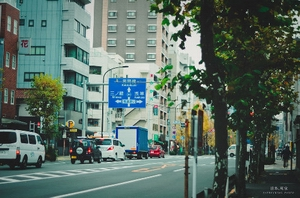
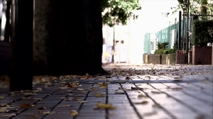

# 苏州街

按理说大学应该与市井之气格格不入，为了爱惜自己的贞洁，很多大学都爱树立围墙与外界隔绝开来。中国大陆少有围墙的大学，比较知名的有湖南大学，这怕是特立独行的一家。很多旅居过海外的人们说欧美有许多大学没有围墙，其实这也是以偏概全，他们University，或许一个松散的形式存在，但是更为重要的College则还是有一个紧密的实体的。北京大学有一年推倒了南围墙，办起了商业街，引起了很大的议论，大抵都是知识界感慨北大古风不存，知识分子和妓女同吃同住了。过了几年，北大当局又悄悄地把围墙修回来，可惜也没人歌颂北大恢复了贞操，大概和修补过处女膜的女人不能算处女一个道理。

实际上，大学与街道的关系欲说还休，有没有围墙都不阻碍它们声息相应，反倒是有围墙才符合文化人矜持的风格。旧式文人爱逛八大胡同，而以柳如是的资质，放在现在当一个文学院和艺术学院的教授也没什么大问题。以近来看，台湾大学边上的温州街成为了台湾作家笔下不厌其烦的描述对象，以至于我一个从来没有去过台湾的小年轻都觉得温州街是文学青年的圣殿，似乎走在这条街上随便就能遇上个文坛巨擘、少年才俊。我等这般文学小年轻，又恰恰喜欢意淫诸如旧书店、咖啡馆、啤酒店、画廊等意象，温州街在台湾作家笔下差不离都具备了。在一些文本中，不免让人感慨当年的文学小青年不是在读台大，而是在读温州街，在温州街上学习、写作，骗教授家的女儿。

按照人民大学占据的一个Block（街区）来看，南北的人大南路、人大北路人烟稀少，偶尔拄拐而过的老爷爷，寻觅捷径绕过车流的汽车，三三两两放学时间穿走的中学生，如是而已。东面的中关村大街（旧海淀路）自然是主干道，文韬武略，器宇轩昂，一路开过长安街去，似乎都能听见当年游行的呼号。如今变成办证大娘的吆喝了，也实在让人钦佩首都的宏大气魄，百川东入海，洋洋洒洒。

苏州街就不一样。第一是它的名字，“苏州”二字就透出和皇城不一样的气场了。当年老佛爷嫌宫廷生活烦闷，她又没有七下江南的魄力。怎么办？去颐和园里的苏州街，苏州街就是江南的街市，不过是只做给一个独孤寡人看的。一个人的街道，该是多憋屈啊。不过自欺欺人的日子也不长，外国人来了，军队开进来，当地盲流再趁火打劫一番，苏州街就毁了。

现在的这条苏州街往北的确通向颐和园，不过比它在园子里的小弟弟更真实。南通北三环，北接北四环，把几所高校串通在一起，让人大是清华的后宫一说也有了现实基础。苏州街有街巷之气，当然不仅仅因为它的名字，更是它周边的环境和氛围。中关村大街边上是当代商城、华宇购物、新中关，还有北边的一坨数码城，纸贵金迷虽然谈不上，摩登味道散发的汽油真是一嗅而出。若是被数码城遍地皆是的导购拉上了，进而被忽悠了一台高价电脑，只可叹都市之无情。但苏州街是属于市民的，也是属于穷学生的，苏州街自有它的悠闲。

北三环边上的海丽轩烤肉便是适合学生的饕餮大餐。烤肉是自助，价格不贵，三两天的在食堂的饭钱而以，却是一个养膘的好去处。五花肉、牛肉片、鸡肉丝、培根随便你去，饮料也可喝个饱，质量未必高，数量肯定让人满意。相比食堂里百般折腾的鸡肉做法，这种自助烧烤实在符合饮食男女的需要。自助烤肉是最能反映中国人的吃态的。学生当然斯文些，吃完一盘再去取一盘，而难得出来豪宴一场的市民则将吃演绎成一场战争。叮叮咚咚锵咚锵，觥筹交错可没那么浪漫，一盘又一盘的肉堆积起来，肠肥脑满的食客陶醉其间。碰杯声，行令声，耍赖声，推挡声，咀嚼声，咕噜声，酒疯声，咒骂声，哭声，笑声，呕吐声夹杂着，组合成一股中式交响乐。在这里，吃变成了一种信仰。夹一片生肉，放在熨烫许久的铁板上，唰地一声白气冒出来，俄而肉片冒出油泡，嘀嘀咕咕，食客再给肉片翻个面，又是唰一声，没多久，夹起来滴着油的熟肉，三两口吞到肚子里。

吃肉有很多地方，比如说要吃串可去西门烤翅。苏州街南面的一条巷子弯进紫金大厦，大厦房子多为出租，租客就是下面串店的固定顾客。烤翅四元一串，羊肉一元一串，骨肉相连两元一串，师傅在档子里烤着，不时冒出油烟气。呼朋唤友三五人，啤酒冒着泡泡，男人和女人说着疯话。苏州街的生物钟比天安门晚，比长安街晚，比故宫晚，比西单晚，比电视台晚。酒过半巡已是凌晨，老板不好意思催你离开，醉生梦死，不过如此。

买东西，苏州街没有管理严谨、设施现代的家乐福，只是名字也显得乡土的“城乡超市”。城乡超市货物的价格未必便宜，品种也不见得多，也不像外资大超市的矜持，有一搭没一搭地吆喝着，还有免费乘坐的交通车。城乡的味道是北京的，面点都是北方货，烤鸡也没家乐福那么洋气，就连粗糙的购物车也保留了老北京一副满不在乎的耍泼气。但是家乐福，那是下班的小白领爱逛的地方，城乡超市，有的是逛早市的北京大妈，推婴儿车的外地少妇，等着关门削价的打工仔，和弄不清单价是多少的大学生。在这里，发票可以随便开，回到了学校了成了科研报销费用，超市门口还有收集小票的女人，她们开了发票去卖钱。

苏州街也有麦当劳和肯德基，要找学生就到里面去。期末考试来临前，洋快餐成了通宵复习学生的聚集地。快餐店里的空气是无比暧昧的，说不出来的心烦意躁。拿本微积分还是线性代数恐怕是心理安慰，一打盹儿，就到凌晨三点了。抬头看看，还是那么几个眼熟的同学，叫不出他们的名字来。倒是送外卖的电动自行车最真切，网络上或者打电话一下单，带着炸鸡腿和汉堡的外卖员呼呼冲到宿舍楼下。这个时候不管男生还是女生，汗衫也好，吊带也罢，都是穿了拖鞋下楼来，交了钱拿了夜宵继续御宅。

北京人是最爱扎堆的，家长里短，流言蜚语自不用说。光是栗子上市季节，耐耐心心排队等在“金栗圣”的奇观就让人纳闷。队伍总是老长老长的，蜿蜒几十米，还多少影响了周边店家的心情。炒栗子的总还是不紧不慢，哗哗地翻动着，呜呜响。一锅炒完，队首的最先开始激动，要的也不过是三两斤，店家打着赠送的旗号多给你几两，足可兴奋半天。北京人最是不紧不慢的，炒栗子是，等栗子是，吃栗子恐怕也是。这在过去是皇城的尊严，放在现在则是拒绝现代的姿态。不过这种不紧不慢与文明实在无太大联系，放在服务领域简直是一种懈怠。因此，大多是北京人当售货员、服务生、店主的地方，我就宁可绕过，他们也许不是看不起顾客，但是他们缺乏的服务态度让人生疼。等炒栗子的，也不过是闲来无事的大学生和坚持吃栗子的北京人，匆匆而过的工作族，大概也是闻到一股香气，摇头叹叹这么长队的愚钝。

买东西未必都在店里面，过了晚上九、十点才是夜摊活跃的时候。天桥上面尽是练摊族，卖袜子的，卖草席的，卖拖鞋的，卖廉价手链的，卖皮具的，卖各种各样的廉价小商品，多多喊着五元一件十元一件的价格。女人的胭脂味道擦在你身上，还不赶紧走，直把天桥当成了商场。无奈赶路的你还得在后面跟着，没办法，停下来也瞧瞧这小商品，还得当心别踩着了。

夜食摊也出来了。小皮卡拖来一车的水果，苹果、香蕉、菠萝，到了夏天就是西瓜的主战场了。你总担心短斤缺两，不过折算一下，就算是短斤缺两也可能比学校里面的水果便宜，这就释然了。还有煎饼摊，烤串摊，麻辣烫摊，锅贴摊，臭豆腐摊。男人们端着啤酒瓶坐在大排档边，光着膀子，露出整背纹身，油腻的味道和汗味好像都可以看见。女人不算是主流，至少皮肤白皙的女大学生不会拖了长裙坐进来。可能是周边餐馆的服务员下班了，和几个姐妹到大排档填个夜宵，疏解一番白天的郁结，和旁边素昧平生的男人调几把情也不算过分。西瓜皮，油渍满地皆是。脏水左冲右突，总算找到下水沟了，前呼后拥地渗下去。

在这里，你永远无法理解他们的机敏与迅捷，城管的车灯还没达到，小摊贩早已雀散。有些时候，付了钱却来不及给你煎饼，或者外不及找零，他们骑着三路车开着小皮卡就跑开了。不过也不要太担心，城管是猫，老鼠大可找到自己的洞，只要耐心等，差你的钱总会补上的。若是有一天，你发现往常的夜市区域空无一人，那就是轮到了大检查了。不出意外，还会发现闪着蓝光的城管执法车停在一边。实在让人感慨，生活的荒诞与调侃。

苏州街的地铁站当然很繁忙，不过不怕找不到座儿，谁让它是十号线东面的第二站呢？地铁站里的人行色匆匆，面无表情，直像白桦树身上的斑纹拉长了。不过出到有流动空气的苏州街上，“地铁脸”也舒展了好多。北京的地铁是充满意淫的，西装革履，脸色苍白，枯枝落叶。要看浪漫，出去，晒晒夕阳也好，我看街边卖红薯的老夫妻也比你浪漫得多。

苏州街不是没有文化，要说没文化的可能只会是趾高气扬的中关村，高不成低不就的样子。苏州街上，走不了几步就可以找到一个报刊亭，不知道有没有具体的统计，我想当然地觉得北京是全国报刊亭密度最高的城市。一份报纸一块钱，一份杂志十几块，还有过期的英文杂志、时尚月刊削价出售，多半是给年轻的学生留着的。

晃荡到北面，那是海淀图书城了。盗版的，正版的，新的，旧的，中国的，外国的，各种各样的书码在一起。考研习题和托福练习似乎最好卖，还有十元一张的影碟，盗版正版都区分不清楚了。这些年来，开书店的日子都不那么好过了，曾经骄傲的全国最大民营书城第三极都歇业了。每到海淀图书城一次，就觉得书店又少了好几家，只有对面的中关村图书大厦，还维持着摩肩接踵的局面。不过这局面有什么意思呢？要看的书在那边找不到，大书局贩卖的不过是商品罢了。总有一个时候，书肆也要成为旧风景了，甚至成了名胜古迹也未可知。摄影课上一个听课的老师就悄悄建议我，该去拍拍有特色的书店了，过了十年、十五年，也许它们就都完蛋了。

弯过海淀图书城还有一个海淀教堂，已经是紧挨着中关村的摩登大厦了。教堂大概适合建设在市井与庄重之间，喧嚣与宁静之间，富豪与贫贱之间，贵族与乞丐之间，白领与蓝领之间。圣诞节的时候有最大的仪式，一轮满足不了需要，当天总要反复三轮，平常不上教堂的情侣是主角了。但是耶和华总不能拒绝啊，糖果也得平均发送，圣乐对每个人也是公平的。哦，也许对外国人就更公平一些。

苏州街也会堵车，上下班的时候堵得心慌。不过相比中关村大街的车龙，不那么宽敞的苏州街总让人容易理解，背靠着大学，总要有点不紧不慢的腔调吧。这边是下班的情侣在吵架，那边是穿着校服的男女中学生出了校门就手牵手了。下课的大学教授在车厢里诅咒北京的交通。中关村的导购员也下班了，数码城慢慢地变得死寂起来。这个时候，KTV的夜场还没开始；这个时候，夜摊主们大概还在租住的地下室里准备食材；这个时候，光着膀子的男人还在工地上；这个时候，每天的这个时候，苏州街刚醒来呢。

2011/6/4

（采编：佛冉，责编：佛冉）

[【你的城市，我的故事】枪炮北方，玫瑰南方](/archives/36216)——就是那样的时代，那样的海南，居然整个岛都划为经济特区，敞开大门让所有民间爱好者们都进来搞经济实验。自然诞生了一片热土，无数个资本草莽在这片热土上狂奔。

[【你的城市，我的故事】上海•印象](/archives/36339)——这里记载着作者四年的印象，不能不说值得回忆。江南好，风景旧曾谙，日出江花红胜火，春来江水绿如蓝，能不忆江南？
