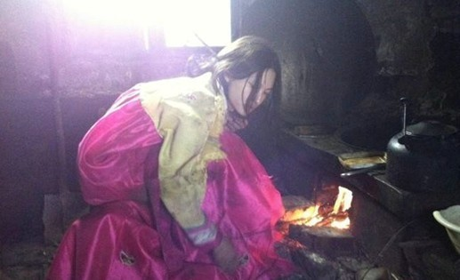

# 九月

###一
演出结束，帷幕落下。后台演员们已经开始匆匆收拾道具服装等东西准备离开。她谎称去厕所，团长狐疑地看了她一眼，应允了，“给你三分钟，我们准备出发回到伟大的祖国。”她拼命使自己脸上不呈现出什么特别的表情。

她走在剧场的甬道，短短十几米，她觉得无比漫长。她觉得每走一步心跳都会加速，每走一步脚都在颤抖，每一步踩下去都像是踩在棉花跺上。她突然想起自己的丈夫每天是不是也走在这样黑暗的甬道中，在地下。她感觉到两颊发麻，两眼发涩。她的手终于搭在了甬道尽头的门把手上，冰凉。“这是不是背叛了领袖和祖国”随着这样一个念头闪过，她用力推开了门，光线和恐惧涌进来淹没了她。

跑。这个动作一旦开始就不能停止。她身上穿着的还是黄黄绿绿的演出服，在经过一扇小铁门儿的时候不知被什么挂住，撕裂了一条儿。跑。一只鞋子掉了，就把另一只脚上的鞋子也干脆甩掉。跑。用尽全力。就算肺像被刀割一般疼痛也不敢停。跑。她脑子里只有这一个念头。跑。

她也不知道自己跑了多久，跑出去多远。她眼前越来越黑暗，一头栽倒在旁边的水沟中。脚上的白袜子变得乌黑，红色的血正在渗出来。

“叛徒。”这是她昏倒前最后想到的事情。

###二
醒来时她发现自己正躺在一堆破棉被上，不远的地方亮着一只瓦数很低的白炽灯，灯光昏黄。除了一个小桌子，桌子上的几个罐子，地上散落的一些不知是什么东西的破烂儿，再无其他。她惶恐地想坐起来。发现自己的两只手腕儿被一根粗重的麻绳缚住，绑在了黑暗中的不知什么地方。冷。脏。疼。

伴随着有点儿刺耳的声音门开了。一个人影逆光出现在门口。门关上后，借着昏暗的灯光，她看到那是个穿着邋遢的男人。一头乱糟糟的头发应该是很久没有洗过，身上的棉衣有些地方露出里面的棉絮，他的脸和他的衣服一样黑乎乎的。他朝她说了句什么，咧开嘴笑了，露出一口黑黄的牙。她听不懂。

他走到桌子边用搪瓷缸子喝了一口水，又到屋子角落捣鼓了一阵儿，像是在捅炉子。是的，她感到暖和了一些。他拖了一把椅子坐到她面前。背对着灯光，她看不见他的表情。只能感觉到他在笑。灯光晃得她头晕，想吐。
他突然扑过来撕扯她的衣服。她想反抗，可是双手被束缚住了。她挣扎了两下就不动了，任凭那个人摆布她。她知道自己没有被抓回去。衣服被撕烂了，她感到无助，羞耻，愤怒，恐惧，悲伤，同时心里又生出了一种莫名的情绪——她有点儿想配合这个男人的动作，取悦他。
下体从剧痛到麻木，最后居然一波又一波快感袭来。她彻底放松了。
“就算这样，我也自由了。”男人伏在她的身上喘着粗气，她的脸上出现了一抹诡异的笑。

她在昏暗的小房子里判断不出时间的变化。只知道自己始终赤裸着身体，蜷缩在一团破棉被烂衣服中。那个男人大部分时间不在，回来之后便会给她一点吃的，然后强暴她。她手腕上的绳子从来没有被解开过。她不知道怎么同那个男人交流，她对他说放了她，她不会逃走，她还会伺候他，给他做饭，满足他。怎样都行。每次换来的都是几耳光或者几脚闷踹。
不知道过了几天。门再次打开的时候，男人旁边跟着另一个穿着制服的人。她突然明白了发生了什么，愤怒地尖叫，可是因为一直没有吃多少东西而显得无力，那声音像是一只被掐住了脖子的鸡。

男人给旁边那个警察一指，便兀自凑着灯光去数刚刚警察给的信封里的钱。五张红票儿，没错儿。他咧开嘴笑了，露出黑黄的牙。

###三
老王今年五十四了。在中朝边境的哨所一呆就是三十年。前两天老王接到通知，说这个礼拜干完，下个礼拜就有人过来接替他的班儿了。“我懂，这意思就是国家需要不着咱了。”老王低声对自己养了好多年的老狗喃喃自语。九月。惨白的阳光斜斜地穿过林子照在哨所的旗杆上，没有温度。

最后一件事儿应该就是交接一个女犯人给对面儿。交接完了，就该退休了。老王不太明白为什么每个月都会有罪犯从对面儿往这边跑。反正他管不着这事儿。他的工作就是截人。交人。这三十年，他这哨所还从没出过什么乱子。第二天早晨交接，那个女人要在这羁押上一宿。
老王折了根树枝在地上划了了圈儿，像是个句号。撂了树枝转身回到了哨所。

那个女犯人被关在房间里一个用铁栅栏隔出来的小单间里。就和普通的囚犯房间一样。她身上的衣服破破烂烂的，还是男人的衣服，也不知道是从哪儿弄来的。头发凌乱，手脚和脸上都是伤，不过还是挺好看的。她跪在铁门前，两手握着铁栏杆。老王一进门，她就迫不及待地对老王说话。

“像你这样的人我见得多啦，你们说什么我也不懂，也没心思弄懂，省着点儿吧啊闺女，明儿把你送回去。”老王坐在桌子前，戴上了老花镜儿，翻开了前一天的报纸。

那个女人仍在说，语调急切，像是恳求。继而哭喊了起来。过了一会儿变成了低沉的啜泣，然后便沉默下去了。老王的视线从报纸上方越过，看到她不知什么时候把上衣解开了，露出了浑圆的乳房和诱人的胴体。她直勾勾地望着他，眼神决绝而绝望。

老王叹了口气。放下报纸。从桌子下面的柜子里拿出一件儿干净的衬衣，还有一方毯子，走过去，从栏杆间递过去给她。她不知所措地接住。老王转身到外屋做饭去了。回来的时候，她已经穿好了衣服，靠着栏杆，依偎在角落。

半夜的时候，老王醒了一次。黑暗中，他听见那个女人在唱歌，非常轻，有些沙哑。

天亮了。老王和另一个年轻哨兵带她向对面交接。对面来了两个人，穿着绿军服，大盖帽，滑稽的正步，表情严肃。填完交接手续，一个人从后面揪住那个女人的头发，另一个人从一个口袋里拿出了铁丝和榔头。

老王好像听到了铁丝穿过皮肉的声音和膝盖骨碎裂的声音。也好像什么都没听到。他看到那两个哨兵拖着那个女人消失在视野中。

###四．
老王坐在小酒馆儿里，身上已经不再穿着那身再熟悉不过的制服了。小酒馆的电视里正在放着新闻联播，经济发展云云，国家改革政策云云，中朝建交周年云云。老王倒了一小杯二锅头。他拿着酒杯，突然怔住了——自己年轻时的样子。妻子的样子。孩子刚出生时的样子。第一次当上哨所所长的样子。三十年来他交接过的每一个犯人的样子。那个女人的样子。歌声。哭喊声。尖叫声。枪声。那个女人。榔头。铁丝。那个女人。地上的两行长长的血。

他一仰头，一饮而尽。酒很辣。他什么都看不清，两行老泪落下来。

