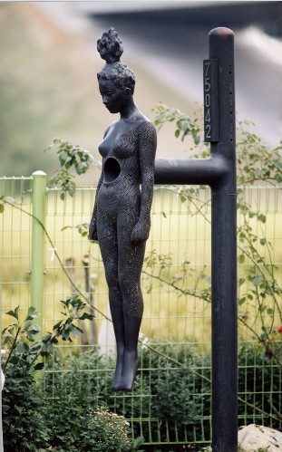

# 蚯蚓

他！

是他！

杜丽娘从梦中醒来阴部湿凉。窗外急雨如倾，雨声盖住了她呼之欲出的惊叫。她圆睁双眼呆呆望着帐顶，内心好似有无数错综弯曲的黑色毛发粘连缠绕着，裹着猩红肿胀的组织一跳一跳。 

宿命降临时的世人，模样往往活像蜡板上待剖的蚯蚓。它们惶恐挣扎，甚至自断其尾。它们用一切行动表明它们对于这冥冥造物之手的困惑不解。它们本可以选择顺从地平躺下来，镇定安详地等待宿命之刃沿着背中线一泻而下，等待无物之针将它们蜷曲的体壁展平钉于身体两侧，等待命运拨拉开它们的隔膜、环肌。

不，它们不愿意。它们害怕暴露自己肮脏下作的消化系统与生殖器官，它们听到命运的法槌敲下却恐惧地捂住耳朵，它们拒绝让造物审视自己当初的作品，它们不愿将自己献祭给某种崇高。它们拼死抵抗，断肢以拒，它们以为自己才是自己命运的主宰，罔顾若无命运之手的钦点，它们根本就不会降临到这个世上。

十六岁的杜丽娘在一个春夜的梦中撞见了她的宿命，她的身体率先一步反应过来分泌出粘液来迎合，她的潜意识在梦中欢叫：他！是他！然而鸡鸣后逐渐夺回头脑与身体的主动权的丽娘却远没有那么果断坚决。她初做此梦时并未声张，甚至没有告诉她贴身的丫仆。她反省是否是自己白日里耳间灌多了咿咿呀呀的艳曲，眼底进多了听雨拍阑干的句子，鼻中嗅多了青衿白脸的戏子身上的脂粉气，才至夜半有此奇想。 

这样是不好的。她清醒的头脑做了判断，并下了闭门不出念经诵佛一阵的决心。蚯蚓在蜡板上挣去了尾巴。 

似乎奏效了一阵，然而一旬后梦中人再度于三更飘然而至，孔孟庄老释裹挟各自旗下的万千弟子，却不敌那条迷离扑朔的影。未隔几日事便过三，她再没能掩住脸上的恍惚之色。断肢处钉下的针，更尖，更疼。 

贴身丫鬟春香在给她梳头时随口一问，她便张皇而泣，自诉恐是中了邪魅，吓得小丫头捂着快要跳出的心就奔去告诉了老爷夫人。那杜老爷再忙不迭地去往了镇中最有名望的梅花观请来素有名望的陈道长。 

丽娘隔着纱帐对着陈道长支支吾吾说完了自己记忆中的这几次梦，只不过隐瞒了自己身体的反应，但称是心慌意迷盗汗焦虑。道长何其仁德，当下掘其所知写了方子，令杜府家仆抓取配好早晚服用。另画符数十张贴于廊中梁上、房前屋外。 

三日后不料邪魅依旧未退再度来犯，众人皆曰见效恐未如此之快，再等等。七日后噩梦不息，半月后梦魇愈烈，丽娘的身子倒开始发虚。众人以为病程至此，反是吉兆，山倒之后，抽丝可期。一个月后丽娘已然不时便浑身燥热，醒来满面鼻血。杜母见之心焦，再去请了陈道长出观来看。道长心有恻恻，倾其观中弟子，为杜府做了场大法事，不顾年近七十的岁数亲自挥动桃木剑为其驱魔。府中上下见之莫不感动，观中弟子亦为其师之毅力精神所感染，各自心中暗暗立誓，要将这一辈子奉献给华夏最为壮丽的事业——为解放民众身心而与妖魔邪怪作斗争。 

数月之后丽娘并无好转，身体日渐孱弱，意识亦陷于飘忽，梦中作祟之人在白日里彷佛也对其调笑招手。一直兢兢业业侍于枕榻的春香终于听清，小姐之前偶然无意识呼喊、如今反复挂在嘴边的那三个字，乃是“柳梦梅”。道长得知断定这必是附身狐鬼之名，再次府上施法时对此名所指代的对象隔空恩威并施，时而柔声劝其不可再纠缠无辜且为转生修善积德，时而厉色赌咒其永陷炼狱不得翻身。没人有心思去计较这其中的自相矛盾。杜老爷杜夫人四十未至，便双双在半年里愁白所有须发。春香日夜服侍其主，在榻前求天公开眼放过她那聪颖心善的小姐，愿替其受此责罚。 

然而众人之诚心并未驱走邪魅，更无天降神威。命运磨利了刀刃，做好了下剪的准备。 

丽娘如今身体之虚已然下不了床，服下的汤药使其昼则面孔蜡黄，入夜转为潮红，伴随着整宿整宿的高热。她似乎再也不做那个梦了，她根本就再也不踏踏实实地睡着。她的生活反倒成了梦魇，睁眼闭眼都是“柳梦梅”。在绝大多数时候，她已不能想起自己作为杜丽娘的一生，却执着于此生所爱名叫柳梦梅的信念，纵然其在过去的二八年华里，从未痴想过什么爱，亦对这柳梦梅彻头彻尾一无所知。 

窗外柳梢月圆，杜丽娘在暗夜中猛然睁眼。百余日未曾下床的她头发粘腻纠缠作团蓬于枕上，棉尿片湿冷，然而她和她的下体仿若并不在意。她抬手推醒了伏在她腿边打盹的春香，让那迷糊中的丫头给她点盏灯。丫头瞪着她就要去唤夫人，却被她制止。她轻声细语地对那丫头说：“你道是怎么回事？原是北安杜镇守之女丽娘，与那柳梦梅后日有姻缘之分。杜小姐春夜受命，因有此梦。”春香被她的神态所震，不知如何接续，脑中同时有了两个念头，一个欲尖声叫喊“我的小姐丽娘她疯了！”，另一个则不问缘由直想号啕哭丧。她终究没有号叫出声，只是拉着丽娘的手挂下两行清泪。秋夜干凉，可没等她的两颊因布着泪迹紧绷发冷，她的丽娘便已含笑阖去双眼。 

十六岁的杜小姐下葬那天，一多半的北安镇民惦念着她昔日聪慧可人的乖巧淑女形象自发来至灵堂吊唁。陈老道长当着众人面痛心疾首地自责除妖不力，两行老泪从他瘪下的面颊一直挂到花白的胡须梢。春香也随着其主人的离世很快病倒。闲言私语传开，说是镇里的柳树与梅花恐是此次邪魅的源头。因为恐惧噩梦而不敢入睡的镇民熙熙攘攘挤满了梅花观求个说法。几日后道观再次倾巢出动搜查全镇，将北安方圆十里的柳树梅花尽数连根掘出纵火焚之。梅花观因凭祖师之训未得更名，只是从此再无梅花。几乎全镇的人都望见了那天的火，即便是瞎子也至少闻到了空气里弥漫的焦味儿。妖鬼死去几何未可知，但镇上的孩子们在此后的一段时间里总是能随处捡拾到干瘪的蚯蚓尸体。他们想当然地以为这是命运给予他们快去钓鱼的指示，奇怪的是没有一个大人对此有半分注意。 

大人们注意力全部放在了团结一致同心抗妖这桩大事上。梅花观的众人因显而易见的尽心尽力姿态被镇中各家奉为座上宾。为了帮助全民防患，他们已承诺下无偿赠符低价做法的义举。当然了，这很大程度上要归功于陈道长不求蝇利、一心救北安人民于水火的拳拳之心。而好客的民风无疑受到了影响，外来生人不出意料地或多或少开始受到或明或暗的猜疑与排挤。 

数月后一个书生进京赴考路经北安镇，挑选借宿地址时鬼使神差选择了一幢门庭有些冷清的大宅。当他报上名姓的那一刻，杜府的看门老头便开始了持续数旬的癫癔。精神较为强健的伙计一路小跑到了道观，很快道士们就备上绳索铁链登门带走了这位懵然无知的柳姓书生。在杜府众人与全北安镇人民的共同决议下，这位貌美年轻的无知书生最终得到了和他姓名里柳梅一样的款待：满身符咒，焚焦于火海之中。 

陈老道长趁空气中那奇怪的气味尚未散去，赶忙宣布了令人心安的消息。灾祸源头已除，北安人民终于不再畏惧夜里做梦。但这宁静也只是一阵子。很快，这些无辜的人民又将陷于惶惑，再次挤满梅花庵索取符咒、预约法事。一个年轻俏丽的幽魂将长期在入夜后的梦里梦外与他们照面，她的名字，叫杜丽娘。

(采编：张山骁；责编：刘铮；)