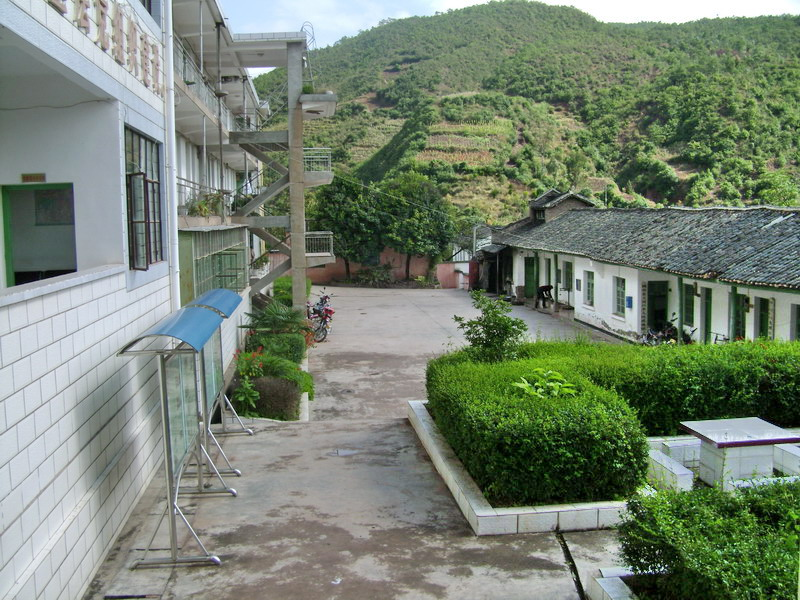

# 裸奔之间

我十一，爸爸事业勇攀高峰，成为学校英语学科负责人和班主任，妈妈妙手回春，连续被评先进个人和模范医生。于是，他们把我的早饭和午饭都托付给了大伯。大伯是政府公务员，据说也算个官，时间精力都很充沛，伯娘没有职业，是成都麻将型家庭主妇，负责照顾大伯跟表哥表妹的日常生活。那时他们的家，就在政府大院后面的花园里，一座哥特式的土家族平板房。

周一到周五，我的早饭和午饭都在大伯家里解决。或许是因为习惯了口味，整个暑假我几乎天天都过去。其实，蹭饭是其次，重要的是小伙伴。那两年夏天，以前在学校一起玩的小伙伴们，无论男女都陆续搬走。政府的院子是个大杂烩，四合院的长廊里，铺满灰的操场上，随处都有电厂医院街上各处的小伙伴。我最要好的是黄狗，他年纪大我一点，经常带我去炸屎、抓螃蟹、扎自行车轮胎......这些事在重庆方言里有一个统称的词，叫做搞卵棒。一般来说，都是我们想方设法搞别人。没想到，他也搞了一次我。SHIT。
    
大伯家的浴室喷头破旧不堪，喷出来的水有时候跟小孩撒尿一样。房间是一段狭窄走廊延伸出来的不规则立方体，整个人都躺不下。但这都不是我不在他家洗澡的原因，大伯有个嗜好。每天吃完晚饭，大概六七点钟的光景，他要么和客人闲聊，没人的时候就坐在客厅沙发上，拿起麦克风歌舞人生，十有八九是红歌，伯娘在旁边织毛衣，也不知道缝错了多少针，表哥在里面打游戏，估计万年过一关。
    
搞卵棒了一天之后，我和黄狗满身疲惫，臭气熏天，却不忍走进大伯家走廊尽头的浴室。伍迪艾伦有部新电影，《爱在罗马》，里面那个罗马大叔喜欢在洗澡的时候清唱帕瓦诺蒂，怡然自得，好不清爽。但如果在清洗下体的时候，耳边突然响起：“南泥湾好地方，好地呀方，好地方来好风光，到处是庄稼遍地是牛羊”“学习雷锋好榜样，放到哪里哪里亮，愿做革命的螺丝钉，集体主义思想放光芒”，难免心中会荡起涟漪。一个大腹便便的中年大叔，就这样被蒋大为灵魂附体。于是，我们决定到大伯家对面的政府大楼里去，二楼的洗手间边上有一个宽敞明亮的大浴室，喷头不再像小孩撒尿，简直扶摇直下三千里。我和黄狗洗澡的时候，喜欢一通乱扯，反正洗澡舒服又免费，能呆多久就呆多久。
    
有一天，我们起了争执。具体事情我已经记不清，但由于黄狗小时候在山东半岛生活，而我的语文课成绩从未及格，所以有可能是这样的：我问黄狗家以前在山东哪，他说在济（四声）南，我说别瞎jb扯，哪来的济（四声）南，明明是济（三声）南，他自己弄混了还嘲笑我不会普通话，于是，在两个人打着肥皂粉、争得面红耳赤时，我走过去狠推了黄狗一把，做出强硬的示意，他看着我好像很生气却一言不发，无辜的眼神惹人怜爱，这个场景现在看来或许可以有另一种解释。他用力一甩毛巾，忙乱地穿上衣服跑出去了。骄傲之后，我感到有点惭愧，毕竟我是地头蛇，而他身在他乡被人欺负。道个歉吧，我心想，说不定还能被表扬，知错会改。洗完澡，我走到隔间准备穿衣，却发现柜子里除了一块圣斗士战神卡什么都没有。反应过来之后，我先一口大骂：“XXX！黄狗！我XXX！”接着一阵大叫“Help！Someone！”，最后才想起值班的大姐在三楼，其他人都已经下班。而此时此刻，先前黄狗下楼梯急促的脚步声仿佛回荡在我的心头挥之不去，这个胖子肯定跑得不远。
　
我决定裸奔。那学期我上四年级，正是花样年华而又纷繁的日子。

我决定裸奔。拿起圣斗士战神卡和肥皂，我就一路往外狂奔，下楼梯时门口大爷端着茶杯抽烟不为所动，跑出政府大楼，我再也顾不上别人的目光，就像被转了好几圈上足马力的玩具人，在楼顶国徽透过夕阳斑驳的倒影中，驶过。看到黄狗时，他在正前方，离大伯家门口十多米。我大叫一声“X！”，黄狗转过头吃惊地伫立着。这时，大伯正在唱K，“远方的客人请你留下来”“在太行山上””“十送红军”，革命和友谊的旋律飘荡在我和黄狗距离的连线上。刷的一声，我冲了过去，一丝不挂，无所畏惧。坐在门边织毛衣的伯娘看见此情此景，只大吼了一句很难翻译过来的方言，大概是这样的意思：“老子信了你的邪！”话音未落，我已经疯狗似地从黄狗手中夺过衣裤，赶紧跑进屋里。穿上之后，我才恍然回想起那风驰电掣的一幕幕，用脑哥的话说，“诸多情绪唯有自知”。伯娘敲响房门把我叫了出去，看得出，她竭力忍住没笑。大伯正在唱“东方红”，他旁边坐着抽烟的人叫宋二，宋二看到我立马开心地叫起来，一连发出很多个拟声词。伯娘急忙为我开脱，“别拿他开玩笑了”，而大伯则一直在从旁阴笑，在伯娘眼神的示意下才说了几句玩笑话。没过多久，他终于主动开口：“来，跟我唱一首《小白杨》”，麦克风倒在了我的手心上。
    
此前，我对红歌一直很反感，觉得调调很奇怪，而且清一色的男女中高音，更受不了那些大腹便便的中年大叔们还都很陶醉其中，大妈们也听得有劲。傍晚的广场，总是被在土家苗族民歌和革命红歌中欢呼雀跃、身姿矫健、舞步悠扬的人们包围。可自从那次裸奔之后，我对红歌不再那么反感。因为它一如我裸奔时所带过的风，是露骨的，性感的，抒发的，而这就是音乐。
    
很多年后，我暑假回家，被电视台领导和大伯拉去参加活动，坐在贵宾席后排。活动开始，前面坐过来一个大叔，身影觉得很熟悉，一拍肩膀，原来是宋二。听说他身兼数职，已然是大哥大级别的黑帮教父，最近良心发现正带领乡亲们发家致富，不少人为此开上了奥迪，用起了小米。第一个节目是红歌秀，照例是大合唱《最美还是我们新疆》，他看着看着，饶有兴致地微微一笑。真是谜一样的双眼。

(采编：张山骁；责编：刘铮；)