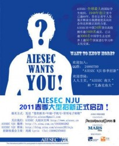
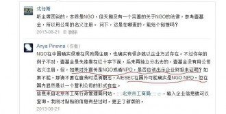

# 第七十五期：AIESEC

**编者按：**AIESEC作为一个非营利性组织，因其财务问题（中国大陆区）被推上了舆论的尖口，那么AIESEC究竟是一个怎样的组织？本期百科将带读者了解AIESEC。

## 词条简介**：**

AIESEC（法文全称Associiation Internationaledes Etudiants en Science Economiques et Commeruales），即国际经济学商学学生联合会。于1948 年成立于瑞典斯德哥尔摩，其组织性质为国际性、非政治性、非营利性，是由在校大学生或新近毕业生学生独立运作的组织。

## 目录：

1 AIESEC的发展历程

1.1 起源

1.2 发展

2 AIESEC中国大陆区情况

3 AIESEC的组织性质

3.1 非营利组织的概念界定

3.2 NPO与NGO的产生背景

4 参考资料

5 延伸阅读

## 1 AIESEC的发展历程

###  1.1 起源

1945年，第二次世界大战结束。在战后萧条的法国，有一位主修经济的大学生 Erik Malson，刚满23岁。Erik写信给一位七年前在瑞典认识的德国朋友，希望能知道他的近况以及德国战败后的情形，即使知道回信的机会很小，他还是寄出了这封信。然而，一个一个月过去了，依然没有回音，他也渐渐淡忘了这件事。

直到六个月后的某一天，他收到了回信，是朋友的姐姐寄来的。信中写到，“弟弟已经在苏联前线战死，父亲则失去了一条腿，而其它的兄弟都失踪了，对整个家庭来说，一切都结束了。”在悲伤之余，Erik 觉得自己是不是可以做某些事情，来阻止这种情况再度发生。他想，或许可以试着联络在欧洲各地的朋友们，因为这些人将来都有可能成为社会上重要的管理阶层，并直接参与欧洲的重建工作。于是，他决定写信给他的朋友们阐述他的理念。

在1947年一月收到了三封回信之后，Erik开始觉得有足够的信心继续做下去。经过了几个月的联络，他确定有来自不同国家的七封信，并对此深感兴趣。于是，在1948年三月，七个来自不同国家的年轻人在斯德哥尔摩的 Grand Hotel 召开了第一次的聚会。会议的内容不外乎如何避免战争爆发以及欧洲战后的重建工作。在热烈的讨论中，英法文夹杂着进行，却对彼此的沟通丝毫无阻。

他们认为，战争的发生是因为对彼此文化的不了解、没有包容心。同时，在欧洲的重建方面，则需要相当多具有实践经验的管理人才投入，或者借交换计划的执行，让来自不同国家、不同文化背景的年轻人，有互相交流的机会，来增进人类彼此之间的了解，避免因误解而引发的战争，并在实际交换的研习过程中，获得各种实务管理的机会。

他们决定成立一个组织，必须是非政治性，且完全由学生运作的国际组织，来执行交换计划，并且号召愿意为了文化沟通及人类发展而努力的大学生。

·1948年，AIESEC，这个传奇组织，至此正式成立。

###  1.2 发展

**AIESEC 的早期发展**

在第二次世界大战之后，这个世界最迫切需要的，莫过于重建饱受战乱之苦的欧洲以及增进国与国之间相互合作的关系。AIESEC 的创立以跨国性的交换计划为宗旨。当时的社会组织正采取各种方法来应对这与时俱变的世界，并设法满足其需求。**而AIESEC把重点放在藉由交换学生的计划，在人与人之间建立友善的关系。**

· 1949年 第一次 AIESEC 交换计划有89位学生参加

· 1949年-1954年五年内 几乎所有西欧国家迅速加入 AIESEC（包括英、德、意、瑞士、西班牙…）

· 1954年 首度扩展至西欧以外的国家（土耳其、希腊、以色列），并开始和其它国际团体展开交流活动

· 1957年 随着美国的加入，AIESEC 首度跨越大西洋

· 1958年 哥伦比亚及委内瑞拉及南非获准加入，更是跨出欧洲一大步

· 1959年 加拿大、葡萄牙、爱尔兰相继加入，自此进入蓬勃灿烂的60年代

** 20世纪60年代**

随着国际间事务的日渐频繁，对于那些曾接受良好教育、具有专业技能，并具有国际观、曾有旅居国外经验的人才的需求也渐渐增加。在此环境下，AIESEC的 Global Exchange Program数量增加。

AIESEC 的成长显示了 Global Exchange Program 对多国间的合作是具有影响力的，而这种合作的观念也渐渐地由西方国家扩展到尚未工业化的地方。

**AIESEC 在此时策划了它的第一次重要会议－国际事务教育研习会( Education for International Business )。**这个组织为“国际经营管理能力交流” ( International Transfer of Management Skills)安排了紧密的课程，它的目的是在强调“知识、态度、专业技能与技术在经营管理竞争上所必须的理 念”的重要性。它显示了：AIESEC 不只是国际专业技能交流的媒介，也是学习与就业实务之间的桥梁。

· 1963年 AIESEC 延伸至亚太地区, 日本和韩国入会

· 1964年 中国台湾地区入会

· 1965年 AIESEC 的步伐终于延伸至大洋洲地区，澳洲的加入使 AIESEC 真正成为一个全球性的学生组织

· 1967年 印度、香港加入；举行第一次 Seminar: Traineeship Program

** 20世纪70年代~21世纪**

全球互相依赖论继续发展。全球人口流动率上升，文化间的交流也相对增加。而此时，这个世界的议题正围绕着如何藉由缩短贫富差距，创造就业机会和促进社会整合来使世界变得更美好。

学生与企业界面临越来越多的挑战与责任。AIESEC 变成一个主动的 NGO。AIESEC 除了参与探讨社会发展的联合峰会外，也积极参与探讨高等教育的UNESCO 世界会议。在这个阶段，AIESEC 除了增加和商业界，政府机关的交流外，更积极推广和非政府机关之间的实习生交流计划。它的愿景变为和平和实现人类的潜能。

· 1996年亚特兰大召开的全球会议确定了AIESEC 主要任务回到交换实习

· 1997年全球在线计算机配对系统 myAIESEC.net 启用

· 1999年南非召开的全球会议, 通过了 “AIESEC 2005 – AIESEC 新的愿景”，并作为组织活动的指导文件

** · 2002年 中国大陆区（Mainland of China）正式入会**

##  2 AIESEC中国大陆发展情况

###  1.AIESEC 成员工作内容 

普通AIESEC 成员和基层领导者大部分从事和国际实习生交换项目相关的工作，主要包括与国外AIESEC分会沟通，为中国学生创造海外实习机会；与国内企业、NGO等合作，为国际实习生创造在中国实习的机会；策划并执行项目，注重于社会热点议题等。此外，还有人力、财务、公关等部门，分会的领导团队负责整个分会的战略规划和决策，策划培训，工作目的是通过高效的组织运作，促进基层领导和普通成员的成长。总会负责全国范围内的战略规划，并与分会共同作出抉择，引导并监督分会的发展，与AIESEC 国际总部和其他会员国家或地区保持沟通。

###  2.AIESEC 中国大陆区的组织结构 

总会设有总会主席、副主席、项目总监职务，分会的领导团队由分会主席、副主席组成。无论是总会还是分会，每一名副主席分管一个部门，总部的副主席统领全国各分会相应部门的工作；分会主席直接向总会主席负责，总会在日常工作中的职责是为全国个分会协调，整合资源，并提供培训，而分会在日常工作中拥有比较大的自由决定权，工作任务可以自行决定。

###  3.AIESEC 中国大陆区的人力状况 

无论是总会还是分会，领导团队的任期均为一年，从经验较丰富的成员中选举产生。大部分分会成员为本科或研究生，总会成员可为新近毕业生或休学的在读学生，专业以经济管理 人文社科类居多，约占70%。所有分会均设在211重点大学，各分会规模大小不一， 30~100 人不等，总会团队仅10 人左右，分会每年做两次人力规划，并根据人力规划招募成员。 AIESEC 在每年春秋两季公开向校园招募成员，所有成员必须经过 AIESEC专门设置的面试和培训才能正式加入，大部分分会能维持稳定的人力状况。

###  4.中国大陆区的财务状况 

AIESEC主要收入来自于国际交流项目收取的行政费用和企业赞助，支出主要用于总部和分会的办公开销，项目投资。分会在每年年初向总会提交年度预算，并接受一年两次由总会进行的审计，大部分分会都有明确的财务制度，总会的财务由分会和AIESEC中国大陆区顾问团共同监督。

##  3 AIESEC的组织性质

国际经济学商学学生联合会（法文全称 Associiation Internationaledes Etudiants en Science Economiques et Commeruales），简称AIESEC，于1948 年成立于瑞典斯德哥尔摩。**其组织性质为国际性、非政治性、非营利性，**是由在校大学生或新近毕业生学生独立运作的组织。AIESEC由对世界议题、领导力发展及管理学感兴趣的大学生组成，强调对民族、肤色、性别、宗教、国籍、种族没有任何歧视，其组织的愿景为：世界和平和激发人类潜能，即通过提供领导力发展，国际交换实习岗位，跨国学习交流环境为一体的国际平台，激发青年人的领导潜能，并对社会产生积极的影响力。

###  3.1非营利组织的概念界定

国际社会对非营利组织( Non-profit Organization,简称NPO)的概念界定有多种不同的方式。例如:

**有从发展战略上界定的。**保尔·罗默和罗伯特·卢卡斯提倡的新增长理论基础上形成的可持续发展战略认为，仅仅依靠国家机制与政府组织和市场机制与企业组织这两套社会发展的基本工具，是难以解决政府失灵和市场失灵问题的，因此难以保证人类社会的可持续发展。只有加入非政府组织(Nongovernment Organization, 简称NGO) 与社会机制这第三个社会工具,才能较好地解决政府失灵和市场失灵问题,实现人类社会的可持续发展。**NGO 就是指既不是政府也不是企业的民间社会组织, 是可用于人类发展的第三种社会工具。**

**有从资金来源上界定的。**联合国国民收入统计系统将经济活动划分为金融机构、非金融企业、政府、NPO和家庭五大类。**NPO 与其他四类社会组织的区别在于: NPO 的收入主要不是来自以市场价格出售的商品和服务, 而是来自其成员缴纳的会费和社会支持者的捐赠。**如果一个组织有一半以上的收入依靠以市场价格的销售取得, 该组织就是营利组织,而若一个组织的资金主要来源于政府的资助,那么该组织就属于政府组织。

**有从共同特征上界定的。**阿索尼认为NPO 的管理控制具有不存在利润指标、税收与法律上享受优惠政策、通常都是服务性组织、对目标与战略有更大的制约、顾客不是主要的资金来源、员工大都是专业人员、责—权—利不是十分明确、高级管理层构成较特殊、对资金管理的重要性认识不足等共同特征。**沃夫则认为凡是符合如下五个特征的组织一般就是NPO:**其一是有服务大众的宗旨,其二是有不以营利为目的的组织结构, 其三是有一个不致令任何个人利己营私的管理制度, 其四是本身具有合法免税地位,其五是具有可提供捐赠人减免税的合法地位。

此外,还有从结构运作上界定、 从法律法规上界定、 从特殊目的上界定、 从子类构成上界定, 等等。

###  3.2 NPO与NGO概念产生的背景

美国是“NPO”一词的发源地, 也是世界上NPO最发达的国家。NPO在美国被认为是最容易划清公益组织与企业组织的界限的。即不管各类NPO之间有着多么大的不同, “非营利”就可以概括他们的共性。**非营利又是与免税连在一起的，所以NPO又被叫作免税机构。**美国人不把 NPO称为NGO。他们认为, 美国的公益组织几乎都是私人办的,所以没有必要叫做NGO。尽管依税法美国的NPO 可分为20 多种不同类型，**不过有几点是共同的:一是明确规定组织目标是为了谋取社会福利,二是组织的净收入不能用于私人受惠,三是必须接受公众监督。**这3条就构成了NPO 的基本特征。按照这3条进行经营的就属于NPO。简言之,NPO 就是按照非营利的方式来经营的。

NGO兴起于20世纪70年代， 20世纪80年代以后开始在世界范围内得到迅速发展和普及。目前，NGO对社会发展的推动和影响已经比肩政府和企业，它正在成为社会政治、经济、环境等领域的第三支柱。在以西方发达国家为主流话语的国际文献中，**NGO常常指的是发展中国家的民间组织或非营利组织，它们强调的主要是这些组织同发展中国家较多存在的集权政府的区别，从而带有更多的政治方面的含义。**

**【注】：**NGO和NPO是从不同角度来说明社会团体的性质，这两个概念都是中国近年从西方引进的，对它们的内涵和外延以及概念的解释目前还没有形成共识性的看法。许多美国人喜欢用NPO一词；联合国的各种文件在内和其它许多国家的官方文件里使用最多的仍然是NGO一词。中国传统文化往往把这两类组织称为[公益](http://www.hbdoc.cn/gongyi/)组织或慈善组织，**根据《社会团体登记管理条例》第2条规定，NPO、NGO和社会团体三者内涵互相交叉。**

##  4 参考资料

1 《国际大学生组织AIESEC在中国的影响力和持续发展研究》 梅潇方 

2 [AIESEC hit—harbin institute of technology](http://www.aiesechit.org/)

3 《非营利组织概念界定的国际比较》 李恒光 《青岛科技大学学报》(社会科学版) （第 20 卷第 1期）

##  5 延伸阅读

1 知乎：[如何看待童哲在人人上爆料的 AIESEC 问题？](http://www.zhihu.com/question/21705392)

（编辑：高丽； 责编：高丽）

[【公益追问】财税NGO/NPO](/?p=42138)--NGO，即为Non-Governmental Organizations非政府组织的英文缩写。1952年联合国经社理事会在其决议中把非政府组织定义为“凡不是根据政府间协议建立的国际组织都可被看作非政府组织”。

[【公益追问】<七星视点>第四十七期：理想与现实——刀刃上的埃塞克](/?p=42124)--埃塞克的英文名是AIESEC，名字源自于法语Association Internationale des Etudiants en Sciences Economiques et Commerciales，中文全称则是“国际经济学商学学生联合会”。
