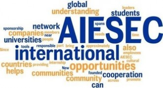

# 第四十七期：理想与现实——刀刃上的埃塞克

## 理想

埃塞克的英文名是AIESEC，名字源自于法语Association Internationale des Etudiants en Sciences Economiques et Commerciales，中文全称则是“国际经济学商学学生联合会”。1948年，瑞典斯德哥尔摩的两名学生在遭受二战创伤后的欧洲创立了这个组织，旨在“通过个体扩大国家间了解”的组织得到了迅速传播。AIESEC的交流方式很简单：不同国家的学生之间，进行互相交换的体验，从而达到双方扩大视野加深了解的目的。

AIESEC的成立是富有理想主义气息的。因为它的性质，决定了其纯粹为大学生之间交流体验的使命，最终目的是为了实现“世界的和平和人类的潜能开发”。

然而之后的AIESEC，随同时代发生了变化。

近十年来，全球化的发展除了将这个国际组织的范围更加扩大外，同时也使得它的主要议题发生了变化：国际贸易、管理学、可持续发展、领导力、企业社会责任和创新。这些新的理念逐渐取代了之前纯粹性的文化了解，随之而来的是强烈的商业化气息。

2002年埃塞克正式进入中国，开始于上海交大，北大，中国人大等高校，随后逐步推广到其他中国高校。新式理念很快受到了推崇追捧，彼时的中国大学刚刚接上中国入世的步伐。作为埃塞克项目核心的海外实习，协同着间隔年、企业文化以及志愿者等新理念在中国大学吹起了一阵至今不灭的火焰。

当青春同梦想、狂热这些理念裹挟在一块，埃塞克的理念就更加吸引大学生的心。“AIESEC的成员均有极高的热情和活力、强烈的社会责任感，有解决问题的能力，有领导力去影响并激励团队里其它成员的工作热情和创新思维，通过不懈的努力和充沛的活力来开展各项活动。”这段截取于国际关系学院AIESEC组织的招新标语正能调动起一切激烈的青春荷尔蒙。

但微妙的变化已经发生。

## 模式

埃塞克在国内的发展远非一帆风顺。

诸多大学将埃塞克从社团名单中除名，不承认其为学生性质的社团组织。可了解到的原因有：埃塞克出国项目难以提供安全保障、埃塞克实习项目产生大量的现金流、海外联络内部会议诸多，挤占了学生大量的学习时间以及出国项目对于学校正常的海外交流造成了一定影响等等。埃塞克实际上游走于多数学校监管的灰色地带，成员的活动不受到学校的认可，活动记录不被列入正常的奖学金加分体系。

埃塞克的销售文化也成为了广被指摘之处。AIESEC将其海外志愿者，海外实习项目视为AIESEC的产品，海外志愿者和海外实习生被看作是AIESEC的客户，而招纳更多的人参与海外志愿者或者海外实习项目看做是一种销售行为。

因此在内部活动中，埃塞克十分看中成员销售能力的培养。因此，AIESEC有比较浓重的销售文化，对分会的评级中，也十分看中销售业绩，如输送多少人到国外参加海外志愿者或海外实习。业绩好的分会晋级，而业绩差的分会会降级甚至关闭。一位成员在反思录中写到：“我一直很反感做AIESEC像公司里追求业绩一样地追求项目实现数目，EP数量多并不代表你的影响力就大、项目质量就好。为什么这个道理大家都懂但还是在盲目地以此作为LC之间能力对比的标准呢。在这样一个时代，企业化的管理和运作方式确实是有助于一个组织明确目标、提高效率、增大产出的。可是我觉得这和我所想象的AIESEC不合。一个公益组织应该靠共同的价值和理想把人凝结在一起并使各人发挥所长,它像一个理想国，不要受到太多外界规则思维方式的影响，不应该太像一个公司企业一样去运营去培训。”

埃塞克一直有“传销组织”的戏称，除了大小会议上的激励性和触发性机制外，这种销售模式般的运营方式则让其他人对其有了“狂热而又鸡血”的印象。一名网友在记叙她在埃塞克做事的室友时说道：“她总在开会，在准备开会的PPT，在和会议的参与者串讲稿，做英文的视频面试，和技术宅技术妞一起校视频内容。她在宿舍呆的时间少了，要么呆的时间总是在忙AIESEC，忙到夜里一两点是家常便饭。她一天要做好多事情，打十几个一长串英文单词的电话。”

埃塞克成员的考评晋升是与其能为多少志愿者建立桥梁的数字挂钩的，而考评成绩的高低则决定了其前往国的好坏。最好的成员有机会获得欧洲的海外实习，而随之递减直至最末的非洲及印度。

## 账目

网上对于埃塞克活动好坏的文章林林总总，都在大学生活跃的社交网络上得到了广泛传播。尽管批评不少，但是各校埃塞克依然有条不紊地运作着。

而此次的发生的碰撞则将埃塞克再一次推向了校园舆论的风口浪尖，甚至达到了一个前所未有的舆情高度。

起因是一篇名为《你欠公众一个解释——AIESEC浙大分会暑期福建项目见闻》的文章，文章中描述了一次糟糕透了的埃塞克DTD活动，所谓DTD，即Dare to Dream，名为“敢于梦想”的留守儿童发展类教育项目。因为主办方的无能，中方志愿者和外方志愿者在福建漳州的支教活动被无序的组织弄得无力而愤怒。作为一次由志愿者支付高额经费参加的无偿支教最终演变为一场闹剧，最终谈判分裂草草收场。

这篇文章如同扔下了一枚定时炸弹，而将这枚炸弹引爆的则是人人网一位叫做@童哲的用户。童哲因为创立了著名的万门大学，而在人人网上拥有巨大的访问量和影响力。这位被称为“童校长”的用户转发了此日志，并写了转发理由“我非常支持AIESEC的全球活动，只是质疑‘大陆区AIESEC总会’（北京埃森克人力资源管理顾问有限公司）是否在做违背AIESEC全球精神的事情。一个项目合作费两万，总会收取一万块，这一万块如何开销，求官方解释。”

他抓住了浙大事件中由埃塞克分会得到了一万元提成作为突破口，步步紧逼。在密集的状态中，对埃塞克的NPO属性进行质疑，同时表示自己手中捏着由“十几位分会长给的邮件，甚至总部的人暗地里给的账目”。

在质疑中，他通过账务查出，埃塞克2012年6月到2013年5月的财务报表中“偷漏税情况极为严重”，同时提出“一年四百多万净利润你们如何解释”的问题。认为本质上“AIESEC大陆区总部（其实是北京埃森克人力资源管理顾问有限公司）的运营模式就是垄断一个国际优秀组织的授权，在国际总会和全国各校分会之间完成一个高额提成，旱涝保收。”

这一系列质疑得到了人人网上面超高的关注度，同时也接连上了热门分享的首页。对于埃塞克的质疑如潮水般涌来，而随之由埃塞克总部铺陈的危机公关也在逐渐展开。

## 回应

@埃塞克中国大陆区公开声明中首先表示：“总会财务一向对内公开透明，所有运营收入均用于支持组织的日常运行开支和促进会员发展工作，并且定期汇报各分会主席，以及受总会董事会顾问团（又称Board of Advisers或BoA，由资深AIESEC校友、公司代表和专业人士出任）监管约束，总会同时聘请专业会计师事务所进行定期审计。”

随后，网友@谢至理根据报告公布了2012-2013财政年的账目：组织总营业额557万225元9角9分。其中总部管理费用187万7131元5角4分，组织培训和项目开销是208万5587元8分，另外还有包括律师费在内的35万9330元其它开销，缴税92573.2元。

与之同时展开的是来自于总会成员的解释。

成员@[窦晨倩Dodo](http://blog.renren.com/GetEntry.do?id=914218648&owner=243248789)针对于高额差旅费的问题提出“做了2-3年校长口中的廉价劳动力，全职做1年总会薪酬福利好点有问题吗”，将埃塞克内部晋升的困难同最终总会的福利政策划上等号，认为作为全职员工“算所有报销1个月1万（真心觉得平均下来一个月有5000就很不错了），加上工资3000多，才多少？”此种福利即使对于正常就职的同辈而言也不算高。

成员@[郑润泽Aoreal](http://blog.renren.com/GetEntry.do?id=914217054&owner=241775947)贴出了具体的总会全职员工工资收入：“工资为430420元，补贴为116913.69元，总会18人，平均月薪+补贴为2533元。对于一份平均工作10小时以上、长期出差的工作而言，实在太微薄。另总会房租19000元/月，对于要给整整18个人办公和生活的地方，实在不算高。”

前总会副主席@[李呈](http://blog.renren.com/GetEntry.do?id=914211675&owner=235883043)的一条回忆当时工作情形的状态：“我很感激我曾是AIESEC中国大陆区总会的一员。那时我靠每月2500元的补贴在北京生活，住在有过猫跳蚤和老鼠的底层公寓，为全国几千名AIESECer和几千名出国志愿者的发展而通宵熬夜殚精竭虑。我可以说我从来没有想过从AIESEC获取过什么，而AIESEC给了我太多太多，那就是：梦想，青春和荣耀。”得到了不少转发。

而他的回忆也得到了另外一名成员@[刘语珊Reason](http://www.renren.com/240097129/profile)的印证：“所谓的豪华公寓里放的是上下铺，十几个人排队用的浴室。「4000多块」的工资我看到的时候还笑了，这是Board of Advisors终于同意给24／7在干活的MC涨工资了吗？所谓的豪华复式办公室，下面一层坐满了人，上面一层开会都不够用，我还记得我为了和其他国家AIESEC打电话实在没有地方说话躲进了茶水间。”

埃塞克总会在对各分会说明情况时列出了诸如“关于AIESEC为何注册为公司而非NGO”、“论分会是否可以收钱”、“论AIESEC的公益性质”、“论我们重视公益的体现”等可能会被其他人提及的问题，并在邮件最后指出了一条逻辑线：“如果我们定义自己是NPO（目前大多LC文案称我们是NPO），从第一点来分析以及结合我们所做的事情，我们没有义务向校长同志和公众公开组织的所有账目。如果我们定义自己是社会企业，我们同样没义务公开账目。然后，实际情况是我们是以一家公司的形式注册的，公司更没有义务向公众公开账目了。”

## 解围

网友@[张克炎](http://www.renren.com/profile.do?id=247155144&ref=minifeed&sfet=502&fin=0&fid=23756025107&ff_id=247155144&platform=0&expose_time=1380111544)在第三方立场上看待两方态度，采取了各打五十大板的方式：“（1）财务更透明是有意义的，这是推动财务效率和管理决策可靠性进步的最大动力。（2） 能够推动进步的质疑是有价值的，无论是建设性质疑或破坏性质疑。（3）如果质疑中出现了事实错误，那就摆出证据反驳事实错误；但关于对动机的揣测、对人格、资格的攻击是可以不出现的。”

而追梦网创始人@[dreamore杜梦杰](http://blog.renren.com/GetEntry.do?id=914129305&owner=232852927)则在批驳童哲对于NPO性质不明和财务公开不分的同时，也提出了一个解决方案。他在发表的日志中，认为不以获取利润为目的不代表不盈利，但也指出中国并没有政策规定NPO需要公开财务。埃塞克的高收费是由市场所决定的。但是为了避免混淆公益与企业之间的关系，建议埃塞克就说“自己是全心全意为大学生服务的受到AIESEC全球认可的中国注册的企业，该做项目做项目，该收费收费，收的多有盈利可以分分红喽，也无须对外公布财务。”

网友@黄宇峰也提出类似观点，认为“既然盈利与营利的关系说不清道不明，倒不如尽快明确公益项目的独立地位，做一套独立的财务系统，当务之急是尽快的‘业务拆分’，公益的归公益，商业的归商业，如此而已。”

危机也是转机。正义不会迟到。请屏息凝神。[郑润泽Aoreal](http://blog.renren.com/GetEntry.do?id=914217054&owner=241775947)在日志《500字给AIESEC》中将这句话作为了结语。等待总部的账目统计结束，再由总部决定是否公开账目是唯一能做的事情。如今来自童哲的声音稍有退弱，但并不意味着这场战役就会据此完结。

中国的NPO的正式发展始于2001年后，正因仅有短短的十几年发展，所以对于各类组织发展的不成熟应该予以更多的包容。尤其是后起的学生组织。

埃塞克作为中国大学里发展国际组织的第一批触网者，这些年来为中国大学开放性做出的努力应当予以赞赏。学生组织的最终受众是学生，而随着观念的进步，学生自身的权利意识也在逐步完善。因而，明明白白算清经济账，踏踏实实做事，才能为自己赢得更多的声誉和支持。遮遮掩掩的方式和网络口水仗并不能解决任何实际问题，与其多一点反驳，不如多一些内省，多一些改善。

清者自清。无论最终结果怎样，此次事件给了更多人一个直观了解埃塞克的机会，也势必将会为未来中国涌现的更多NPO组织提供一个可供参考的事例。

（编辑：方小华；责编：张山骁）

[【公益追问】财税NGO/NPO](/?p=42138)--NGO，即为Non-Governmental Organizations非政府组织的英文缩写。1952年联合国经社理事会在其决议中把非政府组织定义为“凡不是根据政府间协议建立的国际组织都可被看作非政府组织”。

[【公益追问】<七星百科>第七十五期：AIESEC](/?p=42750)--AIESEC（法文全称Associiation Internationaledes Etudiants en Science Economiques et Commeruales），即国际经济学商学学生联合会。于1948 年成立于瑞典斯德哥尔摩，其组织性质为国际性、非政治性、非营利性，是由在校大学生或新近毕业生学生独立运作的组织。
