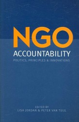

# 财税NGO/NPO

一、NGO/NPO

1、NGO

NGO，即为Non-Governmental Organizations非政府组织的英文缩写。1952年联合国经社理事会在其决议中把非政府组织定义为“凡不是根据政府间协议建立的国际组织都可被看作非政府组织”。在当时，这主要是指国际性的民间组织。非政府组织（NGO）这一概念主要是指“处于政府与私营企业之间的那块制度空间”。它是现代社会结构分化的产物，是一个社会政治制度与其他非政治制度不断趋向分离过程中所衍生的社会自组织系统的重要组成部分。

2、NPO

NPO，即为Non-Profit Organization非营利组织的英文缩写。广义的NPO大致分为基金会、公益服务型、学术交流型、文体联谊型、业务管理型、利益代表型、政治型几种类型。严格意义上而言，NGO与NPO有交叉，但并不完全重叠。

二、NGO/NPO的税收缴纳

1、NGO/NPO有关税种

NGO/NPO也应纳税， 以下将依据我国有关法律与规定，对于NGO/NPO组织所应缴纳的主要税种作一罗列与介绍。

（1） 企业所得税

NGO/NPO和企业所得税并非毫无关系。 对于NGO/NPO而言，应注意：1、收入。所得税法规定，企业以货币形式和非货币形式从各种来源取得的收入为收入总额。因此，接受捐赠也应并入收入。如果政府财政拨款对NGO进行服务采购，这一部分可作为免税收入。2、扣除。扣除包括成本、费用、税金、损失和其他支出，税金不含已缴税款。所有支出必须有正式发票等原始票据，否则不能扣除。需注意的是，来自基金会等机构的项目拨款，应要求分期拨付，并在一个年度内全部支出，如果一次性拨付跨年度的项目经费，按税法规定应全部计入当年收入，盈余就必须全额缴纳所得税。

（2）营业税

NGO/NPO机构很多业务比如项目经费，会议、培训、咨询、出版收入，都应缴纳营业税。只要有经营收入，即按全额征营业税。营业税的税率一般是3%或5%。项目经费收入、捐赠收入、会议、培训、咨询、出版收入，包括场地租金，按5%征收。成员缴纳会费或相关款项，也应计入收入依法纳税。营转增试点暂不提及。

（3）增值税

如果NGO/NPO销售物品，比如纪念品，即应缴纳增值税。比如有些企业把产品捐献给机构，机构再把它们派发给难民，这种行为也要缴纳增值税。如果是来自国外的捐赠，关税和进口增值税都需要缴纳。非营利机构一般会是小规模纳税人，增值税征收率是销售额的3%。

（4）车船使用税

机构名下的车辆，应依法缴纳车船使用税。

（5）城镇土地使用税

除了行政机关等有限的几种单位，机构都要缴纳土地使用税，非营利组织也不例外。如租用楼体，使用部分房产，按实际使用面积缴纳，即按机构使用房产的建筑面积占大楼总建筑面积的比例分摊计算占有土地面积。目前，个人住宅仍免征土地使用税，但机构若租用个人住宅，也应按该住宅土地使用权证上标明的土地面积缴纳土地使用税。

（6）城市维护建设税与教育费附加

此项不再赘述，只要你涉及到营业税、增值税，就要缴纳城市维护建设税与教育费附加。

（7）印花税

不管是工商注册、还是民政注册的机构，都会涉及印花税。印花税是对经济活动和经济交往中书立、领受的凭证征收的一种税。是一种兼有行为性质的凭证税。

（8）个人所得税

作为法人，机构与个人所得税无关。但机构成员所获劳动报酬均应按规定缴纳个人所得税。

2、我国对逃税的有关规定

对偷税的处罚《刑法》有明确规定，偷税数额占应纳税额的百分之十以上不满百分之三十并且偷税数额在一万元以上不满十万元的，或者因偷税被税务机关给予二次行政处罚又偷税的，处三年以下有期徒刑或者拘役，并处偷税数额一倍以上五倍以下罚金；偷税数额占应纳税额的百分之三十以上并且偷税数额在十万元以上的，处三年以上七年以下有期徒刑，并处偷税数额一倍以上五倍以下罚金。从法条不难看出，偷税入刑门槛较低，一万余元就可能判刑，希望诸位公益人士注意，这不是小事，切莫因为自己从事公益就忽视了税收缴纳。（作者注：偷税现已被逃税罪所取代，此处沿用惯用称谓。

三、NGO/NPO财务责任及财务公开

1、NGO/NPO的财务责任

简而言之，非营利组织财务责任包括如下三部分：

法律责任：《会计法》、《捐赠法》、《基金管理条例》、《税法》等法，明确规定了非营利组织的各项法律责任，包括：组织注册、组织营运管理、资金资产管理、接受捐赠管理、投资管理、对社会的责任等等。 会计责任：向捐赠者、资助者报告资金流向流量的会计职业责任（接受资助、受合作协议约定，不论以何种方式，理应向资助者交代资金使用情况）。 公共责任：社会公众认可的责任披露制度：机构建立披露制度、规范披露行为。

换言之，虽然我国当前法律未要求非营利组织定期向大众公布财务报表，但非营利组织有义务尽财务责任，当受到质疑时，应该提供相关材料。真相是最好的公关，如坚持隐瞒不报，社会公众有权利向司法机关举报提请司法机关介入调查。此外需强调的一点是，违规操作很多时候体现在程序不规范，提钱不经过出纳，走账不经过会计。这种事可大可小，不查就没事，查起来全是猫腻。非营利组织财务管理的首要任务就是管好财务活动，厘清财务关系。

2、会计舞弊

会计舞弊不等于会计错误。会计舞弊是指当事人抱着恶意的、不良的企图，并采用伪装、涂改、销毁会计凭证或帐簿等违法手段造成不良后果，存在主观上的故意行为。至于如何避免会计舞弊是机构内部控制的事情，外人不便妄加揣测。这里只是提醒一点，会计舞弊一旦被查处，后果十分严重。

3、NGO/NPO审计

NGO/NPO不是上市公司，没有义务定期公开财务报表。但政府和资助方有权利要求机构完善财务管理，提高会计信息质量。此外每位成员都有权利对机构进行财务监督并提出异议，比如账目不清、票据不合格等，最典型的例子就是该出具发票，结果只给了收据，作为公民有权举报此类行为。需强调一点，外部成员当然有权利质疑财务状况，这也是社会监督的一部分。

4、NGO/NPO财务公开

现阶段，我国大部分NGO/NPO设立理事会，并由约四成机构通过网络、内部刊物等方式公开财务数据。《公益时报》分别于2007年和2012年进行过两次调研，2007年接受调研的机构中财务比较健全的均有不同程度的财务公开，公开形式包括在机构内部会议中、网站上、内部通讯上等等；对资助方的公布也都是按资助方要求提供定期财务报告。财务尚未健全的机构对财务公开也表示赞同和支持，并希望能借此提高机构的公信力。2012年约44%的机构表示愿意并无条件尽量进行信息公开，以提高组织公信力；同样比例的机构表示信息公开很重要，同时要关注成本；也有机构分别谈到信息公开要面对公众质询，付出成本，没有向公众募款的机构不必向公众进行财务公开，不需要向一般职员和志愿者进行财务公开等。显然，财务公开已是我国非营利组织的趋势并逐渐成为主流。

为什么大部分NGO/NPO会选择财务公开？据《公益时报》所言，这与外部环境有关，也与非营利组织自身有关。从外部环境看，公众对于非营利组织的认识和态度还不够理性，尚不能做到有监督、有宽容、有理解，理性看待非营利组织整个行业，尤其是对非营利组织从业人员授薪的理解存在很大误区。一旦对某非营利组织产生质疑，不能做到一方面对自己言论负责，另一方面避免因误会而对该组织造成信誉危机。公众在对非营利组织产生质疑时也缺乏证据意识，尤其是现在网络技术充分发展，部分媒体、公众常常通过网络不负责任地评论，对事件起到推波助澜的作用。外部环境的另一个制约因素是法规、政策的不健全，导致一些机构公开财务信息有可能面临一定政治风险。从非营利组织自身来看，财务管理水平不够、公开的信心不足是重要原因，其次公开的成本及可能由此引起的负面影响也是很多组织考虑的重要因素，此外对于那些主要依靠基金会募集资金的组织，他们也缺乏通过财务公开提升其机构公信力的迫切性。因此目前大部分非营利组织仅局限于从履行义务的角度考虑进行财务公开，而缺乏主动公开的意识和动力。

简单来说，作为NGO/NPO，少不了接受捐赠与成员款项，相应的，就应有对捐赠者与成员负责的义务，保证他们的款项不被滥用挪用贪墨，最好的方法就是各种渠道与方式的财务公开。我们支持志愿工作，但我们反对借志愿之名行少数成员牟利之实。

（采编：张山骁；责编：张舸）

[【公益追问】<七星视点>第四十七期：理想与现实——刀刃上的埃塞克](/?p=42124)--埃塞克的英文名是AIESEC，名字源自于法语Association Internationale des Etudiants en Sciences Economiques et Commerciales，中文全称则是“国际经济学商学学生联合会”。

[【公益追问】<七星百科>第七十五期：AIESEC](/?p=42750)--AIESEC（法文全称Associiation Internationaledes Etudiants en Science Economiques et Commeruales），即国际经济学商学学生联合会。于1948 年成立于瑞典斯德哥尔摩，其组织性质为国际性、非政治性、非营利性，是由在校大学生或新近毕业生学生独立运作的组织。
