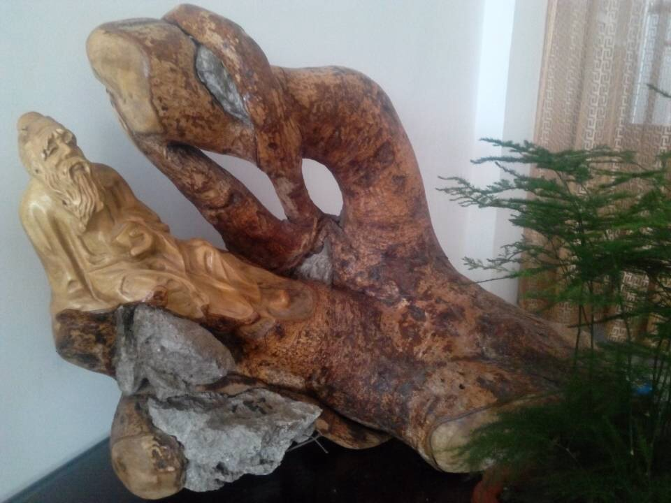
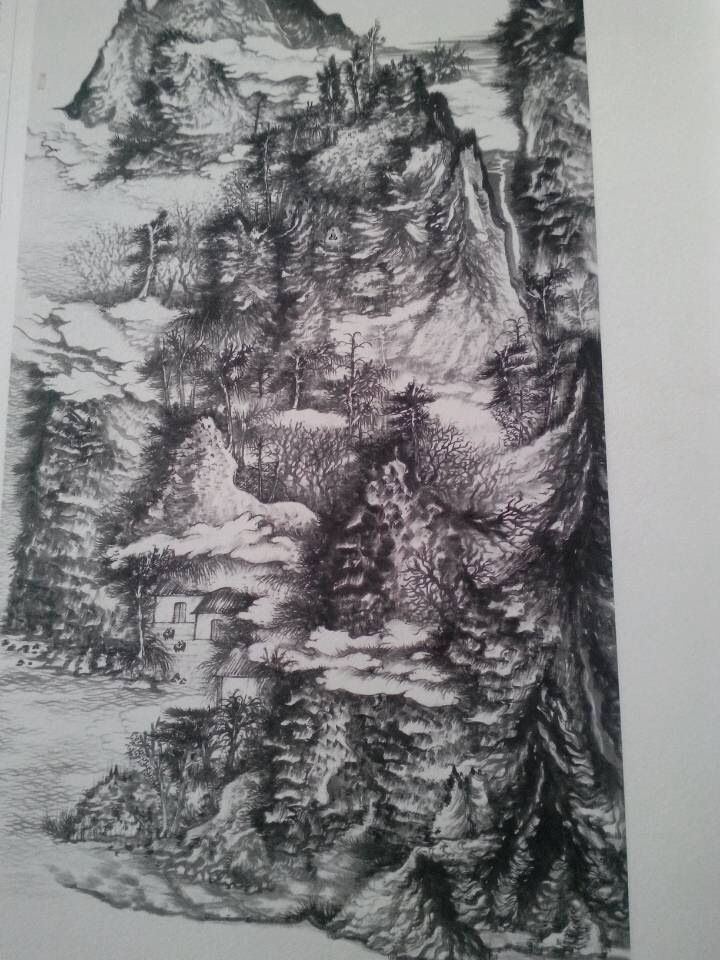

# 【写作者】一个旧体诗人的一个月

2014.02.28
	
早上被短信吵醒，母亲编辑了上百字祝我生日快乐。每逢生日年节，姨妈总会收到表妹的短信，于此事上，母亲对我不无怨念。
	
可我真没什么十分要紧说的。
	
“有事么？”“没事。”“怎么样？”“很好。”“挂了吧。”
	
最近读江湜的《伏敔堂诗集》，满眼的拗体七律，很淋漓很纵横。于是躺床上慕雅手机摁了一首。
	
翌日看看，觉得中二联太费，砍作绝句了。

**【阳历生日得家母短信白字有三】**

**隔阂久不通消息，共席空自诩平安。知信摄生须少食，未宜轻率答加餐。**

2014.03.03
	
刀剑店转出去了，私下做些勾当糊口。找熟人公司挂一闲职，满足了家人让我“进单位稳定”的夙愿。
	
可我真觉得办公室主任好傻逼啊。

于是自作主张换了间办公室。然后不无矫情的写道：

**【当值】**

**从流入职答亲恩，俯首无言乞薄薪。气尽推教人做主，性寒偏耐辱为邻。青天白日筹坚坐，细事平谈过好春。直把闲情贪口腹，莫劳虚话费精神。**
	
这显然不是我风格。微博上点赞的都神马心态。

2014.03.04
	
手头暂拮据，寄居在表姐家。十几个小辈里面，最讨厌外甥女了，因为颟顸肥胖一脸凶相，还硬要人夸美若天仙。因为食肠宽大，不管买多少肉回来，我总几乎一点吃不到。因为每天要陪她下批量五子棋还必须输，否则就哭，须弥崩坏。但同时不得不承认，她是这个屋檐下最伟大的艺术家。
	
“妈妈，你小时候很穷么？不要紧，等我长大了，买好多好吃的好玩的，送给你小时候。”
	
“舅舅，我很生气，我要去远方。”（骨碌碌跑了一圈回来）“舅舅，我刚才去了远方。”
	
于是我愤怒地控诉道：

**【甥女】**

**甥女霸且蛮，食肠阔而猛。自谓身渐长，信乎及屋顶。礼貌罔所知，出言辄隽永。撒娇故不谙，龃龉旋耿耿。忿郁洪声哭，非虚岂俄顷。诸艺擅精博，人嘉矜则领。世态必云学，效舅托酩酊。今尚羸为美，肚腩何妨挺。**

然后我的农历生日就到了。
	
诗人，显然要过农历生日。过生日，显然要写诗。哎卧槽书剑无成啊我真傻逼嘻嘻嘻，哎卧槽怀才不孕啊我真可怜嘻嘻嘻，哎卧槽蹉跎虚度啊我真我真嘻嘻嘻。

**【廿四初度】**

**儿时盼此能糕果，今味烟茶苦亦甘。最好泯然众人耳，差堪聊以俗情耽。勉为初学交游术，早拟如居铁石龛。相看不厌杯中物，纵是知音莫极谈。**

起句至少一个月以前就想好了我会到处乱说？
	
没事再攒个好句，用到今年的《岁暮感怀》里。诗人，显然要过旧历年。辑集，显然要标干支。百度下，今年是甲午删存哼。

2014.03.06
	
公司副总是个风雅人。
	
“哎小韩，我的狗狗游戏呢？”
	
“啊不好意思我有不管用谁的电脑都要清理系统强迫症，我再帮你下一个。”

“哎小韩不对啊，这不是我的狗狗游戏啊。”
	
“这就是狗狗游戏啊。”
	
“不是狗狗游戏，是勾勾游戏，打牌里面那个J，JJ游戏。”
	
“艹那不是狗狗游戏，是鸡鸡游戏。”
	
风雅的副总需要风雅的办公环境，于是买了龙血树，买了龙舌兰，买了仙人球，买了文竹，买了海棠花。我挺喜欢那株海棠，准备混熟了给写首诗。还从来没咏过花呢。我要向副总学习，做个风雅人。
	
可翌日副总约炮，把海棠送给美女了。但我不能不咏物啊，诗人哪有不咏物的。幸好还有文竹。

**【副总嫌办公室冷清进盆栽数本命余布置小几有根雕老者陪以文竹一丛】**

**凿我出真身，雅我繁华地。杯中酒耶茶，纵目天涯际。移来深淡青，妥妥而相对。不近且不远，观之如松意。**
	
是不是很风雅。

2014.03.14
	
本地一位拳师兼习太极八卦形意大成，周末有个表演，打套太极，打几个木板，很傻逼。朋友找我去帮忙拿木板。另一个被找去拿木板的朋友倒不傻逼。要知道，在习武之人里面找个不傻逼的，挺难。
	
完事我们去了他的中医推拿按摩店。那位开手拳跟我一样，太极螳螂。见他容姿沉静，捏了螳螂钩子在客人背上啄，感动莫名。
	
开店时还结识过一位印象甚佳的武友，通背形意八卦。安静和煦。有一首七古后来删掉了，结尾依稀作：
	
**“天涯过从二三子，相逢但说新荷碧。分归独径苍山大月明，莫为寒林感萧瑟。”**
	
王贵良先生是练梅花桩的，几年前朋友给过一段他的视频。

**【观王贵良先生春秋刀视频】**

**一虎来人间，人间何有此。听风闲自忙，不噉亦不睨。细看是猿公，无何忽嗔恚。淳朴兀矫首，天亡岂战罪。醉深真寂寥，吾我周旋戏。生死直不曲，笑哭凭人会。草木持颜色，中心转明晦。坐卧相非相，去住两不意。**
	
这段视频居然把我看哭了。

2014.03.22

**【明天不上班】**

**“明天不上班”，五古方起句。上司推门来，或为彼窥去。窥去又何伤，正愁无所续。递烟恭接来，谈笑昧心腹。春风大撩我，可以即春服。上司旋出门，麻将甫三局。输赢都不计，聊复但聊复。上司亦观我，沙发团一缩。嘴角有时抽，手机何所录。下班时间到，去买猪头肉。**

**【来电两故人】**

**来电两故人，一忧兼一喜。既言当有谓，纷纷絮未已。开口每欲答，能笑莫说嘴。君醉极称荐，酒食案头美。君醒共春风，花可拈可指。**

就知道写得越来越鸡汤老干小清新了。谁让活得这么养生呢，真是诗穷而后工哇。

2014.03.26
	
公司有不少书画册子，盖上流往来的羔雁之具。挑了几本好的没事装模作样看下。

**【读画】**

**位置动逾静，形容阙自满。万山着一衲，趺成归不管。抚松行海市，穷途或退转。横枝促欲攫，空舟孤向晚。峰峦有未到，非云恶其远。方谁梦幻间，石意醉深浅。**

写了一半，领导让我开车去了。在西城听着他们谈生意写完，回家觉得开头不好，砍掉了，又把结尾挪成了开头。

2014.03.28
	
其实这个月写了得二十来首。
	
徒弟误碎我手机屏，透明胶缠起来，安抚了一首七律。后来觉得挺傻逼删了。
	
昆明出事，写了首五古。后来觉得挺傻逼删了。记得句**“或略悉而已，或守终夜阑”。**
	
跟人群聊，写了三首七绝咏麻雀。后来觉得挺傻逼删了。记得句**“卑身亦自有肝肠”。**
	
跟姐夫感慨家事，翌日作了一组绝句。后来觉得挺傻逼删了。记得句**“稚儿灵易感，不敢跪东风”。**
	
大约还有一首菩萨蛮、三首九张机，几首赠人的七律，几首临屏的五古。后来觉得挺傻逼删了。
	
其实还有好多啊，在班归途中，在醉醒寤寐，在我所有不想跟人说话的时候。当然后来都会觉得傻逼删掉，连同眼耳鼻舌身意末那阿赖耶识，归乎尘土。

（采编：刘铮；责编：刘铮）