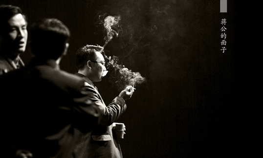
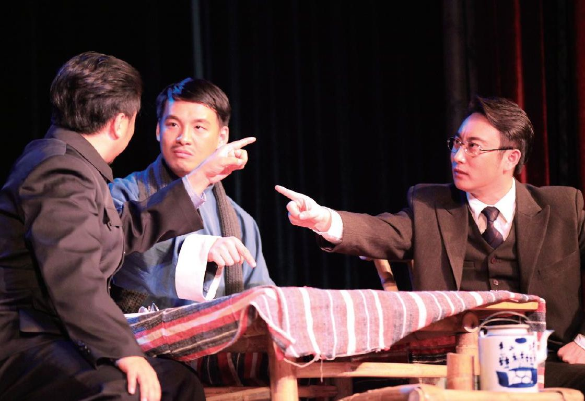
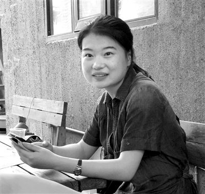

# 【写作者】我写《蒋公的面子》

“戏剧就是把人的灵魂放在火上烤。”

这句吕效平老师的“名言”，我们学生私下里不知道调侃了多少遍。《蒋公的面子》是我的“学年论文”，故事是南京大学老教授中流传的传说。这个题目可以说是非常符合“烤灵精神”。几个教授为赴不赴蒋公的宴席而争论不休，简简单单，不靠情节、不靠动作，只能靠“烤灵魂”了。“烤灵魂”需要多少时间？半个小时？一个小时？作为一个学习过舞台剧写作的学生，拿到一个题目时，第一反应不是主题立意、情节、人物，而是“天！怎么凑出两万字来！”真是有辱师门。为了凑出一个半小时以上的戏，我只能大量阅读各种有关民国知识界的回忆录和文献，反反复复地看《艺术》、《禁闭》和《哥本哈根》。我甚至半为了结局的方便、半为了凑字提出了戏剧分两个时空的想法，谁知吕老师竟同意了。不过凑字还是后话，烤灵魂急需的是“可燃物”。“赞同派”的“可燃物”好找，就是名声。“中间派”的也早就定了，是美食，可真不好找。我本不是一个会吃的人，虽然采购也讲究好米、好肉、好茶叶，可吃喝起来怕是饕客会大骂我“暴殄天物”。不知哪天翻到一篇文人谈“火腿”的文章，灵光一闪，“火腿”非常合适。说它贵，也不贵，教授战前肯定吃得起；说它讲究，又十分讲究，从材料到做法都讲究得很；说它难得，真难得，据说战时金华火腿数量锐减；说它好吃，真难说，不是南方的吃客很难理解南方人对火腿的热情。最后敲定了：火腿烧豆腐！越是家常的菜名越不易露怯。

“反对派”的“可燃物”是最难找的。什么东西能与政治立场相抗衡呢？亲情？友情？爱情？还是某天看到一份关于抗战时书籍古董损失的记录才想到的——书！书是文人的身家性命。烧书、撕书、把有文字的纸踩在脚下，对他们来说都是对文化的大不敬。是的，“书情”，属于文人的痴情，带着智识的傲气，傻得可笑，却充满诗意。

这就是属于三个文人的可燃物。他们的灵魂就这样理所应当地被烤了。

时任道的傲气在骨里，夏小山的傲气在心里，卞从周的傲气在肚里。

在我看来，“面子”是人之为人的必要因素。尊严也好、虚荣也罢，这是人自觉高于其他生灵的地方。对于文人，我更喜欢“傲气”这个词。由于“傲气”，他们尤其放不下“面子”。
   　
时任道是外露的，钢筋铁骨，伤人伤己；夏小山是内敛的，看似友善温和，实则冷眼旁观；卞从周是包容的，大肚能容，也以“大肚”为傲。
    
其实在写这三个人物的时候，心里只有模糊的形象。似乎我也随着剧本的推进在一点一点了解他们。“剧终”后，重阅一遍，他们的形象才如在目前。知识分子都是有“傲气”的，这种“傲气”是落魄的士绅阶层的遗影，是旁观者的清醒。因此，民国时期的知识分子又是自卑的，毕竟士绅阶层终究落魄了，书生的无用较之八股时代更甚。而时代变化之快，思潮涌动之频，又令这些旁观者们再难“清醒”。
     
时任道要引进德先生与赛先生，要肩负时代的道义，可他偏偏只是一个穷儒。人穷志高，易愤世嫉俗。
     
夏小山要洁身自好，要吃喝玩乐。他看透世事，不免有悲观主义者的及时行乐之态。他看透人情，不免任性而动，不近人情。
     
卞从周要推动进步，要实际的好处。他相信文人是政府不可或缺的一分子，却也深知，政治的浑水已将自己浸染得不那么干净。
　　
时任道说：“我研究了半辈子《史记》，仍看不清今日之乱象。”夏小山说：“国事已不可问，我辈且打麻将。”卞从周说：“做一物质上的乞丐，精神上的贵族。”三人都有自己的处世之道，都固执地坚持自己的立场，可不约而同地表现出对现状之不可把握的迷茫。社会将走向何方？我们也为此迷惘着。理论再自信，也敌不过现实的分毫偏离。这三个抬头挺胸、自信满满的文人，处在社会的森林中，也变得“谦虚”了。
   
“谦虚”归谦虚，“面子”还是要的。可怜时过境迁，相对于风刀霜剑之利，面皮终究还是太薄了。
   
“你说的对，我是不会懂的。我真不懂，人为什么这样苦呀？苦得这么深，苦得这么没有代价。”
    
夏衍是个知识分子，他的剧写得最好的也是写知识分子。《芳草天涯》里孟小云对尚志恢说的话，是那个时期知识分子整体的思想写照。那是一个“叫苦”的时代，“苦闷”、“苦痛”满纸，如今再没知识分子敢像那时一样为自己叫苦了。

如今的观众也越来越难为一个“叫苦”的人感动了。看电视上那些苦情戏，最能赚眼泪的人都是最不会“叫苦”的人，他们都是苦得黄连似的，还微笑着温柔地说：“我不苦。”

因此《蒋公的面子》要写成喜剧。三个中年汉子两个小时在台上为了一顿饭哭哭啼啼、声嘶力竭地喊自己的苦痛，未免太矫情。吕老师说喜剧是做出人尴尬的状态。尴尬是什么？是走在马路上突然发现走错了，又不好意思在人群中折回的踟蹰；是答应某事后又想反悔时的纠结；是做错事后百般掩藏却被发现时的窘迫；是几个老友突然找不到话题时短暂的沉默；是发出不合时宜的笑声后接触到他人的目光。把自身的尴尬感受投进剧本，转移到了别人身上，这个过程是很愉快的，因为尴尬总是对于“自身”来说不那么愉快。

第一次去拜访老师的老师董健教授的过程就蛮尴尬。战战兢兢地敲门，进门的一霎竟忘了称呼。董老师很和善，可我还是紧张地一口茶也没喝，到告别时，董老师关心地问：“你茶没喝呀？”我立即拿起杯子一口气吞了大半杯，险些呛出来。出门后，自己都觉着好笑。如今除了董老师讲的那些故事，印象最深的就是师爷的夫人佝偻着背在书房里整理满架满桌满地的书的情景了。
    
时间总是更快消磨掉时代记忆中丑恶的部分，更多留下美好。怀念过去，成了人的通病。我们喜欢怀想民国时期文人的风骨与潇洒。在月影斑驳下吟诵古文，在清流碧波上泛舟拍曲，在古刹秋风中联句品茗。遇见贵人不让路，碰到权贵迎头击。甚至那些婚外情、抛家弃子、八大胡同都成了风流佳话。全不想他们当年是多么“苦”，他们的文字大多离不开“苦”。
   
我希望角色的苦都藏在心里，外表展现的是尴尬，就像裹着糖衣的药丸一样。他们是1943年的知识分子吗？不！我没见过1943年的知识分子。我希望他们是现代人想看到的1943年的知识分子。
  
“沫若自应门，手抱襁褓儿，跣足，敞服（旧学生服），状殊憔悴……然以四手而维持一日刊，一月刊，一季刊，其情况必不甚愉适，且其生计亦不裕，或竟窘，无怪其以狂叛自居。”
   
我已经忘了是在哪里看到的徐志摩日记里的这段话，我也不知道为什么这段话给我的印象如此深刻。胡适与郭沫若的这次会面并不愉快，甚至尴尬得令人窘迫。纸笔相骂时，毫不留情，近乎斯文扫地，然而，一句“无怪其以狂叛自居”，让我多少理解了一些什么叫做“了解之同情”。
  
自小，父母都会指着台上或者画上说道：“这是好人，这是坏人。”于是我们自小都知道要喜欢好人，讨厌坏人。可长大了才发现，所谓的“喜欢”、“讨厌”往往与“好”、“坏”没有关系。有幸生长在一个好家庭、好环境，巴掌大的地方，有几个坏人？可是讨厌的人还是一天天多起来。再长大些，又发现原来自己也并不是讨人喜欢的。人总是想保持自我，遗憾的是，这个“自我”往往可厌、可憎。于是乎，骂过、恨过后，总还是在心里为那个被我骂过、恨过的人找几句辩解的话，毕竟，我也是个遭人骂的。
　　
也许这就是我对时任道、卞从周、夏小山的态度。当然，在情感上会有偏向，在见解上会有倾向。我不会喜欢时的冲、卞的滑、夏的冷，可我还是斗胆以创作者的居高临下的态度对他们抱有“理解”和“同情”。在写他们的时候，回想起许多人、许多话，我把我对这些人、这些话的冷嘲热讽一股脑地塞进这个小小的本子里。写完后，回看一遍，又开始担心是否把他们写得太不“高大”了，是否冒犯了前辈？观众会接受他们，喜欢他们吗？还好，目前结果令人欣慰。我想，一个人，在笔墨中刀光剑影、冷酷无情也不算坏，只要还能不自觉地叹一句“无怪其以狂叛自居”，便还算个好人了。
   
“如果，生而不必为稻粱谋，我愿意一辈子当南大学生。”

历史系张生老师的这句话，让我感触良多。自然，对学校，每个人的感受是不同的。与那些读大学越读越郁闷的人相比，我太走运。有幸进了个喜欢的学校，读了个喜欢的专业，遇到了喜欢的老师，有一群喜欢的同学，“四喜”齐全，多大的福气！有福气，才高兴，才感恩，才惶恐，才写得出剧本。

《蒋公的面子》表面上写的是国立中央大学的教授，内在里是南京大学的乃至一切我所知的真正的教授。一次我听中文系教授在课上批评某名校中文系，说他们的中文系已经不行了，他们的学生过来，一问三不知。可过一段时间，我遇到一位那所名校中文系的教授，他说：“你们学校的中文系学生不行，推荐过来的学生，问什么，什么都不知道。”又一次，我听一老师详细讲述本系另两位教授为一学术问题争吵的轶事，讲得生动如画，大有隔岸观火的自得之态。名校相轻，文人相轻，大抵如此，古今不变。这大概算一种文人气象。在这种气象的包围中，人想不思考也难，而思考正是大学精神之魂。

作为南大110周年校庆的献礼剧，《蒋公的面子》顺利地诞生。这个剧本现在的影响，完全超出预想，这在我看来本是个错误。剧本本身，也有很多错误。有幸的是，有许多好心人指出这些错误。

老师说：“当学生的一大好处就是可以犯错误。”如果可能，我愿意一辈子当学生。

(采编：张蔚涵；责编：薛晨如)

