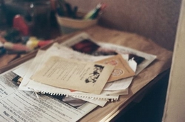
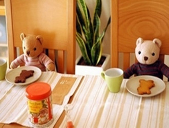
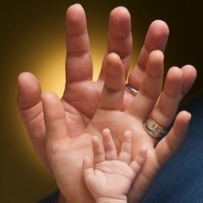

# 写给未来也许不存在的孩子的一封信

肥宝： 

如果你能看到这封信的话，那你真是非常幸运，或者是不幸，因为我从来没有想过自己会有个孩子，同时觉得还在永远热泪盈眶的二十来岁写这种给未来孩子的一封信实在是太奇怪了。不过如果你要是能读到的话，那说明我已经战胜了对婚姻的恐惧，对生育的憎恨，以及对孩子的厌恶，那真是个小概率事件。所以其实说来这封信也不是要和你谈什么，是要和现在的自己谈谈。

我不知道为什么大家可以在二十出头的时候就谈论结婚生子，谈论未来，这真可怕，这难道不应该是一个属于喝酒吃肉、旅行和无望的爱情的年龄？为什么你们都那么确定自己一定会结婚生子呢？如果那个人不出现，怎么还会有婚姻和孩子呢？我不要履行这种动物性的义务，我只在遇见非常聪明、非常喜欢的男人的时候想要与他结婚生子，虽然我一点都不喜欢孩子，但是我觉得跟喜欢的人一起完成他喜欢做的事是非常美好

很多人认为我是个女权主义者，但我觉得其实不是的。我只是跟所有人一样，希望证明自己的存在和价值，只是因为我恰好是个女人，所以你们认为这叫女权，这真可笑。所以在我这种有着很强的自我的人看来，他人即地狱，完全没有办法想象有一天要面对着跟自己有着长期的难以割裂的关系的另一个个体，丈夫还好一点，孩子就真是太可怕了。我喜欢男人，也享受恋爱，我只是害怕婚姻，害怕责任，邱妙津的话很对，“忠诚是来自生命内在的完全打开与燃烧，是一种积极、意志的热望，需要全然的自觉性及实践性...世俗生活要求的是一种被动、伦理道德的忠诚”。而在世俗意义上，婚姻无疑要求忠诚，我一直认为被动的忠诚，出于责任的忠诚毫无意义，然而既然两人之间有着积极的、全然自觉的忠诚，那为什么还需要婚姻呢？

说到底我大概也是惧怕生活变得疲惫、毫无意趣，不得不日复一日地履行下去。我害怕看见衰败。“唯一的真实，就是每逢想到无意义和无穷尽的死就得到苏生，看到行将衰落就炽烈地燃烧起来，光是为着既无方向又无归结的‘感情’而生存下去”，三岛的话我至今还是很喜欢，我要炽烈地燃烧，不要衰败。而我又时常感到一种强烈的厌倦，对整个世界与生活的全部，所以，我这种连有没有未来都不知道的人，还何谈给“未来的孩子”写一封信呢。

“当两个人开始厌烦，因为厌烦而发抖，那就跑掉算了，我有的时候会突然结束某些事情，就是为了不让它们朝更坏的方向去，就是为了逃脱两个人一言不发地吃饭的场面，我觉得真是可怕极了，不再有向对方倾诉一天以来发生的事情的欲望……是的，就是这样，爱情就是想告诉对方一天以来发生的事情，就是你所有的生活里桩桩件件只在于逗对方开心，让他笑，这才是爱情。”但是婚姻就是这样，以及有了你以后，生活可能就变成了讨论奶粉的价格，纸尿片的促销，以及之后幼儿园的赞助费，小学的入学考试，中考高考，再到你的大学要如何度过，能不能找到伴侣，是不是同性恋.....婚姻要操心的事情实在是太多了。当然了，我相信我即使生了你，也不会是个负责的妈妈，我肯定不会操心这么多。我没有义务把我最好的东西给你，至于跟你相处的怎么样，这取决于你笨不笨，是不是个傻逼，你性格怎么样，长得是不是讨人喜欢。所以我觉得我根本不适合当一个妈妈，我的身上缺乏母性，冷酷无情，我也不能想象我对子女会发生无条件的爱和感情。

因此出于对你负责任的态度，我觉得我还是不要把你折腾到这个苦痛的世上比较好。我觉得我生活得并不好，因为我的妈妈，我的姥姥都有抑郁症和焦虑症，我起码是继承了一种极度敏感的天性，世界的一点点响动都能让我疼痛不堪。所以我不希望你来到这世上，像我一样敏感而备受折磨地活着。此刻我只想像野马一样自由自在地生活和奔跑，去一个战火纷飞的国家旅行，然后死在路上，那就没有烦恼了。所以如果你能出现在这个世上，那简直是一个奇迹，像我这种时刻想要放弃自己生命的人，竟然还活生生地造出了另一个生命。

我没有想象过你是男是女，具体是什么样子的，我只是每次都在想，万一有朝一日我要生孩子，生出来一个丑八怪，或者脑子不好使的孩子，那还不如掐死他/她扔到水沟里算了。但是我也并不希望你活得很“成功”，什么从小到大拿奖学金啦，去投行啦，或者是进入体制啦，那多傻逼啊。如果非要有孩子的话，我希望他/她是个很有意思的人，从小就非常独立，不要喊我妈妈，直接喊我全名，或者给我取个绰号，叫我胖胖怪啊什么的就挺好。

其实看起来我对你冷酷无情，是因为从心底里我认为你是一个独立的个体，只有你自己才能对你的人生负责，我没有义务为你提供我所能提供最好的，而你和我是平等的，我们没有互相爱对方的义务。当然我希望我们能够互相都深深爱着对方，但那并不是出于本能，而是出于一种美丽的自发性的情感。

不过有的时候我觉得在这茫茫世上又是如此的孤独，我渴望创造一个和自己有几分相似的个体，然后在我垂垂老矣的时候可以把他/她抱入怀里。你看，像我这样愤怒迷茫的女青年，其实也有温情的时候，所以如果你真的能有机会读到这封信，不要怀疑我对你的感情，我想你也会经历像我一样的时候，充满了怀疑与不妥协。但有一天我想如果你真的来了，我会让你像袋熊一样挂在我身上，再不厌其烦地亲吻你的。因为我们都是这样孤独的存在，只能去爱。

最后，为什么你要叫肥宝呢，因为我胖，我也喜欢胖一点的壮实的男人，所以我想你大概比较不幸地很可能是个胖乎乎的娃娃，但无论如何，我还是想像珍爱尘世中的宝石一样地去珍重你。因为如果你会来到我的生活里，那一定是上天偶然馈赠我的珍宝。

如果生活将你赐予我，我接受，我认可，让我陪你度过你生命最初的二三十年，这也未尝不是一次可爱的冒险。

麦静

2013年五月的最后一天
