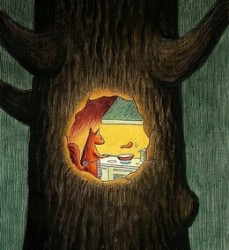
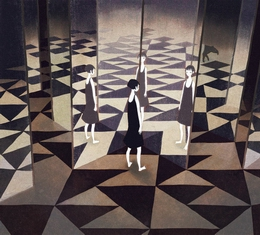

# 写给未来孩子的一封信

你好：

请先允许我讲一段故事。

“松鼠丙继承了他妈妈的遗产，一个树洞，并以此为家，一住就2700多天。

他的独居有一半是生性使然，另一半是因为树洞实在逼仄一洞难容二鼠。

他不是没有想过迁居，无奈想到收拾物什打包展开的折腾他就头痛起来，几次险些从七八米高的树枝上摔下去。

独自在幽暗狭小的地方待久了就很容易进行或许有些多余的思考。有时候他和自己讲好了，今天的最后一顿饭到睡前的时间只允许好好规划一下接下来一周活动，无奈在回忆出洞向右第三棵树时就开始走神。他想起最近地上堆积的针叶越来越厚了，踩踏而过时有一种轻快而又温暖的气氛。他摸了摸自己的尾巴——不，不是这种感觉。如果有另一条松鼠此刻拥在自己的身边，或许他可以摸摸她。他猜想那一定是有着同样的温暖，不过或许不会很轻快，而是绵长与隽永。哪一种更好呢？很难说，他可以随时爬下树干享受松针触感的反馈，轻一脚重一脚，抑或在上面跳舞；但是他不可能随时触碰别人的尾巴，如果抚摸得太轻或许会让对方感到痒的，太重则会将对方惊醒。走神到这里就会有一种疲惫与困倦的感觉向他袭来，他觉得这个问题真是，真是太…应该先睡一会儿吧。

有时候，哪怕对于一只松鼠而言，生活也太会开玩笑了。比如此刻他浑然无知地醒来，感受到拥挤局促。借着晨光粗略打量，才发现洞里塞满了石子儿。是什么在恶作剧？他钻出洞看个究竟，忽然发现地面只剩裸露的干燥泥土，一夜之间松针全部消失。他站在树下茫然无措，脚下坚硬的触感让他想哭，于是他就哭了起来，眼泪把脸上的皮毛板结成一块一块，又染深了脚下的尘土的颜色，他试着去摸染湿的区域，忽然再次醒来。洞里还很暗。没有石头，他的怀里拥着他的尾巴。他感到脸上凉凉的，很开心那是一个梦，也不管是否应该出洞检查下那些温暖的松针是否还在，便又睡着了。”

以上引号里的这些，是我最近试图写下去的一个故事的开头。对于父母，我从很小的时候就觉得，他们应该是给孩子讲故事的那个人。小孩子没有故事，大人才有故事。对于小孩子而言，成人世界的最初是对于故事的一种模仿，而不是相反。我们先是历尽对于它的风闻，从中窥探揣测到它的种种传说，再在某一转身，成为故事里的人。当我们也开始向孩子讲述故事时，我们也自然地成了一个大人。

因此我本来从不喜欢看那些孩子讲故事。他们总是故作老成，假装对于这个世界富有认知的自信。很不幸，迄今为止，我也没有讲好一个故事的自信。我对于这个世界有过也依然有很多意见，但我无法确认它们是否值得借鉴。我至今畏惧承担向人描述一个世界的责任——是的，我至今还不敢确切想象，我会在怎样的情况下决定让你出现在这个世界上，又怎样维持与你的关系。

我对这个世界，至今怀有很多畏惧。最大的一桩，或许就是对于未知的畏惧。而对于此刻的我来说，未知的你也无疑让我陷入深深的恐惧。你知道吗？在我目前众多的意见中，有一项就是认为：人人并非生而平等。外貌、家庭、天赋，种种这些因素在很大程度上是天生就不平等的，我们或许可以通过后天的奋斗来弭平它，但只是或许。我并不怀疑我会深深爱你。但我害怕我会因此对你有过重的寄托。我无法想象，如果我不能给你称意的外貌与天赋，不能给你提供足够好的生长环境，我将如何责怪我自己。我可以尽我所能讲最好的故事给你听，但是我的能力毕竟如此有限，我该怎么弥补这份缺失？以所谓的爱的名义？我深深深深地怀疑。

或许尽力也便是好的。我相信爱是自我要求。它要求人竭尽所能地奉献自我，不问因果。然而即便不问我能给出多少给你，我又该如何确定我施与你的能称你意。你若真能瞧见这封信，想必也会瞧见，在过往的深渊里我曾有过多少惶惑与无助。我很遗憾，我的父母在很大程度上无法帮助我解决那些问题。我也不敢妄自推断，多年以后我能化身超人替你解决类似的问题。但我又是如此地不忍，不忍你也被类似的或不类的问题所困扰。我生性里有那么几分杞人忧天，但或许运气不错，那些跳楼服药的想法或曾在我脑里盘桓，但终不成真。只是，我该从哪里去寻求自信，去相信你也不会陷入类似的僵局，乃至于最终倒向绝望？

人与人之间的理解是多么地不可能而又复杂啊。我并不能因你是我的孩子而对你我之间的交流增强半分信心。从本质而言我对这封信的态度便是绝望的。我不相信它会有用，甚至不相信你会出现。我唯一的妄自揣测是，你将在你最软弱最无能时最需要我，我只能用雪中送炭而非锦上添花来证明传达我的爱意。我必须尽我的一切反抗这荒谬世界里的鸿沟，期望能在你陷落时伸出手，传递最些微的力量。而这封信作为我的一种尝试，它自然不承载任何道理，上述所有，只是我曾对于你有过的那些软弱无能的想法。可笑吧，我期望你在这些烂泥里寻到抓手。我希望你能为你强过我而感到欣慰，因此增添对于这个世界的勇气。

祝好 ！ 2013-05-30 晴
