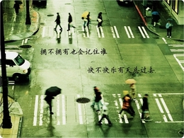

# 写给未来孩子的信

亲爱的孩子： 

马上是儿童节，妈妈祝你节日快乐。

其实妈妈并不知道你要五年，还是十年后才会来到这个世界上。不知道你会是个男孩还是个女孩。不知道你将出生在哪个城市。不知道你是淘气还是沉静。也不知道谁会是你的父亲。甚至不知道你是否会存在。除了你一生下来就是我的孩子，你的一切信息妈妈都不知道，

妈妈现在深爱着一个男人。可是世事变幻，谁知道十年八年后万家灯火下他在哪家？是谁的丈夫，谁管他叫爸爸？

如果可以选择，妈妈希望你是个儿子。千万不要以为妈妈重男轻女，只是妈妈觉得女孩子如果不富不贵不美的话奋斗起来特别艰难，也许在你的时代又能比妈妈的时代不一样许多。可是最近又看了几篇关于分娩和哺乳的文章，做女儿自然很幸福，然想到女人还有一个很难避免的身份：妈妈，又不免惆怅起来。妈妈以一颗女人和母亲的心，希望我的孩子不用承受。若说妈妈包藏一些私心，便是妈妈有一个三观很不正的想法，总觉得拥有三个男人爱的女人才有一种情感和美学上的圆满感。 父亲，丈夫，儿子，排列起来队形似乎很美观。

说起来妈妈现在在许多人眼里还是个小姑娘，记得《红楼梦》里有一回袭人提到宝玉的时候用了“他”，都被笑作“不害臊的小蹄子”。如此说来，妈妈真应该挖个地洞使劲钻才是。又想起初中读《荆棘鸟》，八岁的主人公疼起弟弟妹妹的模样俨然是生养过几个孩子的少妇，后来为了当上妈妈跟一个粗俗的人结婚做爱生孩子。羞愧感顿时大大减少。原来母性不分国籍，不论年龄。

妈妈看过不少关于美好少女不慎或是被迫落入油肠肥脑老男人手中，意外怀孕，为了孩子忍辱负重毁一生的书，电影，电视。也曾为那些女性深深遗憾，也曾为那些母亲深深感动。后来越想越不对劲。为什么要有那么多女人为了孩子放弃自己美好生活权利的故事？这不是强化了女性的弱势地位么？给女人上了一个道德枷锁么？看过这些故事心里很容易打上一个烙印，似乎抛弃孩子家庭的女人一定是自私，没有责任感，不道德。可是如果让自己成为母亲的男人只是把自己当泄欲和生育工具，孩子在不自由和不自主的状态下出生，母亲为什么要负责？

是的，妈妈甚至支持堕胎。要不要生下小孩，对父母而言是一项权利。而一旦生下来，抚养便是一种义务。但妈妈也是优生优育优抚的支持者，若是生下你，一定会是自愿认真负责的，一定是在和你爸爸感情稳定深厚之后，是在自己的追求确定后。而不会毫无头绪地生下你，然后把你当做一生的盼头。

至于你出生在哪，性格怎样，一点都不重要。在哪里付出爱，哪里就是家。而你外貌如何，妈妈也决定不了。不过普天之下的母亲从不会因为孩子不美不俊就会少爱几分。你的妈妈也会如此。

一年以前，妈妈还是个女权主义大旗高高举的热血少女呢。妈妈的一个好朋友因为意外怀孕奉子成婚，妈妈去参加婚礼的前一天哭了整整一夜。担心好朋友从此被丈夫，孩子，家庭绑住，与妈妈成了陌路人。

可是岁月风蚀人的能力真是强。前几天翻完黑柳彻子写的童年回忆录：《窗边的小豆豆》，被儿童天然的真善美深深迷住。如今妈妈走在遍地萝莉正太的台南大街上，看到儿童白皙干净肉嘟嘟的脸，总有一种亲上几口的冲动。瞄到网上二逼非人类的母子照，也有一种生个孩子一起吃喝玩乐的欲望。读到同龄人回忆父母爱情故事的时，会憧憬你将来拉着爸爸的手追问你爹娘爱情故事，是在椰影婆娑的沙滩还是在风清月明的窗前呢？

去年妈妈差点做了一个手术，医生说妈妈的检查结果虽然不能报病，终究是稍稍不健康。妈妈的血液和宫腔检验结果都显示，妈妈患上子宫癌乳腺癌等疾病的风险比正常人高出好几倍。那都是与母亲形象最密切的器官，如果她们一定要病变，希望在妈妈成为妈妈之前。那样的话，这个文章才有意义，这封信才有人收。这也是妈妈希望你是儿子最重要的原因，即使妈妈健康过完一生，也不希望女儿的生命潜伏危机。

这个文章也许要十年八年后才有读者，而亲爱的孩子你能读懂妈妈的这片心思，可能是二十年甚至三十年之后，那个时候妈妈可能不再年轻了，双乳塌陷，皮肤不再光滑。你要记得妈妈写这封信的时候只有21岁，十分年轻。

顺便提一句，妈妈特别讨厌小屁孩便便和尿尿，妈妈这个儿童节最大的愿望就是希望你的爸爸不管文艺二逼还是学术非人类，在你出生后能一秒钟变奶爸！和妈妈一起祈祷吧。

2013.5.28 夜 台南

（采编：李以诺；责编：吴贺）
