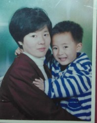

# 我是你爸,我有話對你說

認真的，我還真的沒想過這個問題，真心單身太久了，直到昨日看到銀華姐姐那篇《寫給未來孩子的信》，說實話，我有點小感動。

於是我就正好利用這課餘的時間，對你說說話吧。

不過真的不知道是5年還是10年後，才看得到你的影子，但我很期待那一天，就像小時候我很崇拜我爸一樣，學他走路的樣子，學他說話的樣子，跟著他一起什麽書都讀，一起指點江山激揚文字。

你是個男孩，我希望可以和你一起，給你講講楊椒山的剛烈，講講郭奉孝的遠見，講講那些縱橫沙場保家衛國的英雄，講講歷史上那些動人的愛與堅守，也要告訴你，這個世界上，也有人願意爲了一種價值，絕不退讓。這都是曾經在你腳下的這片土地上發生的故事，若你樂意，我願意慢慢與你扯扯這這光陰的故事。和你一起打羽毛球，看你像你爸那樣上課積極發言提問難倒老師，面對自己喜歡的女孩，大膽追求。我願意在你的身後，默默地支持你。

若你是個女孩，我希望可以給你講講「昨夜朱樓夢,今宵水國吟」的紅樓一夢，也想給你一起渡過莎士比亞與他的《仲夏夜之夢》，讀一讀，「我有一座房子，面朝大海，春暖花開。」，也希望你能看看傑克倫敦，看看生命的力量與驕傲；更希望你看看川端康成的《雪國》，

看看虛無的哀愁與從生至死的愛情。我一直覺得一個女生，文字與知性應是你靈魂的一部份，而這除了來自閱讀，更需要你親身去體驗生命的點點滴滴，一定不可以像你爸這樣寫東西這麼矯情，但記得，要適度浪漫。

如果你要問我男生追你怎麼辦？不好意思這個我還真不知道怎麼辦。。。。。。。也許你可以問問你媽？但是如果你要拒絕人家，一定要和人家講清楚。如果死纏爛打，我一定揍他。

當然，不管你是男孩女孩，這都祗不過是我的一點念想，因為這裡有些是你爸我的優點，也有些是你爸一直沒能實現的願望。不管如何，請學會自由思考，而自由思考從何而來？便來自你手邊的書本。保持閱讀是個好習慣，學來的東西雖然不能馬上變成錢，但是相信我，當你得以站上一個舞臺縱情展示自己的時候，那時你會發現，你腦中所有的財富將比你口袋裡的鈔票來的重要的多。

有些人喜歡說讓子輩繼承父輩的理想，但我其實覺得，只管做自己想做的事就好，這個是你的自由，我不知道你未來會如何，喜歡什麽，追求什麽。但我都會理解你，尊重你做出的選擇，起碼是在你的背後支持你，守護你。誰又知道在未來的某一天，你不會用其他的方式，讓為父為之驕傲？

雖然我現在還沒找到我愛的人，還不知道你媽媽是誰，但我相信她也會和我一樣，希望你能做一個幸福快樂的人，愛你的生活，更重要的是，有屬於你的理想。

正如很多你的阿姨曾經吐槽你爸爸的一點，就是太過於和女孩子認真地談論政治歷史，有些人不喜歡這些東西容易被你嚇到。雖然這確實是一個很要命的問題，但是無論如何請你記住，永遠不要做一個對社會問題冷感的人，今天你的冷感，便是這個社會的冷漠；今天你的放任，便是這個社會的倒退；今天你的沉默，將會是這個社會的災難。這邊是你爸爸的想法，雖然不知道再過20年我是不是還會如此？一不小心我就又認真起來了。

但是這樣的認真未嘗不是件好事呢？今天也許你所追求的和你爸不同，也許你很討厭政治，很不喜歡那些被人捏造出來的歷史。當然這是你的想法，你有你的追求，今天，我只是希望你能多一份思考，去認真地思考你的未來，甚至是這個國家的未來。莫隨波逐流，莫人云亦云。無論中國怎樣，請記得：你所站立的地方，就是你的中國；你怎麼樣，中國便怎麼樣；你是什麼，中國便是什麼；你有光明，中國便不再黑暗。 畢竟是我的孩子，相信身上也多少會有我的影子吧。

最後，我希望你能成為一個有理想的人，爲了自己的理想去努力追求，去經歷成功的喜悅和失敗的痛苦，更重要的是記住你在前往理想路上的全力以赴，不留遺憾，這是你一生的財富。 有願意為之的奮鬥的夢想的人，眼神裡都會閃出不一樣的光芒。而這道光芒，是一份熱愛，是一份專注。哪怕今天你的理想，只是追一個女孩子也好，那也是一件很了不起的事，因為你是在追尋你自己的幸福。

曾經讀到一篇文章里，提起一個成績很優秀的男孩寫給父母的一封信，上面說他不想當什麽資優生，他想休學，不想做第一名，沒有什麽遠大的理想。他只想和自己心愛的女生一起，簡簡單單的過日子。

請你記住，若你能找到一個你心愛的人，彼此經歷風雨，相依相守，哪怕是粗茶淡飯，這又未嘗不是一個人一生，最大的幸福呢？

最後，孩子，去愛的該愛的人，做你喜歡做的事吧。希望你過得幸福快樂。

我是余澤霖，我是你爸，剩下的事交給未來吧，我們要做的，只是一步一步走好腳下的路。

P.S.你要感謝你歐陽阿姨，要是她不寫，我估計就真的準備被作業壓死了。你還要感謝你毛阿姨，你可以叫她夏姐姐，是她說，你爸才想起要寫寫的。

然后爲了寫這篇文。。。我翹課了。。。呵呵呵呵。

半夜起來想了想，還是得改改，突然覺得有一份責任感在驅使我，也許，是我太愛你了吧？

你不可愛的老爸 2013年5月30日於台北陽明山
