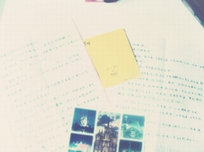
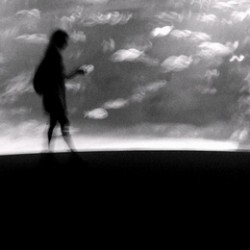

# 给未来孩子的一封信

卿卿如晤： 

此时，此信不知将寄往何处，寄予何人，仍盼展信佳。

不过，如无意外，从社会伦理角度而言，我应该是你的父亲，而你是我的子女。

从我出生至今已经近二十一年，然而我从未有过有朝一日当为人父的自觉，因而对此也没有任何准备。我个人浅薄的见识和经验也没有可以用来说教的地方。之所以写这么一封信，不外乎两点：一个是蕾蕾约稿，是的，这意味着这原本私人之物，在传递你手之前可能已经被很多陌生人阅读，对此我深表歉意；另一个原因是，如果这封信有幸穿越时空完成既定的使命，那么你可以和一个更贴近你年龄的父亲交流，而不是面对一个无趣乏味，和你之间沟壑横隔的丑陋中年男子，当然这是最坏的可能。

记得我还在小学的时候，有一个活动是孩子和家长互相写信，最后还要评比。我爸也就是你爷爷，充分发挥了文青特质，一封长信洋洋洒洒，情深意切，舔犊之情，无以为表。据说看哭了一办公室的评审老师，加之你爷爷一手好字，顿时被惊为天人，此后长期在家长会上受众老师的膜拜。我也借此轻松将一等奖收入囊中。但是这封信的内容，我至今已回忆不起哪怕只言片语，原件也不知失落何处。到头来，那信也许只感动了我父母，和那些老师，而我却是无动于衷。可见父母子女之间从来就是“我本将心向明月，奈何明月照沟渠”，如同原罪一般，永远不得谅解。所以我猜这封信大半会落入同样的境地。但是趁发生的时间还没有太远，教训尚且清晰，我还是要和你讲一些我的经历，免得你再受同样的挫折。

我这辈子非常幸运，出生之时就拥有了世上大多数人不曾拥有的东西。家境优渥，衣食无忧，又赶上了一个不错的时代，远离战争和天灾，也不曾经历各种主义直接野蛮的洗脑碾压。这常常给我带来一种优越感，直到几年前我才意识到这种优越感是一种错误的幻觉。这种优越，或者说“致命的自负”，让我错过了许多美好的事物，也让我承受了原本不必承受的痛苦。因此，就如同菲茨杰拉德所说：“每当你想要批评谁的时候，你就记住，这个世界上并不是所有人都有过你那些优越的条件。”同理，你也不必因为不如人而妄自菲薄。

同时，这话里也可见世间的残酷，在每个人懵懂之际已经开始热切而深远的摧残个人的命运。诚然这世界是绝对不公的，我也不能保证给你带来多优越的先天条件，如果我不幸为你带来了贫穷饥饿，或是世界种种没有加诸于所有人之上的苦难，你大可尽情抱怨，因为这等责任在我。实际上我非常赞同孔融和祢衡的“跌宕放言”。但是现代医学的成就，让控制生育成为一件非常低成本的事情，所以我若落入不幸的境地，那么你应该没有机会来这世界上走一圈。另外需要明白的一点是，即使是完美的个体，也只是个体而已，在时代大潮的冲刷下也不能永远屹立不倒，谨慎和谦卑永远是抵御伤害最好的盾牌。它们是美德，更是虚伪的面具。实际上所有的美德都致力于让人生活的更加理想化，但是未必真实，也未必符合对真善美的想象，所以不必为此感到不适。

之前提到了种种没有加诸于所有人之上的苦难，自然还有那些普遍存在在每个人身上的痛苦。毕竟在人间生存的一个重要意义就是承担痛苦，希望你可以明白这一点。可以想象，在你十多岁的时候，将会面临的最大痛苦就是从周边从小以为的特殊环境和事件里意识到自己的渺小和平庸。某天你会突然意识到那些在你身上发生过的，塑造影响改变了你的事件，在这个世界上每时每刻的发生，只不过主角有所变化。你一直以为自己在舞台之上，但是实际上却是宏大幕布上一个微不足道的像素点。虽然人文主义和自由主义昌盛的今天，个体已经被无限的扩大，但是必须明白的是，平庸和日常才是绝大多数的常态，如果不能接受这一切，不妨试试像维特根斯坦一样英勇发问：“请告诉我我是天才，否则我会在明天自杀。

当然除此之外，还有一个办法便是尽力从日常生活中找到乐趣或者羁绊。谨记生活的乐趣，不在仰望头顶璀璨星空，也不在塑造心中崇高的道德。生活的乐趣就是可以反复遭遇的蝇头小事，文学，艺术，运动乃至吃喝嫖赌。相信你总可以从人间百态里面截取一段来喜爱。

而羁绊则是一种相对复杂的存在。当人际关系亲密到一定程度时候，除了互相取悦，还会产生互相负责的意识，这个时候一段关系就会变成羁绊。在寻找羁绊的同时，还有一个值得警惕的事实——你看世间险恶处处陷阱——“人与人之间是无法理解的”。人际的交往就好像在漆黑的屋子里，把不同形状的积木投进对应形状的盒子里，盒子越大关系越疏远，但是盒子太小或者和积木形状不搭，盒子或者积木就会损坏，而且所有的盒子都粗制滥造，所有积木又极尽复杂精致，所以找不到一个盒子能完美的契合哪怕一块积木。因此愈是亲近的关系，承担着愈大的风险，互相伤害的风险和老死不相往来的风险。所以在和重要的人交往的时候，请务必保持小心和坦诚。我就不止一次因为冒失或者自作聪明，暂时或是永远的失去了那些原本可以成为你阿姨，你叔叔甚至你妈妈的人。

我可以想象你还会有许多问题，这些问题或者是生活中的细碎琐事，或许是对绝对真理的朦胧探索，而你又会迫切地想要知道一切的答案。但是另一个事实就是，世界没有准备足够多答案去回应每个问题，换而言之，很多问题是没有答案相回应的，有的只是谎言或者废话。请学会它们，善用它们。就如同我之前所说，面具并不可耻，请尽可能多的准备，只要你能在照镜子时候不被自己迷惑，面具只会让你生活得更好。

啰嗦至此，差不多也该结尾。我实在不知道你是否会存在，也不知你会是男孩女孩，如果存在又会在人生的哪个阶段读到这封信，也难以想象那个场景。毕竟我是个非常善于逃避的人。而假如我不幸克服了对小孩子的厌恶和对婚姻牢笼的恐惧使得你成为了真实存在，现在的我能提供帮助的只有关于这可怜的头二十年，之后的问题你可以继续来咨询之后的我，如果你愿意的话，当然你也可以独自摸索。人世险恶，前途多桀，请多珍重。

最后谨祝

六一快乐！

你的

父亲 白告

西元2013年5月31日星期五

Santa Barbara, CA, USA 草就

（采编：佛冉，责编：佛冉）
