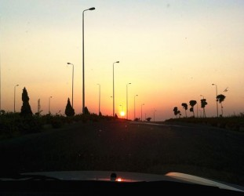

# 埃及宵禁实录：第一天

经过整整一个斋月的“修生养息”，穆尔西的支持者终于在开斋节后卷土重来，军队和穆兄会的冲突升级再次成为各大新闻报刊头条，流血、死伤人数、烟雾弹和清扫这些字眼一跃成为埃及的关键词，把这个有着和中国一样悠久历史的文明古国完全改造成一个电视里看到的正在经历政权过渡、武装暴力阶段的危险国家。

不知道应该怎么来形容“宵禁”这个词。在今早发生军民大对抗，各大主要干道封路之后，下午政府正式宣布全国进入“紧急状态”，并实施晚上七点到早上六点的宵禁。第一次接触到这个词语是在《安妮日记》里，因为德军占领荷兰，犹太小姑娘安妮和家人不得不过着藏匿且充满恐怖的悲惨生活；第二次是前年在巴林工作的时候，正巧遇上巴林大动乱，政府也实行过一段时间的宵禁。临宵禁的前一小时，路上的车辆已寥寥无几，空荡的街道隐约透出一丝爆发前沉静的气氛。两年后的今天，在刚看完《环太平洋》后，出来却见到司机严肃的神情，他低声地跟我说：Emergency, we have to go.

一路上，司机阿西拉夫一言不发，只调到正在播报冲突现场情况的电台默默地听，想知道有什么新消息。此时周围已经没有其他的车了。许久之后，他突然问我，“Sara, 为什么埃及人要自己人杀死自己人呢? ”我知道任何的回应都不能抚平他心里的忧伤，于是保持沉默。 “对于今天发生的一切，我们都非常悲伤，真的。”他直勾勾地看着前方的路，继续发表他的看法：“再这么下去，埃及就真的完了。”听到这里，不由想起中国的一句谚语：本身同根生，相煎何太急。为了政治上那把最高交椅，各派系拼死拼活地想要坐稳政权，到头来受罪的还是老百姓。

穆尔西的支持者和反对者不仅仅在纳赛尔城爆发了剧烈冲突，在另一片没有硝烟的战场facebook和twitter上，两派也开始了唇枪舌剑。社交平台在埃及是一个畅所欲言的缺口，政府基本没有对言论进行管控。也许是因为放任自流吧，所以各种呼声在这种新媒体中的碰撞越发激烈。穆兄会的支持者上传了各种鲜血淋漓的烈士照片，痛斥军队对手无寸铁的群众大开杀戒，毫无良知；而反对者则拿出各种因公殉职的警察照片，指责穆尔西支持者的暴力反抗。各种真相和谎言，披着各种伪装展现在人们面前。朋友老公的弟弟穆罕默德是一名参加了此次清扫行动的警察，自凌晨三点临时接到任务，一直在对抗现场维持秩序。后来不幸在冲突混乱中打伤眼睛，被紧急送到医院动手术。值得一提的是，这次的清扫行动，在大多媒体上的用词都是فض الاعتصام，而不是ابادة，翻译成更确切的中文应该是“驱散行动”。因为一提到“清扫”这个词，总会让人联想到一种隐晦的暴力，但实际上，据消息称，军方发下发的命令中有一条，不可以主动对群众采取暴力镇压，要以和平手段为主，除非抗议者首先发起猛烈攻击。

在这个国家，最有理由的是鲜血，最没价值的是生命，最模糊的是真相，最可怕的是异见，最缺乏的是安全，而最危险的，是盲目和无知。在回家的路上，还看到一个穿着大白袍的大胡子右手扛着一把黑色长枪，同行的同事拿出手机想要给他照相，没想到他竟然回过头来对我们微笑招招手，还摆出一个胜利的V手势。也许他微笑并不是因为我们，是因为想到马上就可以投身到无尚光荣的神圣事业中，就算牺牲呢，也是可以上天堂的；就是这个信念，让无数阿拉伯人奋不顾身地投入到所谓争取正义和自由的战争中。只是，在烈士牺牲后，大多数的下场是被拖到一个集中的地方堆起来，被拍上一张惨不忍睹的照片作为杀人者十恶不赦的罪证罢了，遗体连最基本的尊重也没有得到。

相信宵禁的第一晚对于全部的埃及人来说都将是一个不眠夜。我作为一个外人，虽然可以体会到他们的失望沮丧，写出他们的支离破碎的生活点滴，但终究我也只能是个过路者，无法成为与他们休戚相关的一员。就像我无法改变阿西拉夫眼中的忧伤一样，我不能改变这个国家，可是我能让更多的人懂得在这个国家发生了什么。这是我唯一能做的，也是我想做的。

（采编：纳兰辰翰；责编：张舸）

**前文回顾：**

[【冲突目击】埃及宵禁实录：第三天](/archives/40209)

[【冲突目击】埃及宵禁实录：第五天](/archives/40250)

[【冲突目击】埃及宵禁实录：第七天](/archives/40312)

[【冲突目击】埃及宵禁实录：第九天](/archives/40354)

[【冲突目击】埃及宵禁实录：第十一天](/archives/40484)
