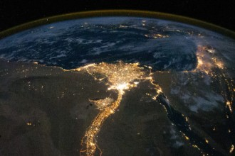

# 埃及宵禁实录：第七天

这两天来穆兄会和军队的冲突虽没有前阵子规模之大，却渐现出持久战的趋势。而各大媒体也是从之前大手笔渲染各种流血画面转到现在增加评论家、观察员对局势评论的时间，似乎他们也开始觉得千篇一律的报道有些乏味。以暴力与血腥为基调的照片，一开始就疯狂地冲击着大众的视觉和心理，渐渐的，观众似乎越来越习惯于这种被呈现的杀戮，出现了所谓的“视觉疲劳”。和示威者和军警双方一样，埃及媒体也处于一种僵持阶段，似乎在寻找新的突破点。

现在埃及社会各股势力都在拔河，力量看上去势均力敌。世界各国除了发表声明要求埃及尽快结束暴力冲突之外，目前看来对局势发展影响并不大，连平时一向喜欢在别国内务上插上一脚的美国这次在埃及问题上表现得也是畏手畏脚，仅仅做出了取消九月份和埃及的联合军演这个不痛不痒的决定。军方和穆兄会依然是冲突的主战场最令人瞩目的两股势力；广大民众似乎已经厌倦于社交网络上的纸上谈兵，而更多地在思考怎样尽快结束埃及当前混乱的局面；世俗派内部对于宗教派意见出现分歧，其中一部分人认为穆兄会成员是无法被说服成为合作对象的，应该将反对进行到底，但另外一部分人认为穆兄会是可以为之所用，来推动社会发展进程的。而今天，沉寂多日的穆巴拉克爆出本周有望获释，这对于前穆巴拉克时代的亲穆派来说无疑是个振奋人心的好消息，但同时，他的获释又将给埃及局势增添一股朦胧的色彩。有评论员认为此举是军方和政府采取的一种制衡策略，即拉拢一批人来制约另一批人。在僵持的关键时候，团结亲穆派来打击它的死对头穆兄会确是在策略上下的一步好棋。但也有人在担心，是否这也意味着政府想要重回中央集权、高压统治的“穆巴拉克时代”？

在各种政治力量的博弈后面，隐藏着埃及所有问题的根源。急剧增长的人口和发展缓慢的经济之间日益加剧的矛盾，是以前、也是未来埃及发展最大的障碍。由于穆斯林被准许娶四个老婆，加上生育无节制，受教育程度不高等，埃及人口一直处于无限膨胀的状态。这样直接导致的后果是粮食供应的不足和失业率大幅度增高。在埃及，大学生真正的是“毕业”就面临“失业”，不少开罗大学计算机系、外语系，甚至建筑系的大学生毕业之后可能只能找到一份的士司机、打杂工这种低收入的底层工作。在“阿拉伯之春”之前，旅游业曾经是埃及的支柱产业，也带来数以万计的就业机会。但是随着埃及局势的动荡，旅游业已经沦落为“夕阳产业”，以前从事旅游业工作的人不得不另谋生计。同时，政局的不稳定和经济的不景气，导致国内总体的项目机会变少，不少外国企业在埃的投资也相应大幅度缩水，从而反过来又影响的埃及的经济发展，这种恶性循环，只能让埃及陷到自己给自己设定的怪圈里面。

究竟这种僵持的局面会由谁来打破？在多方势力和矛盾相互缠绕的埃及，似乎很难找到答案。政治、经济双重的停滞，让埃及处于进退两难的局面。仿佛有两股作用相反的力在推挤它。政治上，一方面对民主的追求敦促着埃及充分赋予人民权利，另一方面，派系的复杂、各利益团体的牵扯又不得不让埃及实施赤裸裸强硬的政策。经济上，社会文明的进步要求埃及迅速加入到经济发展的队伍中来，但部分习俗和宗教教义又禁锢着人民的思想，无法让埃及轻松上阵。当前的埃及需要的是政治、经济、文化上的全面大变革，要开始必须快速找到一个突破口，打破停滞状态的临界点，让整个国家重新动起来。

（采编：纳兰辰瀚；责编：张舸）

**前文回顾：**

[【冲突目击】埃及宵禁实录：第一天](/archives/40153)

[【冲突目击】埃及宵禁实录：第三天](/archives/40209)

[【冲突目击】埃及宵禁实录：第五天](/archives/40250)

[【冲突目击】埃及宵禁实录：第九天](/archives/40354)

[【冲突目击】埃及宵禁实录：第十一天](/archives/40484)
