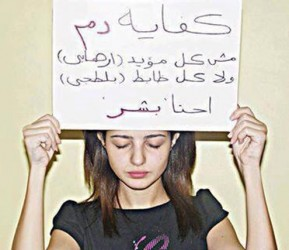

# 埃及宵禁实录：第三天

“黑色星期五”再次在埃及上演。本来是阿拉伯男人们集体去清真寺礼拜的主麻日，今天却成为了穆兄会支持者用来集结群众继续大游行的日子。昨天，军方已放出话来：如发现有任何人具有恶意攻击行为，警察可以直接将其击毙。这样赤裸裸的威胁并没有让支持者们感到害怕，反倒像一剂兴奋剂，使他们更加坚定地走上街头，呼喊着释放穆尔西，并恢复其总统职位。穆尔西的妻子突然惊现

在某一清真寺，声称丈夫穆尔西不久之后就会归来，大大地鼓舞了拥护者的士气。不久前有媒体形容穆尔西是弱化版的穆巴拉克，因为他那么快就被人民赶下台，仿佛是一夜间的事。可他们没想到事情远远没有结束，在穆尔西下台后几天里，就有民间消息称穆兄会正在策划一场大的运动，将会让穆尔西重归其位。那时全国上下仍沉浸在民主游行胜利的喜悦当中，加之斋月即将来临，大家都把这件事抛之脑后。果然，穆兄会势力再度崛起，引发的死伤人数达到历史新高，比当年穆巴拉克下台时死亡人数几乎多了一倍。截止到8月16日，官方说法是至少638人死亡，近4000人受伤。

目前看来，军方的暴力清扫行动在主流媒体上都是负面新闻，声称埃及政府正在实施血腥的“灭绝”政策，是惨绝人寰的行为。各种血浆崩流、尸体堆积的照片不断地冲击观众的视觉，就好像在描述一个真实的场景，隐约还能听到小孩妇女的哭声和炸弹机枪交火的声音。而游行者在媒体里被描述成一个弱者，被警察抽打、虐待甚至直接枪杀。在全球范围内，许多国家纷纷来电要求埃及政府立即停止这种暴力镇压行为，重返和平谈判的议程。情况继续恶化最终只会导致埃及内战。

整个事件，很难说究竟哪一方是对的，哪一方是错的。在战争里，也许本来就没有对错。而你听到的，也许不一定是真实的；而你亲眼看到的，也可能是带着伪装的真相。只能说，双方为了维护自己的权利发生了异见，从而产生了激烈的争端。本来，双方是可以通过和平协商方式达成一致，但不排除各阵营里都有一部分激进分子，掐断了达成共识的桥梁，选择了流血冲突。如果在游行第一天，在警察的劝说下，静坐者能够理智地从安全道路分散，埃及军方是否还会出动坦克对静坐者进行武力驱散？如果部分游行者手里没有携带武器，真正的是和平示威，为什么军方会劳师动众使出致命武器来对付手无寸铁的游行者？如果在冲突中，自己的人身安全受到威胁，是否还会下意识地控制自己不要反击？如果仔细观察的话，在所有的照片里，大多数和警方发生冲突，拿枪的全是青壮年的男人，曾几何时看见过一个带孩子的母亲拿着枪和警察对抗？必然是有些极端分子，以和平示威的幌子作为弓箭同时也是盾牌，用来攻击军方，同时也获取国际社会的同情来保护自己。更不可否认的是也许警察里也有些比较极端的人。不过，之前游行者是有选择游行抑或不游行的权利的，但是相对而言，军方就没有选择权利了，一旦面临前来攻击的示威者，他们别无退路。于是，在这次冲突中，各种不同的人、不同的因素纠结在一起，互为因果，越缠越紧。

实际上，真正的民主制度是由两个因素构成的，一个是民主，一个是宪政，缺一不可。去年穆尔西通过民主选举上台，只是民主的形式得到了实现。但最重要的宪政却没有被很好的建立，直接导致政权的倒塌。就像很多观察员提到的，埃及在民主道路上仍是一个新生儿，走的跌跌撞撞。常年在穆巴拉克的威慑统治下的埃及人，差点已经不知道民主为何物。穆巴拉克的下台就像地面被撑开的一个裂口，各种势力都企图从这个口子喷涌而出。民怨、派系斗争在这个国家的如洪水野兽一般蔓延开来，大多数老百姓成为这场斗争的受害人。此次穆兄会的反抗，究竟只是为了让穆兄会重新掌权，还是为了给埃及这个国家带来更好的发展，不言而喻。

很多埃及人都深信，只要他们存有希望，这个国家就不会死。可是，我看到他们在错误的方向上越走越远。实现民主是为了打造一个更好的埃及，可是他们在追求民主的道路上却丢失了最初的目的。不是所有的支持者都是恐怖分子，也不是所有的警察都是杀人狂。我们，都只是普普通通的人而已，珍惜生命，对流血说不。

（采编：纳兰辰瀚；责编：张舸）

[【冲突目击】埃及宵禁实录：第一天](/archives/40153)

[【冲突目击】埃及宵禁实录：第五天](/archives/40250)

[【冲突目击】埃及宵禁实录：第七天](/archives/40312)

[【冲突目击】埃及宵禁实录：第九天](/archives/40354)

[【冲突目击】埃及宵禁实录：第十一天](/archives/40484)
