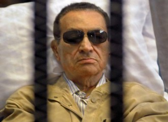

# 埃及宵禁实录：第九天

“穆巴拉克的回归”果然给各大媒体抛出了一个大大的问号，大家纷纷在猜测究竟穆巴拉克从狱中的释放是是否意味着埃及政治形态的回归，或者用另外一个词来说，倒退。看过指环王的人都知道其中有一部叫做“王者归来”，简单而有力的四个字，就让一个高大威猛、霸气十足的英雄形象跃然纸上。而这次穆巴拉克的归来，却早已失去王者风范，我们看到的只是一个奄奄一息85岁高龄的老人，虽然获释，但仍得遭遇软禁。

自入狱以来，穆巴拉克的身体状态每况日下，曾出现过多次心跳骤停现象。今天之前，似乎没有人关心穆巴拉克的死活；自今天确定他已出狱，并被送往买阿迪最好的军方医院之后，大众的眼光似乎才从埃及目前炒得火热的暴力事件上转到他身上。随着中东战争的光荣余晖渐渐埋没于历史的尘埃，当年曾叱咤风云统治埃及长达30年的大将军穆巴拉克，似乎已接近生命的尽头。在很多埃及人的记忆里面，都会有穆巴拉克的巨幅头像，他们是伴着穆巴拉克政权长大的一代，可惜的是，经过这么久他们才发现，原来穆巴拉克这四个字已经成为埃及那个时代的标志，哪怕是2011年2月份突发的群众游行，虽推到了政权，却推不倒那段历史。 那时我还在巴林工作，早上起来看微博，发现很多人都在微博上发表对“阿拉伯之春”的看法，其中有一段给我印象很深刻，大意是埃及人民总以为在穆巴拉克统治的铁丝网之外是

另一个美好的世界，于是拼了命地想要爬出去，但结果将是失去庇护调入另一个牢笼里面。当时我并不能完全理解这段话的意思，直到真正来了埃及，看到路旁的旧楼房墙上贴的早已破损不堪的穆巴拉克画像，从残留的彩色里感受到一丝埃及传奇总统昔日的权威，才真正开始理解发博者的意思。

80年代的埃及，仍处在一个相对落后、贫穷的社会阶段，作为草根出生的穆巴拉克来说，他是最能了解埃及普通老百姓的人。在物质基础还未打好之前，精神层面这种上层建筑更是天方夜谭，很可能大多数埃及人都不知道其为何物。就像中华民族在历史上会被人成为“勤劳的民族”一样，埃及人民也有它们的别称，他们被成为“法老的人民”。法老的人民意味着一旦想做什么事，就会坚持不懈地要实现它。当然，如果全国人民能团结一致，形成一股力共同为经济发展齐奋斗的话当时是皆大欢喜；但很显然，埃及复杂的社会背景注定了产生的力是分成多支并且朝着不同方向的，这种大环境下，如果没有统一集中的政权来管理各方势力，埃及就是一盘散沙。穆巴拉克的政权之所以能持续30年那么久，至少在当时那个时代是有其存在的意义和价值的。

艾哈迈德是埃及一名26岁普通的人民警察。他21岁进入穆巴拉克警察学院（后因为穆巴拉克下台，校名改为警察学院）学习，是一名穆巴拉克忠实的拥护者。在8月14号的清场行动中，他作为当时复兴广场维持现场秩序的警察之一，不幸被穆兄会用散弹击中左眼，导致失明，目前正在家中休养。我问他穆巴拉克时代和穆尔西时代他的工作是否有发生变化，还没等我说完他就狠狠地点头抢着向我述说他的经历：“前几年穆巴拉克当政的时候，国民有很强烈的安全感，任何人任何时间都可以在街上走，没有小偷也没有强盗，也从来没有出现过有人殴打警察的事件，而现在，在街上你喊一个小偷停下，他都可能转过头来先揍你一顿。安全感对整个国民和我们警察来说是生活的核心，生活必须建立在安全的基础上，否则就摇摇欲坠。安全感有两种，一种是摸不到的，如人民内心的感受；一种是摸得到的实物，比如国家安全设施如警察局。如今你可以看到的埃及，警察局被炸，警察被杀，摧毁的不仅仅是安全的第一屏障，更是人民对国家的信心。前几年，在电视和社交网络上，全都是逗人开心的笑料谈资，现在只要一打开电视，满眼全是埃及动乱，让人民如何心安。满心的都是忧愁罢了。”当看到电视里穆巴拉克被释放的消息时，正在哄外孙女睡觉的艾哈迈德的妈妈突然手舞足蹈起来，“哈比比，哈比比”，意思是穆巴拉克是他们最亲爱的领袖，看到他能被释放，打从心底高兴。在和艾哈迈德的聊天的同时，也知道了他叔叔在穆巴拉克时代是专门负责的修补大型文物类建筑的工程师，开罗最著名的萨拉丁城堡就是经由他们的工程队修补过的。这份工作一年能赚很多钱，自然一人得道鸡犬升天，整个家族也因为他叔叔变得比较富裕。但自从穆巴拉克被赶下台穆尔西掌握政权之后，政府就停止了对这块的投资，一下子他叔叔就成了下岗人员，这也算他们全家都讨厌穆尔西的一个特别原因吧。

当我问起他们是否想重回到穆巴拉克时代时，艾哈迈德的妈妈深吸了一口气，大大眼睛里充满了希望，“要是能时光倒流就好了” ，但很快这种希望的眼神被忧郁的神情所替代,“只是，我们不可能回到过去，那，那会相当难。”时代的车轮永远在不停的往前滚，历史永远也不可能倒退。所以，我想起那些把“穆巴拉克回归意味着埃及历史的翻回”作为头版的媒体们，实在觉得他们是在浪费版面。但这倒也反射出穆巴拉克时代依然在很多人心中留有强大的震撼力。

所以，对于“穆巴拉克的回归”更确切来讲应该成为“穆巴拉克的落幕”。不管是军队想要利用他来进行势力的博弈，还是有人企图恢复旧政权，都和这个85岁的老人无关了。穆巴拉克在被宣告“临床死亡”的那一刻起就已经被人们埋进了思想的坟墓，仅留下埃及人民对于他曾经创造过的辉煌王国的缅怀了。

（采编：纳兰辰瀚；责编：张舸）

**前文回顾：**

[【冲突目击】埃及宵禁实录：第一天](/archives/40153)

[【冲突目击】埃及宵禁实录：第三天](/archives/40209)

[【冲突目击】埃及宵禁实录：第五天](/archives/40250)

[【冲突目击】埃及宵禁实录：第七天](/archives/40312)

[【冲突目击】埃及宵禁实录：第十一天](/archives/40484)
