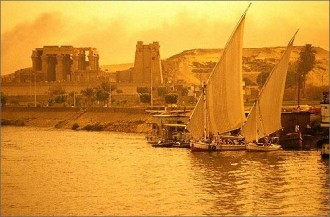
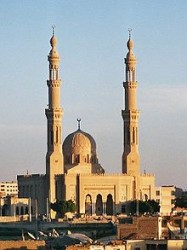

# 埃及宵禁实录：第十一天

“因为埃及动乱，所以我打算把我租的店铺转让出去，提前买票回叙利亚了。”伊马德在周六的晚上突然打电话给我向我告别，顺便问我有没有朋友需要购置桌椅茶几的，因为他想在回国之前把店铺里的东西全都卖掉，由于时间很紧，可以低价出售。

我是在住的小区里认识伊马德的。两个月前的某一天，在宿舍旁边的一间空店铺前看到一个矮矮瘦瘦的男人拿着尺在量门前的距离，很认真的样子。我走过的时候，给他打了个招呼，随口问了问是否这里会新开一家餐厅。他抬起头来，我第一次看清他的样子，皮肤有点黑，长着一双阿拉伯人标准的大眼睛，目光却很柔和，脸是瘦长的椭圆形，笑起来牙齿很整齐。他看到我立刻恭恭敬敬地回应说：“您好！如果真主意愿的话，大概两周之后我的新餐厅就会开张，到时欢迎前来光顾！”一听口音，并不像埃及本地人，倒有点像沙姆地区的口音。后来我的想法得到了证实，他是一名土生土长的叙利亚人。

自叙利亚开始内战之后，很多的叙利亚居民便开始逃离祖国，到最近的黎巴嫩、叙利亚或者埃及等地避难。因为这些国家在地域上很近，而且又不需要办理签证，入境很方便。很多叙利亚的妇女带着小孩子会在沙漠大道临近“智慧村”的一个收费站向开车经过的路人兜售他们手里拿着的动物皮毛，或者在环路堵车的那段敲打车窗，乞求路人购买小包装的纸巾。不过伊马德不是这群难民里的一员，他来埃及还顺带做做生意，开个叙利亚餐厅，想以此来赚点小钱。这也是另外一群叙利亚人来埃及的生存方式。短短几个月的时间里，埃及的叙利亚餐厅如雨后春笋般出现，仿佛每条美食街都能闻到叙利亚小沃尔玛的味道。当然，这是在埃及发生动乱之前，现在包括那些在收费站的叙利亚妇女们早已不见踪影了，取而代之的是两辆土黄色的坦克和巡逻的士兵。

后来过了两周，我特意跑到伊马德的小店去看了看，想尝尝叙利亚美食。可是除了新添置一个咖啡机和几个沙发，我没有看出一点已经开张的迹象。伊马德倒是立马认出了我，急忙从吧台后走过来和我握手：“您好！欢迎光临小店！实在不好意思，现在我们只能供应饮料和水烟，因为请的厨师还没有到位。先坐吧，给您上一杯新鲜的芒果汁！”他的热情让我无法拒绝，于是干脆坐下等他做好鲜榨的果汁。也就是这次之后，我和他慢慢熟络起来，知道他在叙利亚有两个老婆和四个孩子；他去过很多地方，包括中国、泰国、意大利、迪拜、沙特、黎巴嫩等等，大多情况下都是因为外出务工。

“在我走之前请你吃个小沃尔玛吧，呵呵，就当替我送行了。”伊马德在电话里继续说。他把地点约在小区另外一个叙利亚餐厅“大马士革之门”，同样也是一个叙利亚家庭经营的，远远地就能闻到小沃尔玛的香味。因为事出突然，我来不及收拾，随便抓了件衣服穿上就往餐厅赶去。

一群埃及人围在烤肉机前等待热腾腾的小沃尔玛出炉。我一眼就看到了伊马德瘦瘦小小的身影，虽然他只有45岁，但是言行举止都非常缓慢，像个小老头。“sara，快来快来！小沃尔玛已经好了，快趁热吃！”他招招手示意我赶紧过去，一闻到小沃尔玛的气味，我的肚子就像条件反射一样，饥饿感油然而生。

因为嫌小店里的空气太闷热，我和伊马德就坐在店子外面的台阶上边吃东西边聊天。自然而然的，我们的话题就跑到最近埃及局势上面，我问他：“叙利亚现在也在动乱，埃及紧随其后，你觉得这两者有什么相同和不同的地方吗？”他眨了眨眼睛，顿了一下说：“我觉得这两者没有相同点，因为他们的本质就不同。埃及的动乱是政党派系斗争的产物，而叙利亚是有且只有一个执政党，就是巴沙尔为首的复兴党，现在人民进行的抗议是有关人权的斗争。”说起“人权问题”，伊马德似乎打开了话闸:“你知道吗，叙利亚的逊尼派占总人口的80%，阿拉维派只占11.5%，但是他们全控制了整个国家的政治权和军事权，当然也集中了国家的财富。在叙利亚，要是我就这么坐在外面和朋友大侃政治，是会被情报人员举报抓去坐牢的。”说到这里，伊马德的脸上里突然闪过一丝恐怖的神情，但很快就消散了。“在埃及穆巴拉克统治时代，讨论政治也是不允许的，穆尔西上台之后，埃及人才开始慢慢地把政治当成一个茶余饭后的话题。”

在我印象里中，我记得他曾说过巴沙尔是一个有文化的知识分子，于是便觉得好奇：“你以前不是说巴沙尔是一个很有文化的人吗？那你现在也是反对他，觉得他是暴君滥杀无辜？”伊马德似乎没想到我还能记得他说过的话，大咬了一口小沃尔玛接着说：“没错，巴沙尔确实是一个文化人，而且他是一个眼科医生。但现在他的处境已经由不得他了。”“难道还有人威胁他不成？”我试图寻找这句话背后隐藏的意思。“现在巴沙尔和那群阿拉维派的人就是绑在一条船上的蚱蜢，如果巴沙尔敢流露出任何一点偏袒人民的意愿，阿拉维派的人肯定会干掉他的。就像埃及这边穆尔西一样，穆兄会是有严格宗旨的，兄弟们必须服从里面带头人的意愿，穆尔西就是一个很好的代表，他也许并不想那么做，但是他所属的那个群体把他活生生架上去，就是不让他下台。后果呢就是现在他不知道被军方秘密关押在哪个旮旯里，其他穆兄会的就继续上街暴力反抗。”

既然聊到穆兄会，我便很想知道他对现在穆兄会的所作所为有什么看法：“大家都说穆兄会极端，是恐怖的分子，你觉得呢？”他说，“穆兄会是一个很极端的伊斯兰组织，他们致力于把埃及变为一个和沙特一样的国家，女性需要带头巾，取缔disco、肚皮舞等有伤风化的活动，并且你也看到了，现在他们在游行中使用了大量杀伤性武器来袭击警察，攻击平民，手法相当残忍。另外，穆尔西在位一年，拉了不少外国的赞助，可是没人知道这些钱去哪里了，国库这年的财力甚至比上一年还弱。并且，在穆兄会的脑海里，就是在做一场春秋大梦，企图把所有的阿拉伯国家合并成一个大中东，并由他们来管控。这明显是痴人说梦！”

“在叙利亚问题上，你是站在反抗人民一边的；可是在埃及问题上，你似乎反倒和政府站在一起？”我试图再次向他提问以确定我完全理解了他的观点。他想了想，于是这么跟我解释：“在巴沙尔之前，叙利亚是由他父亲哈菲兹·阿萨德统治，哈菲兹去世之后，巴沙尔直接掌握了政权，如今他们父子两加起来统治叙利亚已有40多年了。他们是严禁任何反对党和非执政党后选人参加选举活动的，并且自1962年以来，我们就一直生活在紧急状态法的管理之下，不仅仅群众集会和组织活动被禁止，而且还要警惕隐藏在民众里面的情报人员，一不小心说错话就可能被安全部队逮捕或监禁。可以说，在叙利亚是没有人权可言的。”说到这里，伊马德似乎开始有点点激动，两只手紧紧地握在胸前久久没有松开。

谈话的间隙，一个叙利亚的小朋友突然跑过来问我要不要喝点什么。应该是店主的儿子吧。伊马德摸了摸小孩的头，那再来两罐可乐。我突然很想知道究竟在伊马德心中什么才算好的总统。“好的总统啊？”，他直勾勾地望着前方想了好久，“任何一个总统都要制定有利于国家发展的政策，并且这个政策是有里程碑并且可实现的，不是白纸上晦涩难懂的理论。比如，我承诺在第一年要达成什么目标，第二年要达成什么目标，以此类推。现在不管是叙利亚的总统还是埃及总统，都是说一套做一套，表面乐意倾听民众的心声，实际上做的事是统治层自己想要的而已。至于穆巴拉克，那是连倾听都没有的，呵呵。”

“那你对埃及和叙利亚未来的局势有什么看法吗？”他的回答和所有我问过的埃及人一样，都说埃及的军队会很快地控制局方，新一轮的民主选择也会如期所至。但说到叙利亚局势的时候，他却露出深深的担忧：“我们是不会放弃和政府的对抗的，但是叙利亚本身比埃及的情况要复杂很多，加上有很多国外势力已经渗入叙利亚，在几年之内，叙利亚都不会稳定。”“那你这个时候选择回叙利亚，岂不是不太明智？” 我很担心伊马德回到叙利亚之后会面临着更大的危险。“我的两个妻子和儿女们都还在叙利亚呢，我想他们了，迫不及待想回去。”说着说着他把手机里妻子儿女们的照片翻给我看，照片里有两个相当丰满、穿着性感的女人，虽然年纪看上去不小了，但是风韵犹存。还有一个儿子三个女儿，最小的那个女儿还被二房捧在手里嗷嗷待哺。“你在埃及这几个月，有没有感觉过和埃及人格格不入，或者生活文化上有什么不习惯的地方呢？”他连忙使劲的摇头，眼睛睁得大大的:“不，不，完全没有！我在这里生活就感觉在自己的家乡一样，唯一的缺憾就是家人不在身边。我有很多埃及朋友，其中也有来自穆兄会的，平时我们也会坐下来聊天喝茶，拉拉家常。我们讲的是同一种语言，并且都渴望和平，努力地想让世界看到我们非暴力的形象。如果可以把家人带过来，生活在埃及比生活在叙利亚还要舒适。”

此时，小区的清真寺又响起了宣礼的声音，召唤各个虔诚的穆斯林开始礼拜。“万物非主唯有真主，穆罕默德是真主的使者。来吧，来礼拜吧，它给你带来成功……”伊玛目洪亮的声音渐渐消融在夜色里面，我看到路上看到几个穿着白袍子的阿拉伯人慢慢朝清真寺走去。“sara，记着我的叙利亚电话号码，有空的话去叙利亚看看，那是一个特别美丽的国家，到时我带你见我两个的妻子，她们会很高兴的。不过，不是现在这个时候，呵呵。”我把他的电话号码存入了手机，就像很多在埃及这边认识的人一样，在分别时我会记下他们的联系方式，但之后却从来没有联系过。偶尔会有一些人主动打电话过来问我最近过的好不好，愿真主保佑你之类的。特别是在这种局势动荡的时期，没有人会知道下一次见面会在哪里，是什么时候。我看着伊马德的背影，想起在三个月之前见到他的第一眼眼里充满的柔和的目光，和他总是向上升调的轻柔的叙利亚方言，这个在埃及的叙利亚人，又一次让我对阿拉伯世界有了更深刻的理解。

（采编：纳兰辰瀚；责编：张舸）

**前文回顾：** [【冲突目击】埃及宵禁实录：第一天](/archives/40153) [【冲突目击】埃及宵禁实录：第三天](/archives/40209) [【冲突目击】埃及宵禁实录：第五天](/archives/40250) [【冲突目击】埃及宵禁实录：第七天](/archives/40312)

[【冲突目击】埃及宵禁实录：第九天](/archives/40354)
