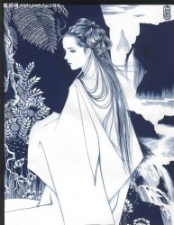

# 洛神

很多年后，面对被收缴的皇后玺印，曹子桓将会回忆起第一次看到甄的那个遥远下午。那是曹丕第一次去邺城，也是唯一一次在坦克中进入这座城市。

“不在坦克里观察一座城市，就无法真正了解这座城市。”后来成为十大元帅之一的曹仁曾如是教导过这位储君，那时，还是许都的一位太学生的后者正战战兢兢地抚摸着虎式坦克的Kwk43L/71型主炮，它出自于曹魏的天才工程师马钧之手。

后来，曹丕在毕业旅行的时候用诗人的方式把这句话说给了弟弟曹植：“我们永远无法真正了解一个没有和我们做过爱的女人。”那时，他们坐在黄河边破旧的码头上，遥望着冀州上方辽阔的夜空，想象着那些尚未开垦的土地，曹丕指着天际问曹植：“你是否知道熊星座就是盘古？”他们心中的情绪如同成功人士的社交网络一样稠密，而当时的他们完全配的上年轻这个词汇，原因之一就是他们仍然对这种成功人士充满着不屑的情绪。也许唯一的例外就是他们的父亲。

********

曹操对两兄弟的心态了如指掌，这个大腹便便，皮肤松弛，日理万机的中年人在三十年前曾在洛阳城的街头四处徜徉，他出没于圣高祖广场的咖啡馆中，在那里不断地写字。在给一位贵族姑娘的情书中，他写道：“你是属于我的，整个洛阳也是属于我的，而我属于这张纸和这支铅笔。”这一句式要在多年后才会被某位在巴黎混日子的美国小记者再次使用。而最后，如我们知道的，那位姑娘还是离年轻的曹操而去。在曹操受宦官排挤离开洛阳时，同样年轻的袁绍在他身后大喊道：“他们是一帮混蛋，他们加起来都比不上你！”而他们再次见面，则是在官渡的战场上了。

在率领中原野战军主力渡过黄河发动战役之前，曹操召来了沉默寡言，经常把自己关进作战室几天几夜不洗头的参谋长贾诩，用正式的语气询问他，自己的两个儿子什么时候才能从敏感的年轻诗人变成能继承他事业的成熟接班人。后者冷静地回答道：“我听说过一句话，二十岁时不爱五月天的人没有心，四十岁时还爱五月天的人没有脑。”

事实在印证着贾诩的判断，从北方回来时，曹丕带回了甄，却把自己心中的浪漫主义丢在了冀州的土地上。他不再排斥打领带穿皮鞋，并把村上春树的小说丢到了书架底端的柜子里，与此同时，他的弟弟曹植身上的浪漫气质却与日俱增，他饮酒与作诗的频率开始大幅度上升。没有人知道这里面的奥妙，除了他们自己和甄。

在旁观者看来，甄满足一位储君正妻的任何标准，她温柔美丽，贤惠体贴，并深爱着曹丕，甚至会做东吴那边的菜。不过，却很少有人知道，她在邺城大学攻读艺术史时，曾是一个心中怀有许多浪漫幻想的姑娘，比如和喜欢的人牵手在午夜的邺城游荡，或者一起去听苏打绿的室内演唱会，在那个时候，她曾爱上过一名工学院的学生，后者后来入伍投身于袁绍方面所称的“伟大的卫国战争”之中，此后便杳无音讯，不知道残骸埋在黄河北岸的哪个战壕里。而自从曹丕从坦克里跳下来，来到她的面前之后，那个孩子气的甄便消失无踪，博尔赫斯在考证这一段历史时说道：“就像水消失在水中一样。”

曹丕在东宫和吴质、司马懿等人一起研究国际政治形势的时候，曹植正在和杨修、丁仪一起在英雄联盟里开黑，他在杨修的辅助下完成了一次五杀，这使他快乐地大叫了起来。这时，使者传来了曹操在宫内宴请家族成员与群臣的消息。

在用餐的时候，曹操宣布了自己要再次南征的决定，这一次的对象依然是长期制造分裂的孙权势力，上个月他们宣布对铜雀台前的五斗米教徒自焚事件负责，这是赤裸裸的挑衅行为。为了国家统一，人民幸福，这次南征势在必行。曹操冷静地命令忠诚的中央办公厅主任董昭以最快的速度炮制一份《伪吴人权问题报告白皮书》，后者领命而去，夏侯淳则起身向曹操报告，江淮一带的军事力量已经部署完毕。

曹植对这一切毫不感兴趣，他只是咂摸着口中的美酒，在辨认它产自沛郡还是墨西哥。而此时的曹丕已经走下自己的位置，开始诚恳地表达自己对父亲即将远离的悲伤之情，他开始痛哭起来，泪水不断落下，宴会上的局势出现了混乱，人们试图安慰曹丕与曹操。曹植趁机离席来到甄的身边，后者对这个年轻人露出礼貌性的微笑。

“你看过《1973年的弹子球》么？”曹植问道。

“啊……”甄愣了一下，她已经很久没有听到这样的话了，这使她好像回到了很多年前的自修室里，被某个学弟用拙劣的方法搭讪。

“那里面说，直子的笑是一种属于成绩单是都是A的女大学生的笑，我觉得你的笑里也有那样的影子。”

说完这句话，曹植就像没事人一样转回头找杨修玩去了。

听到这句话之后的好几天，甄都难以入眠，并在晚上破天荒地回绝了曹丕的要求，这令后者感到极为不快。曹操再次南征时，曹丕随他一起出行。在甄觉得自己终于要遗忘这件事时，她收到了曹植的一封很长的来信，这封信是通过艰难的步骤才达到甄手中的，她一字不漏地读完了信，然后伏在精致的床上啜泣。

他们在宫墙的阴影里幽会，并肩沉默而行了一段时间之后，曹植突然说：“我第一次见到你时是在建安九年的邺城。那时街上都是坦克，人们在惊慌地四处逃走，我看到我们的士兵把‘曹’字大旗插到国会大厦上，而当时的我还没有爱上除了我母亲之外的女人，直到我和杨修骑着军用摩托车在城里兜风时看见你。第二次见到你是在宴会上，当时你也见到我了。第三次，就是此刻了。”

“建安九年啊，那是《你在烦恼什么》发行的后一年。”

“对啊，当时本拉登还没有被我们的虎豹骑击毙呢，格策甚至还在多特蒙德的青年队里。”

“从那一年起我就不再是全A的女学生啦。

“不，你是的。”

“我不是。”

“我觉得你是。”

此后是长久的沉默。

“我们还能再见面么？”曹植热切地问道。

回应他的仍然只有沉默。不过，这种沉默并不令人尴尬。

建安二十四年，杨修因为反革命罪被判处死刑，曹操亲自签字同意。曹植带着人们去监狱里探望他，他们讨论了在刑场上应该说什么话，杨修坚持认为“再见了，菲列特利加”是必须有的，曹植让他加上“柯哀永恒”这句话，丁仪觉得“消灭人类暴政”也一定要说，最后争执的结果是这些话都要说，不过顺序经过严密的编排。为了防止行刑者不耐烦一刀挥下去，重要的话必须放在前面。

不过他们其实都想多了，因为行刑前杨修被割断了喉管，所以这些话一句也没有说出来。事后，杨彪还被索取了三文钱的刀口磨损费。

这一年还出了一件大事，就是以魏讽为首的政治风波被镇压了下去，当时负责邺城卫戍的太子曹丕在风波中果断坚强，获得了曹操的极高评价。但是，这一事件中的平民死伤数据永远是个谜，太子的新闻发言人吴质信誓旦旦地说没有一个平民死去，这在吴蜀两国传为笑谈。

粉碎魏讽反革命集团的报告大会要求每个人都要出席，听曹丕的报告时，曹植一阵恍惚，他发现自己无法将现在这个严肃冷酷的中年人曹丕与当初和他一起看星星的子恒联系起来，正像他无法将自己心中纯洁完美的甄与现实中的甄联系起来，那么，爱的对象究竟是真实的人还是自己心中的虚影呢？杨修已不可能再与他讨论这个问题，于是他只有自己沉浸于这种思考之中，任凭这种思考侵蚀着他，同时也完善着他。

在这种思考还没有得出结果的时候，曹操死了，他死在洛阳这个梦开始的地方。曹植决定要去洛阳，虽然他知道那里很危险。

“不要来洛阳，子恒会对你不利。”甄对着虚空说，曹植则在虚空里聆听到了这个声音。

“不，我要来，我一直在想冬天玄武湖结冰时里面的野鸭子去哪了，或许能在洛阳找到它们呢？”曹植对着虚空说。

离开洛阳时，曹植已经成为待罪的藩王，而甄不久成为了皇后。

在渡过黄河前，曹植对着虚空说：“我爱你。”而虚空中并没有传来回应。

一年后，一本名为《洛神》的诗集登上了《邺城时报》畅销书的榜首，作者据传是一位皇室成员，不过这一身份一直没有被证实过。

********

也有好事者拍过电影，说甄曾买过这本书，在被店员问到是否要包起来送人时，含着泪回答：“不，这是送给我自己的。”其实这个情节是抄袭《他人的生活》的，作为一名文艺理论家，曹丕当然对这种抄袭的行为深恶痛绝，于是这部电影胎死腹中，导演五年内不得上映新片，不过听说后来它在蜀汉举办的成都电影节上斩获了大奖。

司马懿曾对曹丕评论道：“把一种因荷尔蒙而起的生理反应称之为所谓的‘爱’并为之献出自己的一部分生命，这真是只有愚蠢的人类才会做出的行为。”

曹丕不置可否，当晚回宫之后，他在《典论》里写了对《洛神》的评论，不过哥伦比亚大学东亚学系图书馆中收藏的《典论》善本中没有这些评论，不知道是何时散失的。****

（采编：张山骁；责编：王卜玄）

[【出格】食人者杂记](/archives/47807)--上臂、后腰和排骨里脊之类都是很棒的食材，煎烤炖煮皆可。肢解之后冻在冷柜里，我一个人可以吃上半个月。
