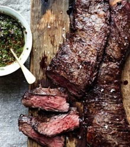

# 食人者杂记

说真的，我从来都不拿男朋友的任何一部分宴请客人。

也不是所有的位置都可以用来烹饪。比如肝脏，据说是排毒的器官，但我只是因为它的味道太苦才放弃的，也许不过是由于我刀工不够纯熟，刺破了胆囊的缘故。对于那些喜欢抽烟的人——他们几乎个顶个都是多年的烟民，大概这让他们增添了艺术家的气质，而我总是被那些有艺术气息的人吸引——他们的肺部我也从来都不敢尝试。我猜想你们一定都被公益广告骗了很多年。当我剖开他们的胸腔，看到还在微微起伏的肺部红润饱满，并不像广告里“吸烟有害健康”的附图中那样干瘪腐朽，这是令我由衷感到欢愉的。但即使如此，迫于潜意识中轻微的洁癖，还是要把它们切下来扔到一边。

大脑也不吃。这跟智力无关，即使他是爱因斯坦我也不吃。也并非因为这一行为让我看起来像个丧尸。听说拿人脑做食物有可能感染一种叫“克雅氏”的疾病，去他大爷的科学，维基百科又不会告诉我“食人脑的利与毙”，它只会每天叫嚣着42是万物的答案，表意不明。我不过偏执于，吞食大脑无论怎么看来都像是一种反智行为，一种亵渎神明也亵渎思想的做法。即使我偶尔也会幻想他们的脑容物跟我的融为一体，然后让我揣带着他们的思想和记忆继续生活。一般幻想到这里也就戛然而止，我并不想代替任何人走完他的余生，这让我感觉既焦虑又委屈。

上臂、后腰和排骨里脊之类都是很棒的食材，煎烤炖煮皆可。肢解之后冻在冷柜里，我一个人可以吃上半个月。而至于他们的骸骨和其余不可食用部分的处理，一度成为享受这种美食对我所造成困扰的重心。我曾尝试过填埋、投海、焚烧等各种办法，无一让我这完美主义者满意。那时的我还称不上是一个有经验的屠戮者。直到白老师教导我们：“氢氟酸加聚乙烯容器”。

一个男人在我口中的标签由“男朋友”变成“食材”，必然经历的过程显然是死亡。我很想拿“多义性交合”、“子体母体”或者什么“共产主义小恶魔拿他上颚作为病菌培养基”之类故弄玄虚的概念混淆过去。比起真相，我更希望用这些荒诞不经的缘由欺骗和说服自己。

因为真相常常比构想更加荒诞。

十三岁那年，学油画的堂姐留法归来，有一天心血来潮带着还分不清委拉斯凯兹和伦勃朗的我去参加一个现代画展。为什么是画展呢？因为一般关于尚未成名的艺术从业者的故事，邂逅都常常发生在这类地方。堂姐在那儿碰到了一个曾有过几面之交的朋友——她是这么跟我说的，至于他们有没有上床，现在这世界上恐怕也只有她一个人知道了。

那个人是个风光纪录片的导演。现在的很多国内导演不是长发就是秃瓢，不幸的是，他并不属于两者之一，至少在他活着的时候都还没有。我跟在堂姐身后怯懦地打招呼，很明显他惊异于我这个年龄的孩子为何会来这种地方，好像我出现在这里就暗示了他的品味等同于一个十几岁的小孩儿。

但一个过了不惑年龄的艺术家当然有足够的自制压抑内心不置可否的羞愤。他随即和颜悦色地跟我们，确切地说是跟堂姐攀谈起些无关痛痒的话题，临走还送了我香蕉牛奶。

我就是从那个时候开始爱上香蕉牛奶的。

不久后的某一天，我放学后看到他站在校门口，手里还拎着家乐福的购物袋。我从未想象过一个艺术家装扮得如此居家的场景。他当时正在打电话，看到我后抬了一下拎着购物袋的那只手示意我过去。

于是我跟他回了家。

那个年龄的少女们大多什么都不明白却对什么都要装作一副老练世故的样子，我也不例外。就算隐隐约约觉得有些不妥，还是选择固执于自己内心偏好的选项——跟他走。这个比我爸爸年纪大概都要大一些的男人让我觉得，在安稳之余更多的是一种新鲜的尝试，当时的我以为，那一刻随他走进的很可能是一种我这辈子都鲜有机会体验的生活。

文学作品中从来都不缺少这种角色——他们垂涎少女的童贞，得到后再歌颂她们的献身，然后为之挽祷。这似乎是他们一种与生俱来的欲望，赤裸真实。但事后他们总是要想尽各种办法为之洗白，将其牵强附会地称为对纯洁少女的爱怜、对天使的致敬，似乎这种欲望本就该与嫉妒和贪婪等等一并算作原罪，以炼狱淬火将其燃尽。所以说，与继女乱伦的亨伯特也并非个例。

有趣的是，那时我告诉他“我爱你”，是因为我觉得自己可以爱他。但事实上我并不爱他。

我年幼无知却自以为聪明，习惯于顺遂每一个来到我生命中的变动，不反抗不逃避，算不上随波逐流但也依旧像波流一样缓冲着各方撞击。这便意味着，如果我的河道有分毫的偏移，我可能就随之与原路渐行渐远。

比如这一次。

我并没奢求他会是另一个里昂，用沉默象征性地做不由衷的回绝，因为我能感受到他作为一个艺术家的过分感性，他的体内永远流着难以冷却的血。某种程度上我们算是同一类人，不相信宿命却接受一切偶然。可他不能永远十三岁，这就是他事后恸哭的原因。

是的，当我坐在他的床边享受盒装的香蕉牛奶的时候，他忽然毫无征兆地恸哭起来。我试图靠近安抚他，他却受惊一般地躲避开。那时候我实在不敢相信他是个年龄为我的三倍多的男人。我不明白自己尚未发育完全的身体如何触动了他，就好像我不明白成年人的世界中关于爱情的游戏规则一样。

起初他的理智尚存，呢喃着他热爱一切原始与本初、一切鲜活和美好，一如他热爱一个十三岁的小女孩。但不久之后他非但没有平静下来，反而变得愈发癫狂。他时而说我是妖魔、是毒物、是美杜莎，时而又唱起歌来，歌颂着什么墨尔波墨涅。

我无比恐惧，却也满怀忧虑。奇怪的是当时我想了无数种事情进展的可能性，唯独没有考虑离开——想必那会儿一心前行的我不齿于做逃兵吧。

不知道过了多久，他终于安静下来继而渐渐睡去，我也变得精神恍惚思维混沌。当我被一阵饥饿感唤醒的时候，身边的人已经冰凉。

他死了，死在我身边，而我连他的名字都还不知道。

令自己都感到惊讶的是，我彼时居然无比平静，脑海中只回荡着一句话——我想他说对了，我真的是毒物。

可我还是饥饿，出离的饥饿。我抚摸着他尚未僵硬的肌肉，为自己脑海中一闪而过的念头感到惊讶和恶心。我觉得继续按照自己的秉性顺其自然下去，事情会变得更加可怕，所以我胡乱套上外衣离开了那个房间。

当我走出房间以后，这个世界发生了一种骇人的突变：人类世界的规则倏然间就退化为一种原始的、自相残杀的形式，但这种残杀是被动的。交媾成为了男性们生命的交接仪式，女性一旦受孕，孩子的父亲就会在不久之后死亡。这样一来，看似并不阻碍人类繁衍的进程，但男性的数量大大减少了。

起初，一些女人觉得如释负重。她们曾长年受到家暴的迫害。也有一些女人呼天抢地，大概失掉了长久的靠山。但是人类的适应能力是不可低估的，久之也就习惯了这一新的规则。而男人们面临着一个定夺权衡的问题：是为了人类的延续献身，还是只求自保？这回是真正的花下死，不知可愿求风流。

几年以后，女性角色的数量早已在各个领域直线攀升——从政客官员到科学家和技术工人。毋论社会守序与否，令人难以接受的是她们甚至开始提倡人性回归和本能解放。而最直接的方式就是吃人。“男性尸体大量囤积，不如立法吃了吧，像雌性螳螂那样。回归原始回归自然嘛。”第一个提出议案的人是这么说的。

“我们尊重他们的意志，但死后并不受到意志的控制。”一个支持者这样回击反对者。

我想不明白，这些人究竟积聚了何等病态的仇恨，才会让这项权利通过。不久后，权利变成了义务，所有的火葬场都不再处理因交媾而死亡的人。她们用自己昔日的恋人作为主菜聚会和宴请，跟朋友们分享……

我还很清醒。

我今年十九岁，距离那次变故过了六年。

我顺遂生活中的变数，并习惯和接受，但这并不代表我是盲目的。我体内有一个清醒至极的自己一直在冷眼旁观和记录我的变化。可她从不参与干涉，即使我的所为天理难容。

我并没有吃过几个人，不多。我认真地烹调作为最后的敬意。反正这时代也快要灭亡了，为什么不顺遂她们的意愿回归本性呢？

我不能不吃，因为老大姐在看着我。

如果我不吃，总有一天会被吃掉的。

（采编：张山骁；责编：王卜玄）

[【出格】洛神](/archives/47762)--后来，曹丕在毕业旅行的时候用诗人的方式把这句话说给了弟弟曹植：“我们永远无法真正了解一个没有和我们做过爱的女人。
