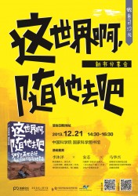
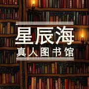

# 星辰海真人图书馆：做自己沙龙——《这世界，随他去吧》阅读分享会

你是否——

一直在准备，却不知该如何迈出第一步？

一直在期待变化，又害怕改变之后不及现状？

一直在为难：担心长途旅行会破坏大好前程？

我们想要讲给你——

•旅行其实也可以为职场加分

•为什么旅行如此重要

•在快节奏的生活中，工作与旅行该如何平衡

•旅行之后如何快速回归职场

•如何把旅行经历变成职场竞争力

我们想要和你分享——

•旅行者的世界环游见闻

•旅行回归之后给工作的减压及眼界心态带来的变化

•旅行助力你的职场的经验，让旅行不再是职业的绊脚石！ 

**【主题】** 做自己沙龙——《这世界，随他去吧》阅读分享会

**【时间】** 12月21日 下午2：30-4：30

**【主讲人】** 李沐泽（职业媒体人，旅行者，《这世界啊，随他去吧》作者。曾供职英国路透社、每日邮报。）

马华兴（新精英生涯研发总监；新精英职业生涯管理课程高级培训师国际项目管理师[PMP]；中国移动工作12年，通讯IT领域资深专家。）

安芯（自媒体"芯对话"创始人，《安心的义工旅行》作者。文化产业投资从业者。）

**【主办方】 **星辰海真人图书馆，浦睿文化，新精英生涯，中国科学院国家科学图书馆

**【地点】 **北京 中国科学院国家科学图书馆（近地铁4号线 中关村站）

**【费用】** 免费

**【报名方式】**登录豆瓣页面点“我要参加”或前往『活动行』平台报名：http://www.huodongxing.com/event/4206636954100

通过『活动行』平台报名参加的朋友可到现场凭手机号领取小礼品

**【活动链接】** 请点击这里

[http://www.huodongxing.com/event/4206636954100 ](http://www.huodongxing.com/event/4206636954100)

** 【资讯提供】**星辰海真人图书馆

（采编：李维；责编：万晓华）
