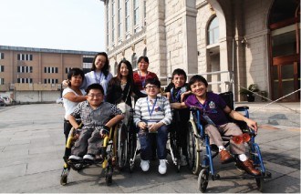
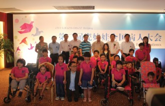

# 第三届瓷娃娃全国病人大会

**【主题】**第三届瓷娃娃全国病人大会

**【主办方】**瓷娃娃罕见病关爱中心、中国福基会瓷娃娃罕见病关爱基金

**【时间】**8月3—5号

**【地点】**北京

注：8月3日开幕式：

8月3日（周六）9:00-12:00

美泉宫饭店三楼国际厅（北京市海淀区西四环北路125号）

**【报名方式】[开幕式邀请函地址](http://chinadolls.org.cn/page/4411)**

**【活动简介】**

瓷娃娃全国病人大会每两年举办一届，是全国性的脆骨病人大会，来自全国各地、各个阶层的脆骨病友家庭共聚一堂，

就自身疾病相关的问题展开讨论，会议内容涉及到医疗康复培训、政策法律培训、心理干预及疏导、就业模式探讨、义

诊以及病友故事分享等议题，并倡导和呼吁社会、政府以及社会对这一群体给予关注和支持。

**主要日程：**

8月3日：

9：30—12：00大会开幕

14：30—16：30政策发展与社会行动

16：30—17：30罕见病问题与个体行动

19：30—21：30真人图书馆：病友故事分享（就业、教育、婚姻、亲子）

8月4日：

9：30—12：00成骨不全症国际医学交流论坛：意大利经验分享

9：30—12：00绘画工作坊

14：00—17：00成骨不全症国际医学交流论坛：国内经验交流

14：00—17：00音乐工作坊

8月5日：

09：00——12：00 工作坊一：成年病友的自立生活

09：00——12：00 工作坊二：父母子女的亲子关系

**【瓷娃娃介绍】**

成骨不全（osteogenesis imperfecta，OI）又称脆骨症，是以骨脆弱、骨畸形、蓝色巩膜、牙齿发育不良、身材矮小等为临床特征的常染色体显性或隐性遗传性结缔组织病。有 家族遗传倾向，可母婴同患，也可发生于孪生儿。新发现的散发病例则因Ⅰ型胶原基因突变所致。新生儿中的患病率（国外）为21.8/10万，居民中的患病率 为10.6/10万。贝鲁特的黎巴嫩大学医学院儿科从1991年2月至1993年7月，对全部（3865例）新生儿进行了查体，发现64例先天性畸形患儿 （发病率16.5/10万），其中成骨不全仅1例。国内也有成骨不全的散发病例及家系的报道。根据David Sillence的意见及临床X线和遗传学特点，一般分为四型。X线的表现主要有骨质疏松、多发性骨折和多骨畸形。

**【关键词】**

公益 瓷娃娃 北京 论坛 行动

**【活动链接】**

**[请点击这里](http://chinadolls.org.cn/dahuizhuanti/index.html)**

**【资讯提供】[瓷娃娃罕见病关爱中心](http://www.chinadolls.org.cn)**

（责编：叶声）
