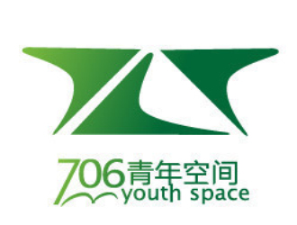

# 许知远谈“台湾经验与社会转型”暨《东方历史评论》签售会

【主题】台湾经验与社会转型  【时间】2013年9月13日19:00—21:00  【地点】706青年空间（北京五道口华清嘉园15号楼2006室）  【主讲人】许知远：北京大学校友，作家，出版人，公共知识分子  【主持人】罗勉：北京大学学生  【联合主办】北京706青年空间和《东方历史评论》杂志社  【费用】15元无限畅饮饮料（奶茶、红茶、咖啡等）或自点饮料；706会员自愿消费 无需提前报名 ，进门需签到 【讲者介绍】 

许知远，作家，70后公共知识分子之翘楚。曾任《经济观察报》主笔。现为《生活》杂志出版人、《亚洲周刊》与英国《金融时报》中文网专栏作家，以及《东方历史评论》主编。他是北京独立人文书店“单向街书店”的创办人之一和博客站点“思维的乐趣”的主要博主。已出版作品《那些忧伤的年轻人》、《一个游荡者的世界》、和《极权的诱惑》等。

 【内容介绍】 

在本周五晚的706青年空间，许知远将以“台湾经验与社会转型”为起点，向诸位讲述他对世界的观察和思考。他期待来到706，与80后、90后的年轻人们共同探讨我们所关心的——中国的未来。

同时，许知远会谈谈办一本历史杂志在当下转型时代的意义。现场将供应《东方历史评论》杂志第一期、第二期，以便诸位赏阅、选购。

许知远希望这次活动成为一场自由、开放、平等的分享会。

 【作品选读】 

“中国的巨大转变，是对人类社会种种既有理论、思想的检验与挑战，也提供了眼花缭乱的情感与故事。如何运用自己的头脑与眼睛，来观察、理解、描述这一切，则变成一项艰巨、迷人的工作。它也是整个人类价值系统中的重要环节。”

——许知远《中国纪事》 

“每一代人、每一个人都要寻找自己的方式，来确立自己的内在世界。但这种改变的前提是，我们必须把那些被玷污、扭曲的词汇、情感拯救出来，赋予它们本来的光彩。精神、思想、知识不仅不是脆弱、无力的，反而是一种永恒的力量，它们永远在防止现实权力变得过分粗鄙与粗暴。

作为一个知识分子，让他忧虑的不仅是现实境况，更是某种抽象的原则。一定存在某种更高的价值，值得人们去尊敬，一定存在某种准则，超越党派、利益团体，值得为之呐喊与坚持。正是这种价值与准则的存在，才使每个人得到最终的保护，才使每个人感受到更充分的人生意义。坚持这种努力，不是因为它会获得成功，而是因为它符合我们内心的主张。”

——许知远《时代的稻草人》 

采编：程小鱼 责编：程小鱼
