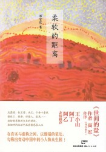

# 读书会：邓安庆与《柔软的距离》

【分享馆】读书会：邓安庆与《柔软的距离》

曾经，他辗转漂泊，他遍尝冷暖，他充满故事；他用柔软的眼神观察熟悉又陌生的世界，他用柔软的笔绪记录这个极速变化的时代。现在的他，是豆瓣红人，是文坛新秀，是见了谁都要扯一扯文学的小疯子。他说，文学是一层保护膜，它避免作者直接与生活近身肉搏。

他的笔下有各色人等，有家人，有行人，有工人，有小贩，有边缘人物。他的下笔冷静而不冷漠，他的小说多情却不滥情。他不是哲学教授，他就是邓安庆， 一个纯粹的文学书写者。正式的作者简介是这么写的：邓安庆，湖北武穴人，1984年生。中文系毕业后，辗转去过不同城市，做过泥瓦工、服务员、教师、文 案、培训等多种职业，现居北京。已出版有《纸上王国》一书，在各文学期刊发表文章多篇。

  

【时间】2013年8月4日下午1点30分到5点

【流程】13:30-14:20，邓安庆单独陈述他的新作与他的故事；

14:21-15:20，邓安庆与Danyboy、狗剩儿他爹、罗贲等人对谈；

15:21-16:10，观众提问与互动；

16:11-17:00，自由交流与签名活动。

【主讲人】邓安庆

【主办方】706青年空间

【简介】关于《柔软的距离》

从菜园到公园，从泥路到公路，从瓦房到楼房，我跟我的同辈人一起从农村到了城市。跟北京、上海本地的朋友聊天时，我说你们不会知道什么是叫做乡愁。家乡你 已经回不去了，而城市你还融入不了。在这种两无着落的尴尬状态中，一方面人自然会有一种游离的漂泊感，一方面也拥有了一种超然出来的清醒——对于农村与城 市都被迫有了一种距离。与亲人，我距离过近，因此我走远一些来写；与陌生人，我距离过远，因此我走近一些来写。我希望把距离定位在一个适合的距离，同时也是一个柔软的距离，用情度之，用理解之，因此才有了这些勉力为之的粗糙文字，只希望把他们的片段留下。

【费用】10元 场地费 706会员免费

【地址】706青年空间 （北京市海淀区五道口华清嘉园15号楼2006室）

 

【活动链接】请点击这里

[http://page.renren.com/601261629/note/910506910?ref=minifeed&sfet=2032&fin=3&fid=23253938615&ff_id=601261629&platform=0&expose_time=1375497578](http://page.renren.com/601261629/note/910506910?ref=minifeed&sfet=2032&fin=3&fid=23253938615&ff_id=601261629&platform=0&expose_time=1375497578)

 

责编：程小鱼
