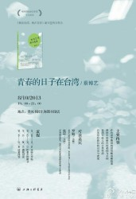

# 青春的日子在台湾

**【主题】**

【季风声音】青春的日子在台湾——《我在台湾 我正青春》新书分享签售会

**【时间】**

8月10日晚19：00——21：00

**【地点】**

高安路淮海中路，地铁10号线图书馆站站厅内季风书园

**【主讲】**

蔡博艺

**【嘉宾】**

罗勉（大陆）：北京大学国际关系学院 2013年2月～6月在台湾大学交换

张可（大陆）：首届赴台陆生，台湾大学国家发展研究所博士在读

**【主要内容】**

在台求学期间的经历和有趣故事

两岸青年世代的相同与不同

台湾年轻人的公共生活

台湾带给我们的启示与改变

**【流程】**

19：00～19：05 主持人开场

19：05～19：15 作者介绍新书

19：15～20：45 嘉宾对谈

20：45～21：00 读者问答

**【关键词】**

公益 季风书园 上海 新书分享

**【活动链接】**

[请点击这里](http://photo.renren.com/photo/283193893/photo-7354195273?ref=minifeed&sfet=701&fin=3&fid=23289802141&ff_id=283193893&platform=0&expose_time=1375886819&psource=1)

（责编：叶声）
