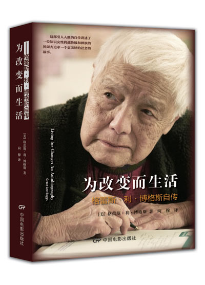

# 骆晓戈：为改变而生活——格雷斯自传中文版介绍

   
格蕾斯是一位1915年出生的美籍华裔，中文名陈玉平。她的自传《为改变而生活：格雷斯•利•博格斯自传》（Living for Change An Autobiography Grace Lee Boggs）从个人成长的视角出发，生动纪录了一个世纪以来美国社会文化的急剧变化，生动地展现了杰出华裔女性对历史变革的参与和推动。
讲座邀请该出版项目主持人骆晓戈主讲，将介绍格蕾斯的纪录片，访谈格蕾斯的感受以及该书的出版背景。并将与会者签名售书。

##【主题】
【新媒体女性】骆晓戈：为改变而生活——格雷斯自传中文版介绍

##【时间】
1月7日晚7：00——9：30

##【主讲】
骆晓戈（《为改变而生活》项目统筹协调人。湖南商学院中文系教授，诗人，女性研究中心主任。曾任妇女/社会性别学科发展网络常务理事。）

##【主办方】
新媒体女性

##【地点】
学而优书店(新港西路)，地铁中大站B出口，近中大西门旁

##【费用】
免费

##【活动链接】
[骆小戈：为改变而生活——格雷斯告诉我们什么](http://www.douban.com/event/20642104/)

