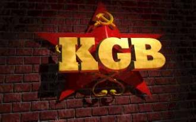
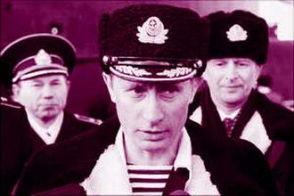

# 第六十六期：卢比杨卡

**词条简介：******

**在俄罗斯，一提起卢比扬卡，人们就会想起盛极一时的克格勃。**因为，当时克格勃的总部就设在卢比扬卡11号。克格勃在苏联时期是集情报、安全、保卫等职能于一身的超级安全机关．它的情报机构．即：克格勃第一总局．是与美国中央情报局和联邦调查局情报机构分庭抗礼、并驾齐驱的庞大机构。

 **目录：**

一 诞生背景

二 发展沿革

三 历史影响

四 参考文献

五 延伸阅读

 ******一 诞生背景******

十月政变后，列宁终于获得了政权并决心要保住这个政权。

斯莫尔尼大学是一座正面有古典装饰的大楼。这里是早先专为圣彼得堡贵族小姐们开设的一所学校。在计划十月政变的日子里，这里的重要的安全工作被交给了一个蓄着山羊胡子，办事认真谨慎的波兰贵族。他曾经是沙皇警卫队的受害者，蹲过他们的监狱。他的名字叫作费力克斯·艾德蒙多维奇·捷尔任斯基。

捷尔任斯基通晓波兰语、俄语、英语和依地语。他把他的全部献给了布尔什维克主义的事业。革命后不到一个月，革命军事委员会便接受了他的建议，成立了一个肃清反革命和怠工委员会。由于法律废弛，秩序混乱，有钱人的住处时常遭到流氓恶棍的抢劫，成立酗酒成风。在捷尔任斯基的提议下，人们把冬宫地下室储蓄的酒倒进了涅瓦河，并且捣毁了所有其他的酒精储藏室。他们成立了内务人民委员部，并命令它组织起一支民兵队伍。捷尔任斯基从一开始就是革命军事委员会的成员。在他的领导下，由革命军事委员会宣布解散，将其维护布尔什维克执政的职责交给了全俄中央执行委员会的有关部门。唯一适于承担这一职责的部门就是根据捷尔任斯基的建议成立的肃清反革命和怠工委员会。中央委员会接到了一份在国举行总罢工的情报。在列宁的极力主张下，捷尔任斯基承担了制止这次罢工的责任。

要建立一个革命向反革命进行清算的机构。我们必须立即行动，不是明天，而是今天。”委员会当天就采取了行动。

1917年12月20日，委员会决定成立“契卡”，即全俄非常委员会（为肃清反革命、投机、怠工和渎职罪）。从而成立了今日的克格勃即卢比杨卡。这个组织并不是依据法令，而只是简单地依据决议成立的。之所以称为“非常”，是因为这个组织将是临时性的。

 ****二** 历史沿革******

克格勃的情报机构从成立到解体重建大致经历了三个历史时期：

 **1****．发展阶段——****50****年代末以前**

克格勃情报机构第一总局的前身最早可追溯到1917年12月布尔什维克政府刚建立时成立的全俄肃反委员会“契卡”的对外特种侦察处．该机构也成为全俄肃反委员会第一个对外侦察机构。1920年9月苏波战争后．为了进一步加强苏联的侦察机构．俄共中央委员会政治局决定对侦察机构进行重组．**同年****12****月****20****日组建独立的全俄肃反委员会外事局．这一天也成为围家安全委员会****(****克格勃****)****的诞生日**。此后一直到克格勃成立．苏联情报机构根据国内外形势的变化做了六次较大规模的调整．领导机构配置趋于合理。人员编制不断增加。为克格勃情报机构的最终建立奠定了基础。1954年2月苏联共产党中央委员会决定将国家安全机构从内务部独立出来．组建为一个独立的部门．**当年****3****月****13****日成立了克格勃**。前内务部第一副部长谢罗夫被任命为克格勃主席，对外情报侦察工作由克格勃第一总局负责．帕纽什金被任命为第一总局局长．

 **2****．成熟阶段——****50****年中期至****80****年代末**

克格勃建立后．为了适应不同历史时期主要任务和侦察对象的变化。第一总局又进行了三次较大规模的调整。1975年1月初．克留奇科夫被任命为克格勃第一总局局长．在他担任局长期间他对第一总局进行了较为彻底的改革．并使第一总局最终走上稳定发展的轨道。

80年代下半期根据《帕尔金松法案》苏联对外情报侦察机构不断扩大．克格勃第一总局的编制人数超过了20000人，建立了许多新的局和处．当时克格勃的情撤机构权力很大。只对中央政治局负责．侦察范围和对象涉及到了世界的每个角落，为苏联社会、政治、军事、科技、经济发展做出了巨大贡献。

持枪独守克格勃的普京

**3****．分解重建阶段——****90****年代初至今** ** 1991****年****12****月****3****日****苏联最高苏维埃通过了《国家安全机构重组法案》，宣告曾经声名显赫的克格勃的最终解散**。在此之前。1991年10月22 R苏联国家委员会第八次会议决定将苏联对外情报侦察机构即第一总局从克格勃分离出来重组为苏联中央侦察局，普里马科夫任局长。苏联解体后．俄联邦总统叶利钦下令将中央侦察局改组为俄联邦对外侦察局，普里马科夫担任对外侦察局局长。 

1992年8月11日俄联邦通过了《对外侦察法》．根据该法案．俄联邦对外侦察局不再在全球范围内进行侦察活动．而只是在那些涉及俄罗斯同家利益的地区展开侦察活动．对外侦察局的编制结构也发生巨大变化．对外侦察局30--40％的中央和国外机构被撤销．干部人数削减到了15000人。驻非洲、拉美和东南亚的三十处间谍机构被关闭。

1995年12月8日俄罗斯通过了新的《对外侦察法》．新的法案加强了对情报机关和情报人员的保护．促进了俄罗斯情报机关的发展。目前．俄罗斯联邦对外侦察局尽管在编制结构、人员素质上无法和当年克格勃第一总局相提并论．但是由于于它们继承了第一总局许多好的做法和合理的机构配置．使得他们仍然能够很好的完成政府赋予的各项任务。

 ******三 历史影响******

“全俄肃反委员会”即“契卡”成立后，人权被秩序所侵犯。人们开始指责“契卡”，但列宁不为所动。就像他对“契卡”的评价一样：“能够坚持无产阶级专政，这比什么都重要。”“契卡”诞生于布尔什维克立足未稳的特殊历史时期，直接诞生于列宁对秩序的坚持，这或许已经奠定了克格勃的历史底色。“契卡”沿着列宁划定的道路坚定不移地走了下去，并迎来斯大林、亚戈达和贝利亚，而其创建者捷尔任斯基则被丢到了一边。在“大清洗”中，没有法庭，没有侦查和预审，克格勃完全沦为了个人独裁的工具。

1991年8月19日，已于1954年更名为“国家安全委员会”(克格勃)的这个情报帝国第一次站到了政权的对立面，发动政变企图挽救苏联。这是一次不成功便成仁的行动，如果失败，克格勃将万劫不复，末代克格勃主席克留奇科夫十分清楚这一点。也许他到死都在后悔，他们的“阿尔法”部队无法从克格勃接到明确指令，最终失去逮捕叶利钦的机会。如果总部在“阿尔法”的数次询问中哪怕给出一次明确指示，历史都将被改写。

政变失败，克格勃只能愿赌服输。捷尔任斯基塑像被推倒，克格勃被迫取消了其内部的苏共组织，巴卡京开始主持改组克格勃工作。一位老克格勃闯进总部大楼，面对巴卡京喊道：“我是共产党员，到死也是！”巴卡京平静地回答道：“我只关心你的业务水平，你的信仰我不关心。”

到了选择的时候，很多人都被迫做出了改变，这其中就包括普京。政变发生后，普京辞去了在克格勃中的职位。他无奈地看着自己的国家陷于万劫不复之境，无奈地看着自己为之奋斗了6年的情报机构被大卸八块。

现在，掌管俄罗斯间谍的机构是对外情报局(SVR)，它是“国家安全委员会(克格勃)”的现代版，相当于美国的中央情报局(CIA)，负责对外情报搜集，而其同为克格勃继任者的联邦安全局则专责反情报及国内安全。由于普京的特殊关照，SVR在后冷战时期的今日极度活跃，如令全世界都大为震惊的美国逮捕11名俄罗斯间谍事件。

******四 参考文献******

1 《克格勃历史》 （英）布莱恩·弗里曼特尔

2 《克格勃情报机构的历史变迁及对我启示》 邸卓然 彭刚虎 章小勇 《山东文学（下半月）》（2009.10）

3 《克格勃变迁史》 《南都周刊》（2010年7月）

 ******五 延伸阅读******

1《浅谈克格勃》 肖玉秋 《历史教学》（1998年02期）

2 《卢比杨卡档案：克格勃兴亡史》 孙乔 甘肃文化出版社

（编辑：高丽 责编：高丽）
