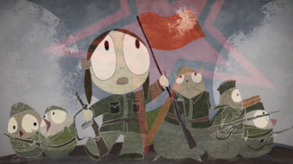
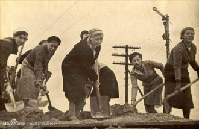

# 第四十二期：你给《前进，达瓦里希》几颗星？

一部8分钟的毕设作品，短短几天内被大量转发，在豆瓣评分上更是遭遇“一星”和“五星”的两极评价，在一群人表示“流下来眼泪”的同时，另一群人则“看吐了”——你一定知道，我指的是北影09级毕业生王一琳的《前进，达瓦里希》。

对《达瓦里希》评价较高的，基本有两类人：一是认同短片中的政治理想，对于这种情况我们不想在此浪费笔墨；二是认为去除政治性因素后，短片在艺术性上值得肯定。否定者则与此相反，认为观众需要从政治的角度批评它。“去政治化地看待艺术”，这一观点引起许多网友的争论。在对待艺术作品时，我们要不要去政治化？进一步讲，我们能不能去政治化？本期七星视点，就让我们来聊一聊政治与艺术的关系。

# 

# 需要去政治化地看待艺术吗？

 首先，赞同“去政治化”的网友认为，努力去发现“美”，而不是发掘意识形态，是欣赏艺术作品的应有态度；反对者则针对美的标准发起质疑—— 正方： 

Royzhang：很多人都不是在看一部作品，而是在猜测或者试图找出这作品背后蕴涵的意思。可能最终找到了正确的含义，但可能没有欣赏到作品本身所蕴含的美感。我就想知道，是否只有符合自己意识形态的作品才是可以被欣赏的？或者只愿意去欣赏符合自己意识形态的作品？

 反方： 

[末代盟主独孤羊](http://movie.douban.com/people/59259944/)：这部动画，是长大后的中二迷们彻头彻尾的清情怀片……问题在于：如果真的要纯粹审美地看它——把一切苏联因素都剔除、悬搁出去——这部影片还剩下什么？其实什么都不剩下。如果还剩下些什么，那只是一种二十年前的话语熟悉感。**有这样一种误解，误把对自己童年、青年经历的熟悉感、共鸣感，混同成审美感……**五百年后的人看今天的达瓦里希，看到的只是疯子。这是为什么呢？因为**达瓦里希们根本就没有任何审美上的可取之处，他们受到的欢迎，即便是非政治的，也只是迎合了观众的此种心理：“这是我的童年。”——但你的童年就是“美”的么？**

“在人的眼里，只有人性可能是美的。”——这是一切美学的基本前提。因为无论你看到什么美，看到的都是人性的美。 但“在我们这代人的眼里，我们的童年就是美的”——这是一种多么幼稚、或狂妄的思想？这里有一个畸形的综合体：它综合了人类古老童年中的信仰，和现代人对自己时代无理性的肯定欲。

——《“对幸福的许诺”——对达瓦里希们的审美批判》原文链接：[http://movie.douban.com/review/6132270/](http://movie.douban.com/review/6132270/)

随后，赞同者又提出，我们之所以要不考虑意识形态地看待作品，是因为意识形态本身是多元的，而这种多元性需要得到保护，因而，我们不能从意识形态正确与否来评判艺术作品：

 正方： 

Commando：从我个人来说，我觉得如果大家都有“无限深挖文艺作品的意识形态”的意识，那么在这个土壤上很容易就催生出“所有文艺作品都要有健康的意识形态”的花朵，再进一步就是“所有文艺作品在无限深挖的前提下也必须拥有健康的意识形态”——这可真就和意识形态委员会沾边儿了。

我希望大家抱着善意和宽容去看待文艺作品的创作者。无论如何，把某些东西看得是神圣的（不管是共产主义、还是民主、还是党、或者宠物狗），不许创作者去亵渎；同样，在不违反法律的前提下，把另一些东西（不管是共产主义、还是民主、还是党、或者宠物狗）看成是禁区，不允许创作者去触碰，这种思想我并不喜欢。

微风阁：我们所珍视的是与享乐主义不同的英雄理想主义情怀，这种情怀在哪里都有，不是一种政治态度，更不必引发人们就狂躁恐慌、乃至导致暴力情绪的政治迫害妄想症。**任何一种曾经、正在、未来试图让人类更好的学说、信仰和理论体系（无论是自由资本主义或互助社会主义），都有宝贵价值。**而历史过程中的种种悲剧，都有各种复杂的原因，不只是推翻这套学说、信仰和理论体系就可以解决的.

其实每个人内心都有一个集体主义者，希望能和平快乐平等互助地与其他人生活在一起，就像每个人内心都有一个个人主义者，希望能完全自由不受他人束缚独处享受一样。只强调人性的一面，是永远不够的。无论什么时候，尝试接受和宽容他人的思想，就是对历史教训的最高尊重。

——《说好的宽容精神呢？》原文链接：http://movie.douban.com/review/6134636/

但是，反对者认为，“去政治化”本应是理想状态，但是，在中国社会当前的语境下，短片中体现出的意识形态并不是思想自由、思想多元背景下的产物，而根本就是政治力量塑造的结果，因此不顾具体背景，泛泛而谈多元与包容是有偏误的：

 反方： 

[韩乾](http://www.douban.com/people/sandlong/)：是不是忽略了一点，即“去政治化”的艺术在当代中国的时空中真的存在吗？**若人们为一种逝去的理想感动，而这种理想却只是政治力量所有意塑造灌输的，这种感动算得上是“去政治化的”吗？**

这个讨论似乎没有重视这样一个前提，即当我们在当代中国这个语境中谈及“去政治化”这个概念时，**我们所谈论的首先是一种为极权核心自上而下的“泛政治化”统治策略所制造出来的自下而上的伪“去政治化”状况**；“去政治化”概念之本义所指的，只可能是自由制度之下的生活，而不可能是当代中国的生活。正因为此，这个讨论便给我们带来了时空错乱的观感。

“去政治化”实际上是自由主义的典型理想，是自由主义与其保守主义反对者的论争主题。但是，反过来用这个主题去理解当代中国，去理解那种立足于后三十年而怀念前三十年的奇异情绪，是错把杭州作汴州。我们不得不说，这种情绪无非也是极权核心十余年来所苦心孤诣营造的那种国家主义合法性宣传的一部分，是其所谓精湛统治技艺的又一个“杰作”。

极权核心所欲制造的是政党-国家与市场-社会已充分分离的假象，然后用这一假象来支撑自身的程序性、中立性地位与市场-社会的独立性。在如此伪装下，才会产生类似于《激情燃烧的岁月》和《前进，达瓦里希》这样的极权主义美学作品，更进一步地，才会产生对此类作品的“去政治化”辩护之逻辑。他们心知肚明：**一部“去政治化”的作品和对这部作品的“去政治化”理解，本身也只有当人们的确身处一个去政治化的环境、一个政治社会已然分离的框架之中时，才有可能成立**；但如果能够成功让人们自以为身在如此的环境和框架中，那样的理解也就能被广泛接受了。于是这就形成了我们今天所看到的状况。

——《错把杭州作汴州》原文链接：[http://www.douban.com/group/topic/40767782/](http://www.douban.com/group/topic/40767782/)

[半死不活李二锅](http://movie.douban.com/people/Eversint/)：退一步讲，即便这种纯粹的、真诚的怀旧、感念是存在的，对其的愤怒也并非是不可欲的。对此有以下两种论证：1）纯粹、真诚的感情就其本身就具有内在的正当性或善，是一种过于浪漫甚至是不负责任的开脱。2）形成这种所谓纯粹、真挚的感情或曰偏好的过程就是高度政治化的，如果不是可恶的。**一个自由、开放、竞争的舆论乃至伦理市场上形成的怀旧倾向，与一个受宰制、封闭、垄断的灌输体系下形成的固有倾向，并不是平等的**。暗示这种平等存在，因而对某种与认知无关的感情的愤怒是不可欲的，实际上也是在表达某种政治：对我们的过去，这是一种睁眼闭眼的默认。

# 

——《“去政治化“的贫乏》原文链接：http://movie.douban.com/review/6135912/

最后，反方认为，即使需要保护多元的价值观，我们也大可对不符合自己价值观的东西猛烈批评。这并不是对多元性的否定，而是争取自身话语权的过程：

GTY：**达瓦里希作为一个文本既然涉及政治，那么自然就进入到了公共领域，因而必须面对对话和论辩。多元的真意是自由平等的对话和对私人领域的保护，而绝不意味着对公共领域中必须要进行论辩的话题左右躲闪。**更重要的是，政治话语因为其特殊性，必须在对话和论辩之后面对抉择，套用佩蒂特的说法，论辩民主必须要有一个暂时性的终点，民主的结果必须被接受，按照实用主义的观点，这是因为自由平等对话的结果，就是真理，就是善好。反对者不过有两种选择：要么闭嘴，那么多元会保护你们在内心默默思考的权利，要么就在接受现实的基础上继续对话和论辩，那么你们就不能以多元为借口要求对手放任你们自说自话而毫不搭理。

（所谓的“多元论”者）不仅对多元有着极其低级和错误的理解，更没有意识到一个浅显的，关乎自由的事实。正如共和主义的积极政治自由观说的那样，**自由不会白白得到，而是要靠积极投身政治实践才能维护。**或许多元论者确实反对诸多达瓦里希们，然而他们却因为所谓的多元或者犬儒主义，而畏惧于在政治竞技场中维护自己的立场，其结果，只能是他们所珍视之物的丧失。到那一天，他们又能向谁哭诉自己当初的森破呢？

——《谁的坚守，谁的背叛？——乃衣服的达瓦里希，森破的多元论者》原文链接：[http://movie.douban.com/review/6138897/](http://movie.douban.com/review/6138897/)

## 能不能“去政治化”？

网友们为艺术作品是否应该“去政治化”争得不可开交，但是，有人突然提醒我们思考一个问题——艺术作品的“去政治化”能否真正实现呢？艺术本身不是空中楼阁，它的创作受到了社会环境的影响；受众对作品的评判，同样也在一定的社会背景下进行。我们能逃脱政治的影响吗？

 反方： 

[韩乾](http://www.douban.com/people/sandlong/)：一般地，是否存在着具备以下功能的视角，即通过它可以产生与观看者之政治立场无关的审美评价？我们很快就会发现答案是否定的：**通过将政治意义贴附于艺术作品中的各种要素之上，政治立场将完全能够左右观看者的审美判断。**举例而言，在《前进，达瓦里希》中主人公将一只宠物命名为“贝利亚”，而此时对贝利亚的评价将不可避免地改变对这一艺术场景的审美评价。

这里可能会引起一个反对意见：对贝利亚的评价是一种基于政治立场的评价，它似乎应该被“去政治化”的视角所排除。然而即使如此，对贝利亚不同程度的认知也势必会使观看者产生不同的价值主张；而如果“去政治化”的视角进一步要求排除这些主张，那么连审美判断本身便都会遭到拒斥。至此我们终于发现，**在政治性评价与审美评价之间并不存在一条清晰的界限：为了得出审美判断，观看者不得不追求对艺术作品之意义的最佳解释，而这一解释则又依赖于更深层的价值观点——其中便包括政治观点。**

——《再论“去政治化”》原文链接：[http://www.douban.com/group/topic/40839132/](http://www.douban.com/group/topic/40839132/)

 正方： 

Zhenmafang：我的意见，并不是说去政治化在中国语境下本身是可能的，而是，**对一些强调自己的情感是去政治化的观众来说，他们的情感表达是诚实的。**另外，我认为情感的生发与认知没有那么紧密的联系。因为认知问题，对某种诚实的情感表达表示愤怒，我觉得是不可欲的。

我们知道，法**律和社会道德有天然的亲源性；而艺术和社会道德呢，其实就有天然的对极性。讲白了就是，艺术天生就有反社会倾向！**

审美这种人类活动，在现代而言，本来就是在各种现实繁杂事务，各种政治道德困境中开辟出一块相对独立的领域，来安抚疲惫不堪的灵魂，也唤醒长久潜藏的渴望。法律-道德-政治等社会性规范性学科关注的是“人应当如何”，但审美永远分心侧目于“人可能如何”。 

不错，**艺术品都有时代背景，稍复杂的艺术评判都不能完全脱离现实价值取向。**惟其如此，欣赏者才需要追求审美自律，维持艺术与实在的有益张力。为避免简单而强烈的情绪化评判“淹没”艺术品的各个侧面，有时候要特意断开离合器，降低相应边的权重，以挖掘丰富的可能性 。

## 结语

艺术欣赏本是很个人的事，然而一旦作品本身涉及到政治话题，就在一定程度上进入了公共话题的范畴，难免争议重重。说到底，艺术并不是单纯的技术，而是一种态度和思想的表达，完全和现实社会割离开来是不可能的，而现实社会，又无处不受政治因素的影响。但是，即使脱胎于政治环境，作为具有自由意志的个体，我们完全可以在欣赏过程中，自觉识别政治因素并做出自己的判断。意识形态宣传并不可怕，重要的是时刻记住对自身判断力的运用。

还有一些其他的话想说。在本期的视点中，我们呈现的观点，都是在认同“不能走向共产主义之路”的基础上进行的讨论，然而，还有很大一部分赞扬的声音来自对共产主义道路的期盼。理想和信仰一定是值得推崇的吗？不一定。历史上有许多时刻，正是怀有纯粹又崇高理想的人做出了非正义的事。然而，我们可以允许他人在心里保留这种理想与信仰吗？我想是可以的。人们可以怀旧，可以感慨；但一旦有人想要实现回到过去的梦，我们就要指出这种理想的错误。道路的巨大转折，给许多人造成了精神的失落，从这个角度讲，“达瓦里希”们应得到理解和关注；但我们仍要不遗余力地批评它，这并不相悖。

（编辑：刘迎；责编;：刘迎)
