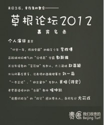

# 12月23日 幸存者的聚会

**[草根论坛2012报名贴](http://rrurl.cn/145Xnm)**，这是全球指定唯一报名点哦～ 参加论坛必看：[【草根论坛小百科】草根论坛是什么？幸存者的聚会！](http://page.renren.com/601120734/note/888296519) [草根论坛2012 [ 行路指南 与 时间表 ]](http://page.renren.com/601120734/note/888836957) 欢迎加入官方QQ群（草根碗，很美味：250088970）  **如果没有世界末日，让我们再次相聚草根论坛——** **写在前面：** 有“人人”的地方就有江湖。 江湖里的人，有那么一小撮，他们有那么点理想； 江湖里的人，在追求理想的时候，你和我，成了朋友； 江湖里的人，在一起太久，难免有恩怨纠葛，爱恨情仇； 江湖里的我们，纠葛太久，往往会忘记很重要的东西，那就是—— 我们本来共同追求着，同样的自由。 所以， **“你们在一起太久了，都忘记世界上有坏人了”** ** —— 这是第三届草根论坛的主题之一。** 【今年的论坛】： 草根论坛2012分为日场和夜场，日场分为嘉宾演讲与圆桌互动，夜场为通宵狂欢party。    **时间：**2012年12月23日 **地点：**草吧公社（草场地300号） **费用：**无论是否就餐，男100，女90。包括场地费（三层楼给我们折腾一天一夜，上哪儿也没这价），下午的小吃和饮料，晚上的自助餐及酒水。去年耿老师很照顾，几乎赔钱支持的，损坏那么多东西还没有赔偿。今年价格涨了，不过性价比依然是别处没法比的。 草根论坛不盈一分利，除报销准备费用外，若有结余，日后会做成纪念品寄送给大家。  **还想要？** 那就再透露点会来的萌妹子吧： 人大草根思想沙龙 [勺见](http://rrurl.cn/ag9U1Q) 的创办人周雨霏； 写《[你拍桌子给谁听呢？](http://page.renren.com/blog/265012411/883290584?from=010203041)》的萌妹子边梦笛； 咆哮体终身奖，女神暴雨哥； 宋嘉卿之母徐小细菌； 百鬼夜行的苏媚行； 去年的收银小霸王，夜场麦霸周晓鹰。 ……
