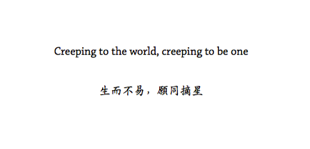

# 《 北斗2013年精选集 》

##《北斗2013年精选集》

###致本刊所有读者

我一直以为所有刊物，前序后记类无关内容凡超过三千字都是喧宾夺主、自恋可笑的。但鉴于这一次的特殊性，实在有必要为各位做出一些解释说明。

这本集子中所选文章，来自二零一三年伊始至二零一三年最后一日北斗网站上刊发的作品，是以谓之“二零一三年北斗精选集”。但由于种种原因文章自遴选、整理到最后成型，已经过去了一年多。这期间，北斗内部发生了许多重大变化。从二零十三年年初理事会成员相继退出开始，上一批老志愿者们纷纷结束了学业，进入手忙脚乱的实习或者工作生活。这本集子，是大家忙碌之余抽空花费时间精力的结果，因此拖了这么久。在此，也要特别感谢集子的美术总监张苏樊，一人操刀完成全部，工程浩大，其中艰辛难以尽述。

或许有人要问，北斗真的没人了吗？总是在招新，难道也没有成果？那么多一茬茬的鲜肉们，总该有几个关心政治热爱生活的吧。这其中，当然有各种各样的原因。正如北斗当年的诞生，算是时代的产物；而七年过去了，当年的人和想法都已经老了。

正如我的理念跟本集子的美术总监存在差异一样，新的年轻人们也有着不同的想法，新鲜的，稚嫩的，各式各样的。看到每一次招了新人进来，都要跟他们讲北斗的历史、让他们认可北斗的价值观，我内心觉得这不能让北斗人达到想要的效果，但确实又没有其他的办法。老一代北斗人的精彩历史和现在，是不可重现的，因为那就是他们的坚持。而如今年轻人们，也有自己的坚持。你凭什么让人家去坚持你的坚持呢？他们或许是稚嫩的，各式各样的稚嫩，就让他们去花样作死去好了啊。

北斗对于我们，已经是一种精神，一种寄托。这是因为大家有了共同的经历，付出了切切实实的勇气和汗水。新人们并没有跟我们一同经历担忧、甚至恐惧，一同在外界的猛烈动摇中经受成长，凭什么把北斗当做精神寄托呢？

上一次最大的打击也跟精选集有关。北斗二零一二年精选集已经付梓印毕，最后遭到埋伏，连赔给印刷厂的钱都是北斗老一代志愿者们凑的。也因为同样原因，这一本二零一三年文章的集子，选择了只公开电子版，不再组织印刷。

于是或许又有人要问，既然如此，为什么不让新人也来经历一下这些风雨？

现今的舆论环境并不曾更加宽松，一旦发生了更加意想不到的事，其中的责任谁来承担？这些无辜的新人之后的生活如若受到影响，没有任何人能承担得起这个责任啊。

（看吧，我跟你们柴女神不是一种人。）

我希望的是，即使北斗不再是大家的精神寄托，也没关系。这世界是要有各式各样的青年，各式各样的精神寄托，各式各样的坚持。北斗不唯一，也不永恒。我们这些赶上的，觉得还挺幸运的；那些没赶上的，也不必惋惜，我相信在你们也有自己的一套理想主义，还没付诸实践或者已经着手了，没做的也是迟早，趁着年轻，趁着天不怕地不怕的。年轻这么好的借口，怎么幼稚和作死都会被原谅的。

毕竟，青春就是一场花样作死。看到这本集子的你们，或许已经青春过了，翻翻这些文字想想当年的轻狂哈哈一笑；或许刚进大学正在折腾，读了文章如遇知音，那欢迎你来找我们，我们都还在，北斗撰稿人们或许也会为你重焕青春。

 

王卜玄  
2015年4月1日

《北斗2013年精选集》电子版 [下载连接](http://ibeidou.qiniudn.com/specials/ibeidou2013.pdf) :  http://ibeidou.qiniudn.com/specials/ibeidou2013.pdf