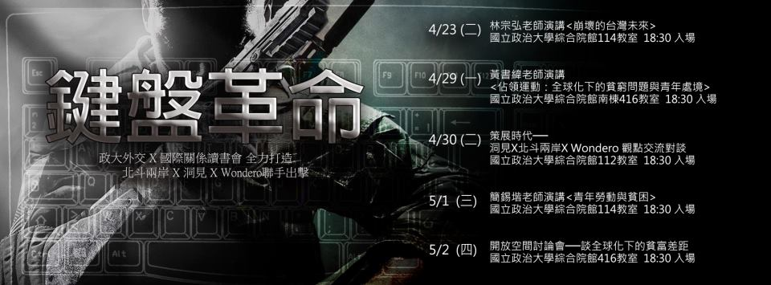

# 台灣活動資訊——鍵盤革命

点击查看清晰海報介绍

很多人在問，鍵盤革命是什麽，你們難不成要拿著鍵盤來個揭竿而起？

這其實是一個活動，政大外交系邀請我們北斗兩岸，洞見和wondero幾個網絡媒體一起來主辦。我們彼此並沒有什麽交集，但卻爲了一個相同的目的走到了一起。

這是一個網絡的年代，一個每個人都有可能改變的時代。網路革新了人類，改變了社會的公共性，也改變我們每個人看社會的方式。以至於現在每個人都可能通過網絡改變這個社會，改變這個國家，一點點推動著時代前進。但現實而言，網路並不是我們生活的全部，雖然我們很依賴網路，習慣在網絡上指點江山，習慣在網路上一呼百應，也習慣無能為力的看著網上激烈的辯論，習慣無奈的追隨人群的意見。

但當看到台灣的22K，不由得讓我想起大陸的高校畢業生，畢業找不到一份好工作，如同失業一般充滿了絕望

看到國際上對於第三世界國家的資源掠奪，這不由讓我們想起大陸至今還存在的血汗工廠，以及社會高度關注的農民工問題

這樣下去，真的會改變嗎？

這個世界真的會好嗎？

我們希望你帶著你的鍵盤滑鼠，走出你的房間，

重新審視你身邊的台灣社會，你臨近的中國大陸，還有這之外更加廣大的世界

本次活動設計包含專題演講與部落客對談，結合知識與實際參與的可能性，期待給予參加者對公共事務討論、參與的全新想像。

鍵盤革命發源自鍵盤，卻希望跳脫出鍵盤。挑選全球化與貧富差距作為主題，讓我們對世界與社會的關心，用全新的參與方式展現。

誠邀您來參加我們的活動，與我們一道，引爆這場鍵盤革命

**===報名網址===** [https://docs.google.com/forms/d/1zCNm1vZJGYyREw2ZvtihO-UmHIRGJLD5CRo6rg5f7jA/viewform](https://docs.google.com/forms/d/1zCNm1vZJGYyREw2ZvtihO-UmHIRGJLD5CRo6rg5f7jA/viewform) **===活動資訊===** 4/23(二) 林宗弘老師演講<崩壞的台灣未來> 地點:國立政治大學綜合院館114教室 入場時間: 18:30p.m.  4/26 莊奕琦(政大社會科學院院長) 地點：國立政治大學綜合院館南棟416教室 入場時間: 18:30p.m.  4/29黃書緯老師演講<佔領運動：全球化下的貧窮問題與青年處境> 地點：國立政治大學綜合院館南棟416教室 入場時間: 18:30p.m.  4/30 策展時代──洞見X北斗兩岸X Wondero 觀點交流對談 地點:國立政治大學綜合院館112教室 入場時間: 18:30p.m.  5/1 簡錫堦老師演講<青年勞動與貧困> 地點:國立政治大學綜合院館114教室 入場時間: 18:30p.m.  5/2 開放空間討論會──談全球化下的貧富差距 地點:國立政治大學綜合院館416教室 入場時間: 18:30p.m.  点击查看清晰海報介绍 Attention：**活動資訊點閱需翻牆**
