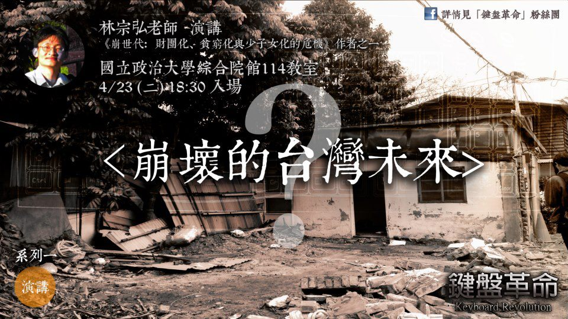
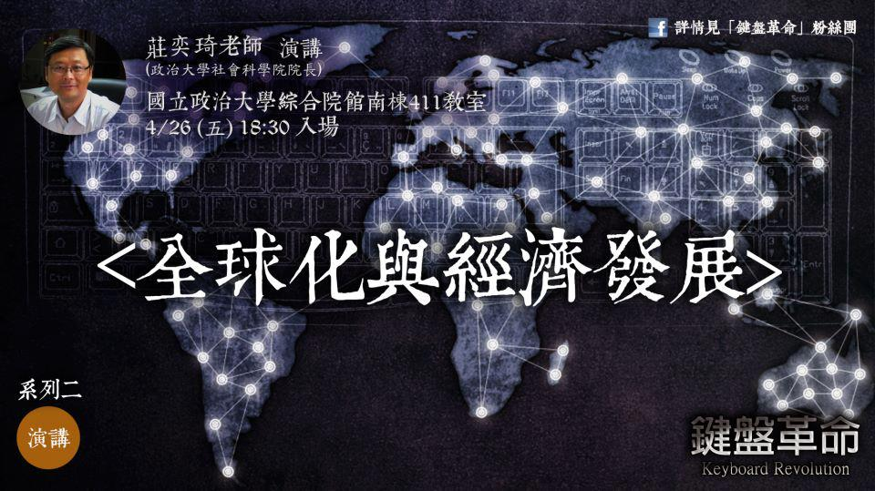

# ------兩岸青年，莫做兩岸社會變革的犧牲品

歡迎關注[北斗兩岸](https://www.facebook.com/BeiDouLiangAn)，關注[鍵盤革命](https://www.facebook.com/keyboardrevolution) 活動

======================= 

大家好，我是北斗兩岸的主編余澤霖

昨天鍵盤革命的第一場演講，來自「**崩世代**」作者之一：林宗弘老師，為我們說明經濟全球化環境下台灣所面臨的－財團化、貧窮化、少子女化的未來。

老師的演講十分精彩，順利的完成，也讓我們舒了一口氣

這也是北斗網，第一次以北斗兩岸的形式，走出海外，主辦活動。

而我相信，通過這次的活動，也正是對我們北斗兩岸的主旨最好詮釋

【**追尋人文精神，探求社科知識，助力當代兩岸青年之自我啓蒙，打造屬於兩岸青年的無障礙的思想對話平臺。**】

面對兩岸現今的大格局，這是我們一直希望給大家提供這樣的一個思想的平臺，而通過我們的文章也好，通過這次鍵盤革命也好，我們都是想告訴大家這樣一個道理

【**兩岸青年，莫做兩岸社會變革的犧牲品**】

其實我們在大陸的網站上也在宣傳我們這次的活動，也將很多資訊同步更新，但苦於兩岸網絡之間的差異，無法直播，但是我們一樣收到了很多我們的讀者，撰稿人的祝福。

其中讓我很好奇的是。很多我們的讀者都在問

台灣現階段的情況，其實對比起大陸，實在是好了很多

但崩世代，是否在對二十年後的台灣的論述，有些過於悲觀？

若是如此悲觀的未來，那麼我們又該如何去面對呢？

但其實擺在我們面前的社會，就算是台灣，其實並不會很樂觀

而當身處這樣社會之中，我們青年，常常安於現狀的選擇我們的人生，而疏於對歷史體溫的宏觀感知，乏於對社會變革、人世流變的遠見。

如同在40年前的大陸，那時的年輕人正滿懷豪情響應國家號召，走向農村的廣闊天地，接受貧下中農再教育。此時在田間耕作的他們，誰能預言“文化大革命”會在10年內結束？誰能預估到10年之後的中國會走向改革開放的變革之路？誰又會料想到在上山下鄉中失去教育機會的一部分人將成為20年後國企改制與下崗潮的主要犧牲品？

同樣70年代末，台灣的經濟開始起飛，通過蔣經國先生推動的【十大建設】和【十二大建設】，穩定了台灣的經濟。也使得在80，90年代的台灣，用一己之力，憑藉創新的智慧和勤勞的汗水打出了亞洲四小龍的一片天，無數的工人，在經濟起飛之後『黑手變頭家』。

但今天呢？

在兩岸進一步加深經貿往來的今天，全球大環境下的貧富差距擴大，台灣青年的社會流動管道逐漸閉塞，台灣的企業開始紛紛爲了尋找低價勞力而向外移動，台灣社會所標榜的創新力量的衰弱，人才紛紛外流。當年的美景，如今是否依舊？

你可以說，今天台灣的生活很安逸，這樣的生活很美好，我幹嘛要去關心對岸？我幹嘛要去關心兩岸？我幹嘛去關心這個社會會變得怎樣啊？我自己過得很好。

但若今天因為很和平而只是關注自己的事卻無感於社會，無感於公共事務，更忽視兩岸之間不斷變化的現狀的話，其實這樣的後果，是災難性的。這是一個變革的年代，也許漫長而痛苦，但每一個兩岸青年，一定不可變成兩岸社會變革的犧牲品

居安處更應思危。今天，這便是我們的社會，這便是我們的兩岸。也許我們沒辦法明確告訴你個人面對這個動盪的時代，但是我們需要你一起來，和我們共同思考，共同尋找一條出路。

昨天的活動是鍵盤革命的第一場，而之後還有很多很多可以一同思考的活動正在等待你的一同參加，若你不甘現狀，關心未來，思考兩岸。我們誠摯地邀請您參與我們後續的活動，同時也請多多關注【北斗兩岸】。

一個人的一小步可能很小，但當我們每一個人都跨出了這一步，那便是社會最偉大的勝利。

北斗兩岸主編 余澤霖 謹上

================= 

### 鍵盤革命活動資訊

  * 4/26(五) 莊奕琦(政大社會科學院院長)演講 <全球化與經濟發展> 國立政治大學綜合院館南棟411教室 18:30入場
  * 4/29 (一) 黃書緯老師演講 <全球化下的貧窮問題與青年處境> 國立政治大學綜合院館416教室 18:30 入場
  * 4/30(二) 策展時代──洞見X北斗兩岸X Wondero 觀點交流對談 國立政治大學綜合院館112教室 18:30 入場
  * 5/1 (三) 簡錫堦老師演講<青年勞動與貧困> 國立政治大學綜合院館114教室 18:30 入場
  * 5/2 (四) 開放空間討論會──談全球化下的貧富差距 國立政治大學綜合院館416教室 18:30 入場

### 報名網址

  * 已報名過但未報名新增場次者: [https://docs.google.com/forms/d/1eU6gzgliGdM6Q-BgjB_Vdu2pjHqa-6HSOAOSht_DVxo/viewform](https://docs.google.com/forms/d/1eU6gzgliGdM6Q-BgjB_Vdu2pjHqa-6HSOAOSht_DVxo/viewform)
  * 未曾報名我們活動者: [https://docs.google.com/forms/d/1zCNm1vZJGYyREw2ZvtihO-UmHIRGJLD5CRo6rg5f7jA/viewform](https://docs.google.com/forms/d/1zCNm1vZJGYyREw2ZvtihO-UmHIRGJLD5CRo6rg5f7jA/viewform)

### 

### 活動詳情及相關宣傳請洽：[鍵盤革命](https://www.facebook.com/keyboardrevolution) （需翻牆）

