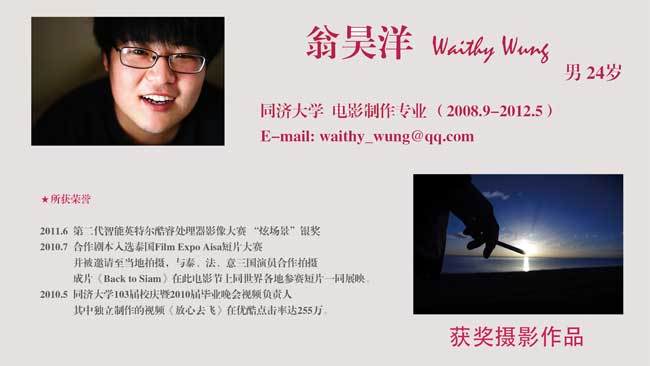

# 翁昊洋：用“心”看电影

【主讲人】 翁昊洋（上海戏剧学院外聘教师） 【主题】 用“心”看电影 【时间】 3月9日（周六）晚八点 【地点】 YY语音（频道ID：89646441） 【主讲人介绍】  同时，欢迎加入北斗线上读书会QQ群（228568238），及时获得最新最快的北斗线上读书会资讯，并与书友们一通分享你的阅读私体验！ BTW—— 请[猛击此处](http://www.yy.com/)，只要3分钟，便可[下载YY语音软件](http://www.yy.com/)，加入到精彩无限的北斗线上读书会！ 另外，请[猛击此处](/?p=30696)，我们为您提供了[图文并茂的简易教程](/?p=30696)，帮您了解如何下载和使用YY语音！
