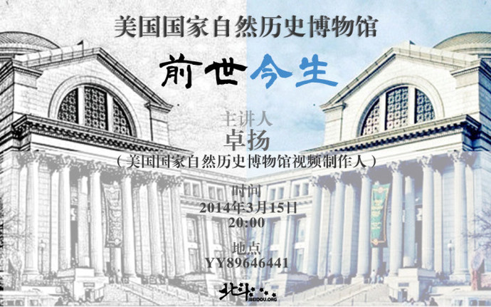

# 美国国家自然历史博物馆前世今生

美国国家自然历史博物馆，建于1869年，专注于天文学、地球科学、人类学、古生物学等的博物馆。该馆的主要收藏项目包括于各大洲哺乳动物的收集，展示了人类进化过程中的各个阶段。
本次线上读书会将由美国国家自然历史博物馆视频制作人卓扬主讲。

###【主题】
北斗线上读书会·第23期 美国国家自然历史博物馆前世今生

###【时间】
3月15日晚8点（周六）

###【主讲】
卓扬（美国国家自然历史博物馆视频制作人）

###【主办方】
北斗线上读书会

###【地点】
YY频道：北斗读书会：89646441

###【费用】
免费

(采编：李维)