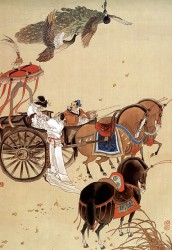

# 《孔雀东南飞》：沉默的好爱情

读史，发现爱情长久地处于一种失语的状态。

士大夫的心胸中有爱，有情，却没有爱情，爱情没有专属于它自己情感属性，诸子百家也都无所议论。爱情是一种悬浮于伦理教化之外的语汇。当男人们谈论起爱情的时候，要假以托词，或曰贪恋容色，或曰侍养双亲，或曰承继后嗣。身中情花之毒，每当思念佳人，胸口便像遭大锤狠狠一击，这种感受士大夫不会有，即使有，也不屑于说。

直到悲催的焦仲卿，徘徊庭树下，自挂东南枝。

焦仲卿是个非常糟糕的男人。他是庐江府吏，“薄禄相”，没什么经世济国的本事，还有一个“何乃太区区”的自我感觉非常良好的妈。

焦仲卿取刘氏女，虽然“共事二三年”，且新妇温婉贤惠，“女行无偏斜”，但焦仲卿的妈对聘下的婚事不满，仍执意逼子休妻。焦仲卿要劝谏亲妈，“府吏长跪告，伏惟启阿母。今若遣此妇，终老不复娶。” 在那个以尊亲事孝继嗣为天大的事的时代，焦仲卿真是个有悖教化的不肖之子，不但忤逆高堂，而且为新妇不惜绝嗣。但是这个软弱无能的男人还是要妥协的，“我自不驱卿，逼迫有阿母。”新妇无奈，被迫返家，临行互诉相思之意，“君当作磐石，妾当作蒲苇”。刘氏父兄爱财，也为刘氏女生计烦忧，便将新妇转聘他人。刘氏女不愿转嫁，决计殉情，“举身赴清池”，焦仲卿悲愤之下，也一并“自挂东南枝”。

若是这样的桥段放在现在的电视剧里，姑娘们是要痛骂渣男恶妇的吧。

****

说起来，焦仲卿是个莫名其妙的人。虽是大家子，“仕宦于台阁”，可他自身并无意于此，不求进取之道，却为了儿女私情计较个没完。他的情商很低，在婆媳之间不知如何取舍，留不住爱人，却又在得知新妇转嫁之讯时，口出怨怼，“磐石方且厚，可以卒千年。蒲苇一时韧，便作旦夕间。” 他反抗，可是又反抗得不那么决绝，“府吏默无声，再拜还入户”，他顺应，可是又顺应的不那么彻底，最终还是过不去心中的坎儿，“自挂东南枝”。

暗暗日欲暝，愁思出门啼，最终焦仲卿没了爱人，又被人说成不奉养高堂的逆子，也没成就一番功名，只逼死了自己。他是个四边不靠，孤零零的悬在半空进退两难的人。除了悲催，实在是没有什么词可以形容他。

可是啊，就是这么一个悲催的男人，在这数千年沉默的爱情的暗夜中，成了一道明亮的闪电。

教化还没有爬到人性头上的时候，世间是一片春意融融的景象。天下初定，万物都充满勃勃生机，谁也不知在这包孕得如此精美的天地间会生发出什么。

小民们谈天说地，在山泉草木的注视下相交相好，野合是美的，私通大约也可以，那时候的人对许多后世视为比天还要大的事都处于一种淡然的态度，还没到会说出“饿死事极小，失节事极大”的时候。君王霸业也是有的，攻伐倾轧虽然不间断，但诸侯们还讲究尊容体面，要事出有因，要师出有名，襄公上阵也要带上他那面绣着“仁义”的大旗。女人能用轻佻的言语挑逗“狂童”，男人也不会像后来人那样总是会暴跳如雷，偶尔有那么几个情深款款的，比如强娶了息夫人的文王，见到夫人思念旧爱，“手把定情金合子”，他就要起兵攻蔡，为自己的情敌雪耻。

那时候的人才算作人，有浓郁的人情味儿，是帕斯卡说的“一根能思想的苇草”，虽然脆弱，却高贵。

后来，爱情渐渐成为了一个被回避的话题，是悖于夫子大义的祸水。爱情是永远存在的，爱情每天都在发生，却在春秋以后的主流文学史中成为了一条伏脉。

男人对女人的情爱，叫做“幸”，项王有美人名虞，常幸从；或者叫做“宠”，褒姒身入深宫，蒙幽王宠爱；或者叫做“嬖”，骊姬嬖于献公；再不好听一点的，叫做“迷”，“惑”，登徒子好色，见到美人，“嫣然一笑，惑阳城，迷下蔡”。男性对于女性的亲近爱慕之意是需要牢牢克制的，而那种深深缔结于心血中的刻骨铭心的爱情更是说不得，只有不求寸进的无能之辈才会沉溺于此。

“易何以首乾坤？诗何以首关雎？” 男人的爱意，更多的是对于“恩义”的回报，且似乎只有等到阴阳永隔，在一篇篇叙悲遣怀的词赋中才有展露，却还要被限定在一种严格的体例和格式中。偶有一句“十年生死两茫茫”，一句“惟将终夜长开眼”，便足以流传千古，足以让人忘却诗人的爱情其实有多么的禁不起推敲。

能让男人们去死的理由很多，或重于泰山，或轻于鸿毛，小到金刀美酒、打家劫舍做没本钱的生意，大到海内知己、士子气节、山河破碎风飘絮。后人以现世的精明，总对这些话题加以轻薄，“帝王业终成落日残烟”，所有因这些宏大命题而死的士大夫们，都逃不开这种关于宿命的荒诞玩味。

****

唯独焦仲卿，这个无能的悲催的没出息的男人，作为极其罕见的殉道者，百分之百地为爱情去自挂东南枝。

想到这，估计谁对焦仲卿都恨不起来。

几千年来，宗法伦理制约着人们对两性关系的观念，纯真的人在被压制的关于爱情的话题中往往扮演悲剧的角色。悲剧最深的根源，来自于内心的无力感，礼教是一种巨大漩涡，救祸而祸弥深，焦仲卿、焦仲卿的妈、刘兰芝、刘氏父兄，每个人都是受害者，每个人都是加害者。

直到夫子的教化被推翻，直到“千秋万古，为留待骚人，狂歌痛饮，来访雁丘处”，直到此时此刻，你和我，以及其它所有人都能够自由地用一切溢美之辞来赞美爱情的时候，我们能有比焦仲卿更圆满的爱情吗？

最早宣称自己要做爱情的殉道者的人群散得最快，生活太沉重，生活中有太多不可以辜负的东西，爱情逐渐成为其中最可有可无的一种，这是情非得已。爱情的美感在这个世上孤零零的，柔弱无力，随便一场生活的小小风波就能把它撕个粉碎，散落成一地鸡毛。焦仲卿没能挽救自己的爱情，可是这几千年来，也很少有人去苛责他的无能。名教摄人的压力已不复存，而爱情却死得更快了，死于远行和离别，死于长距离的思念，死于各种各样光怪陆离的诱惑。“不得已”三个字，包含了人世间所有埋葬在时光里的沉默的爱情。

“同是被逼迫，君尔妾亦然。”

《深夜食堂》里有三个人到中年依旧不屈不挠追求纯爱的大婶，她们誓死也不向现实妥协，直到生活中的一切都开始变得面目可憎。我们嘲笑她们，直到回想起自己也曾经为爱情“仰头相向鸣，夜夜达五更”。这时我们的脸上大约有一种讪讪的表情，似乎为自己曾那样相信爱情而深感抱歉。

欢乐趣，离别苦，就中更有痴儿女。比之焦仲卿，你我都是薄情客。

可怜焦仲卿，直到死，也说不出他为何而死。

他不能理直气壮地，清清白白地说，我要去殉情，我为爱情而死。

爱情一直沉默着，从生到死。

（人教版 高中语文 必修二 第二单元，《孔雀东南飞》）

（采编：曹雨晨；责编：曹雨晨；配图：曹雨晨）

[【北斗语文课】《在地铁车站》新作](/?p=36115)

[【北斗语文课】《游园惊梦》：头足倒置的故国魂梦 ](/archives/33530)

[【北斗语文课】《泊船瓜州》：京口瓜洲一水间](/archives/33521)

[【北斗语文课】《夜雨寄北》家书 ](/archives/33543)

[【北斗语文课】《逍遥游》：独与天地精神往来 ](/archives/35013)

[【北斗语文课】《五人墓碑记》：彼五人者 ](/archives/35572)

[【北斗语文课】《林黛玉进贾府》：生是死命是运 ](/?p=36619)

[【13年高考同题作文】](/?s=%E9%AB%98%E8%80%83%E5%90%8C%E9%A2%98%E4%BD%9C%E6%96%87)

褪去学业的负担、“正确性”的压力，回首记忆中的语文课，是否有了和当年不一样的触动与感受？与北斗一起重读当年语文课，期待你的参与，期待你的声音。欢迎投稿至[coldline@ibeidou.org](mailto:coldline@ibeidou.org)
