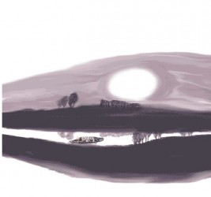

# 京口瓜洲一水间

到了镇江，便是江南。镇江出名的，有醋、有庙、有山。

北方吃的多是山西陈醋，而江南多的便是镇江香醋。与山西陈醋相比，镇江醋的最大特点在于微甜。尤其沾以江南的肉馅小吃食用的时候，微甜更能体现出小吃的鲜美。浇一碗鸡汁干丝，来一屉淮扬小笼，就着镇江陈醋，方为绝配。香醋的产地，便是京口三山之一——焦山，三山的另外两山，北固山有甘露寺，金山有金山寺。

崇祯二年，有个三十出头的青年人携仆从数人，北上游历。途径金山寺，已是夜半时分，青年人想起当年梁夫人擂鼓战金山，韩王爷的指挥所就设在寺里，不禁兴致大发，吩咐小厮铺排开来，在佛堂里唱起韩王爷大破金兀术的戏来。寺里的僧人被喧闹惊醒，纷纷起身来看，青年人也不答话，径自唱完，天已拂晓，便带着随从继续赶路。僧人目送一行人上了船，颇为惊异，不知是人是鬼是怪。

青年人是江南才子张岱，有明一代首屈一指的散文大师，从他在《陶庵梦忆》中洋洋自得的口吻来看，他对年轻时这段近乎狂狷的经历颇为得意。只不过他没有许仙出名，寺里的老和尚也没有法海有名，提起金山寺，首先想到的，怕是白娘子为救情郎，水漫了金山吧。

由于地处要冲，镇江自古是兵家必争之地，南京的门户，上游是采石，下游便是京口，此两处最适渡江。北固山横枕大江，石壁嵯峨，山势险固，因此得名。站在北固山顶，滚滚长江，一览无余。 孙权在此屯兵，刘皇叔过江结姻，也来到了北固山甘露寺，送了乔国老钱，遂了吴国太意，化险为夷，只是周郎却被好生调笑“赔了夫人又折兵”。不过戏终归是戏，历史上记载的只有英雄无觅孙仲谋处，以及曹孟德的生子当如之叹。

盛唐的新年，极繁华而尽奢靡，当然也会有游子过客，不及返家，只能在路上辞旧迎新。一岁之交，身心飘零，怎不令人思乡？此时正有一叶扁舟，游经北固山下，窗外大江拍岸、苍山乱流。舟中的游子想的是国的往事、家的乡愁，略一思索，便吟成一律：

客路青山外，行舟绿水前。潮平两岸阔，风正一帆悬。海日生残夜，江春入旧年。乡书何处达？ 归雁洛阳边。

王湾的这首《次北固山下》遂成名篇。最绝妙之处在颔联：潮平两岸阔，风正一帆悬。春潮涌涨，江水浩渺，舟中人的视野也因此开阔。这一句，气魄宏大，下一句“风正一帆悬”，更是精彩。只有风正，方可悬帆，一个“正”字，有小景生入大景之妙。春来雪融，江水漫涨，崖岸宽阔，和风劲吹，船帆高悬，以一轻舟而济汪洋，何其壮哉。

这首诗地位颇高，开元中，宰相张说曾亲自将这首诗题写于政事堂，"每示能文，令为楷式"。明代胡应麟认为诗中的"海日生残夜，江春入旧年"二句，是区别盛唐与初唐、中唐诗界限的分野。

王湾本是洛阳人，频繁往来吴楚间，为江南山水吴姬曼妙所吸引，写下大量吟咏江南的诗作。可惜王湾一生不得志，意在干禄，也不过当到洛阳尉。既然如此，又何必眷恋官场，何不早日思退，定居江南？有时候人诗写的大气，做事却不大气，做小事大气，做大事却不豁达。王湾要是知道千载而后，有个一生未尝出仕的张岱，挂冠而去的袁枚，又会做如是想？

镇江的对岸是扬州，京口的对岸是瓜洲。“泗水流，汴水流，流到瓜洲古渡头”。自古瓜洲便是长江主要渡口，千载而下，无数的游船画舫，当然也有数不清的战舰艨艟在此停泊。不论何时，瓜洲总是繁忙不已，就算是江潮退却的深夜，也会看到“两三星火是瓜洲”。瓜洲没有停歇的时候，无数人南下江南，又有无数人北上，出淮右而赴伊洛。京口是江南的起点，瓜洲是江南的最后一站。

江南好，风景旧曾谙。江南的好，要是有点小雨，更是尽得风流。淅淅沥沥的雨点，滴答滴答的打在青石板上，打在疏疏落落的斗拱上，在小巷的转角，走过来一位妙龄女子，撑一把油纸伞。姑娘娇羞的面庞，便是江南的模样。江南，是下雨的江南，听吴侬软语的浅笑，从樱桃口中吐出的呢喃，能将一切英雄的壮志都瞬间消弭掉哩。熙宁元年，王安石奉宋神宗之召北上，正当宏图大展之际，在王安石面前，是千载难逢的际遇，他的心情应该是澎湃而兴奋，但当他的小舟行在京口瓜洲之间，他的笔下却是：“春风又绿江南岸，明月何时照我还。”他留恋的正是江南美景、越女多情。王安石不是个有情调的人，一生最有情调的日子应该是罢相定居金陵之后，此公胜在一个“豪”字，却输在一个“拗”字。

向往江南的人很多，比如金海陵王完颜亮。完颜亮铁马弯刀游牧人，哪里来过江南？完颜亮是个豪迈绝伦但过分贪残的主儿，平生有三大愿望：“国家大事，皆我所出，一也；帅师伐远，执其君长问罪于前，二也；得天下绝色而妻之，三也。”这想法，和汉光武丽华之叹，没啥本质区别，只是成王败寇，免不了被骂为荒淫无道。他当上了皇帝，实现了第一条，而第二三条，其实可以结合为一个目标，南下灭宋，“立马吴山第一峰”，混一寰宇，坐享江南美女。面对不设防的江南岸，一切彷佛唾手可得，只可惜他在采石矶遇到了命中的魔星虞允文，用一万多残兵败将击溃了他的六十万大军。完颜亮被臣子谋杀在瓜洲，他死前，已经看见了江南，可惜却未能踏上京口。如果泉下有知，他一定会问王安石，是掌握国政快活，还是当江南一富户快活？

京口瓜洲一水间，数不尽的风流，道不尽的往事。时至今日，润扬大桥上，车水马龙，旅人如梭，今天的江南故事，在苏州评弹里，依旧不断上演，曾经有过的历史，未必不在一次次重复。骏马秋风塞北，杏花春雨江南，江南有环佩芳菲的风致，有语笑嫣然的风韵，有珠履琳琅的风情，有妙高台上的风雅，有秦淮河畔的风月，却没有浓妆艳抹的风尘。

江南，在周伯仁的泪眼里，也在庾子山的秋思里。是张季鹰的鲈鱼，也是李太白的月色。让白居易念念不忘，也让江文通黯然销魂。

这便是京口，这里是江南。

(采编：阿飞；配图：阿飞；责编：阿飞)

[【北斗语文课】《在地铁车站》新作](/?p=36115)

[【北斗语文课】《游园惊梦》：头足倒置的故国魂梦 ](/archives/33530)

[【北斗语文课】《夜雨寄北》家书 ](/archives/33543)

[【北斗语文课】《逍遥游》：独与天地精神往来 ](/archives/35013)

[【北斗语文课】《五人墓碑记》：彼五人者 ](/archives/35572)

[【北斗语文课】《林黛玉进贾府》：生是死命是运 ](/?p=36619)

[【北斗语文课】《孔雀东南飞》：沉默的好爱情 ](/archives/37460)

[【13年高考同题作文】](/?s=%E9%AB%98%E8%80%83%E5%90%8C%E9%A2%98%E4%BD%9C%E6%96%87)

”褪去学业的负担、“正确性”的压力，回首记忆中的语文课，是否有了和当年不一样的触动与感受？与北斗一起重读当年语文课，期待你的参与，期待你的声音。欢迎投稿至coldline@ibeidou.org“
