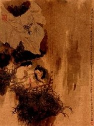

# 夜雨寄北

晏君：

每回拿香烛把素笺焚寄给你，看着蓝烟升起来的时候，像是又将这十二年活了一遍。川中的山雨太大，烟沾染了湿气升不上去，在身边漫漫绕绕，散又不散。你是要抱我么，还是来怪我，怎不归去，到现在，还不归去。

我总想着要是母亲过世后没再出来，和你留在荥阳，做一对田舍翁与纺织妇，这时应该要对月喝黄酒，菊花插满头了。等到秋冬一去，拉你去灞陵折青柳，树下的草软，坐在那里看游鱼纸鸢，清风拂面，有禾苗的香味。

灞陵的柳条年年都发，你有多少次站在窗前徘徊，细语轻吟，忽见陌头杨柳色，悔教夫婿觅封侯。应悔的人是我，如果这些年每天早上都有一碗你做的热面汤，要管什么国，什么君？巴山的雨啊，只是无聊，这样淅淅沥沥的下，何时顾及过离人的感受。

晏君，不用你问我，我心里愁得很。从前有人等着，总不回去，现在起了归心，却不知归处在何方。我只好欢喜这轻烟，烟一飘起来，你就醒来，我就入梦，看你微笑，同我呢喃。这里的烟太重了，飘不动，看不真切，还是得回去。回去点好了红烛，剪灭了看烟吹动你出场，散去时再点上烛火，擦一点浊泪，再剪灭，烟又荡起，好像刚刚你只是去给我泡了一壶茶，现在奉盏回来了。

期长期短，总是要回去的。这一辈子多少穷困潦倒荣华富贵，临了还是要回到那里，所以你别急，我也不急，什么都是未知，唯有这最后一遭我们都已选好。你那里好啊，每年春天的蚕豆蝴蝶花，夏天的油菜，又漂亮又香，秋天的芦花像雪飘，冬天地被整过以后，我们一个一个冒出头来，还是秉烛的新婚人。

巴山的雨落深了池塘，注不满心里的苦海。烟散了梦就断，你去吧，夜雨冷，我怕你受凉。

义山

(采编：阿飞；配图：阿飞；责编：阿飞)

[【北斗语文课】《在地铁车站》新作](/?p=36115)

[【北斗语文课】《游园惊梦》：头足倒置的故国魂梦 ](/archives/33530)

[【北斗语文课】《泊船瓜州》：京口瓜洲一水间](/archives/33521)

[【北斗语文课】《逍遥游》：独与天地精神往来 ](/archives/35013)

[【北斗语文课】《五人墓碑记》：彼五人者 ](/archives/35572)

[【北斗语文课】《林黛玉进贾府》：生是死命是运 ](/?p=36619)

[【北斗语文课】《孔雀东南飞》：沉默的好爱情 ](/archives/37460)

[【13年高考同题作文】](/?p=36619)

”褪去学业的负担、“正确性”的压力，回首记忆中的语文课，是否有了和当年不一样的触动与感受？与北斗一起重读当年语文课，期待你的参与，期待你的声音。欢迎投稿至coldline@ibeidou.org“
