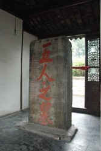

# 彼五人者

“五人者，盖当蓼洲周公之被逮，激于义而死焉者也。”

这是张溥在《五人墓碑记》中开宗明义的话。这篇文章的写作时间，是公元1628年，明崇祯元年。

事件的导火线，是天启六年（1626年），锦衣卫往苏州抓捕东林党人周顺昌。周顺昌，字景文，号蓼洲，曾作吏部郎官。天启五年（1625年），曾与杨涟一同弹劾魏忠贤的魏大中在嘉兴被捕解京，路过苏州时，周顺昌到船上送行，流连三日。押送差官催促，周顺昌痛骂魏忠贤，于是结怨。天启六年，魏忠贤借织造事务陷害应天巡抚周起元，并诬攀周顺昌等结党，命锦衣卫往苏州逮捕。这就是“蓼洲周公之被逮”。

本来天启年间，党争不断，缇骑横行天下，是司空见惯的事情。偏偏这次在苏州，情形实在是太不一样。按《明史》上说，是“顺昌好为德于乡，有怨抑及郡中大利害，辄为所司陈说，以故士民德顺昌甚”，就是说周顺昌是地方有名望的士绅罢了。姑且不论这句话有没有虚饰美化，然而东林士人，大抵都是罢归乡里后又被逮问，何以未曾激动民变，难道道德民望都不及周顺昌？或者，是因为周顺昌所在的苏州，有什么与众不同呢？

“吾社之行为士先者，为之声义，敛赀财以送其行，哭声震动天地。”

所谓“吾社”，是张溥在天启四年在苏州建立的复社，平时以文会友，兼以评论朝政，一时颇有名望。当时党争风气炽烈，复社既然议论政治，自不能免。复社的立论，也有其偏激一面。传言，后来张溥遇害身死，复社保荐过的周延儒闻讯先惊后喜，有人问何故，周延儒拿出一个小册子，说：“此者天如（张溥字）所欲杀之人也，我如何能杀尽？”于是便有诗句“故人昨夜魂游岱，相国方言好做官”。

复社的存在，大概对事件的发展起了相当的作用。锦衣卫到达苏州时，民众数万人聚集府衙，执香请命，如果没有士绅的宣传号召，应该会很困难。而最初挺身发言的，也是后来成为复社骨干的杨廷枢等“诸生”。那么张溥所说的“行为士先”，是不错的。至少在事件初期，复社的确主导了事件发展。

然而在锦衣卫喊出“东厂逮人，鼠辈敢尔！”之后，事件的发展就走向了一个新的、冲突激化的方向。苏州平民对阉党的敌视，这是一个值得考虑的因素。明代江南经济存在着脱离自然经济的倾向，这是公认的事实，而苏州更是其中一个标志性的地点。另一方面，明代织造等经济事务向由内廷主管，后期商税增加，也是出入内廷，这个过程中宦官与商民自然不免冲突，那么地方商民对宦官产生敌意，也是理所当然的事。早在万历二十九年（1601年），苏州税监加重赋税，就引致织工民变。领导这次民变的葛贤，直到崇祯三年（1630年）才在苏州去世，葬在五人墓旁。那么天启年间的民变，是不是也延续了万历民变的经济因素呢？这是很有可能的。如果这是正确的，那这次民变就不单单是追求正义，也有了追求自由的味道了。

所以锦衣卫提及东厂之后，市民的激愤终于被点燃：“始吾以为天子命，乃东厂耶！”此时，先前交涉的诸生“皆惊避”（据《明季北略》），剩下的，就是市民与缇骑的冲突了。

“嗟夫！大阉之乱，缙绅而能不易其志者，四海之大，有几人欤？而五人生于编伍之间，素不闻诗书之训，激昂大义，蹈死不顾，亦曷故哉？”

五人都是普通市民，在民变中，也并非领导人物。只是巡抚毛一鹭在厕所中藏身幸免之后，又诬告吴民谋反，魏忠贤准备镇压，五人才起而投案，作为“倡乱者”被杀。

一般的观点是，明代虽然特务统治特别发达，然而士人的抵抗意识，或曰气节，也是特别强烈的。但是这种气节的前提，却是传统的支撑。当君主和朝臣的平衡被宦官破坏的时候，这种气节究竟还能不能保持，就变得值得疑问了。缙绅之所以易其志，大抵还是因为诱惑太多，譬如嘉靖年间，杨慎哭谏左顺门，同时也有张璁议礼幸进的事。但是收买众人是困难的，不单是因为成本的高昂，还因为这并不容易被意识到。所以，在士绅不敢抑或不愿发言的时候，市民就出来行动了。而他们的行动，虽然更底层，更弱小，却更果敢。

“且矫诏纷出，钩党之捕遍于天下，卒以吾郡之发愤一击，不敢复有诛治。”

虽然五人终于被害，但《明史》上说，“然自是缇骑不敢出国门矣”。当然阉党最后的倒台，实在跟这桩事件没有什么关联，而事件本身究竟有没有鼓舞什么人，威慑什么人，也很值得怀疑。然而，这终究是一场抗争，一场市民阶层的抗争，甚至可能，是朝向自由的抗争。

“由是观之，则今之高爵显位，一旦抵罪，或脱身以逃，不能容于远近，而又有剪发杜门，佯狂不知所之者，其辱人贱行，视五人之死，轻重固何如哉？”

按《明季北略》，五人刑前最后的话，是颜佩韦对观刑众人笑说，“列位请了，我学生走路去了！”此时是天启六年十月，四个月前，周顺昌已经死于诏狱。

（《五人墓碑记》，张溥，江苏教育出版社，高中语文必修三，32页）

（采编：杨松子；责编：曹雨晨；配图：曹雨晨）

[【北斗语文课】《在地铁车站》新作](/?p=36115)

[【北斗语文课】《游园惊梦》：头足倒置的故国魂梦 ](/archives/33530)

[【北斗语文课】《泊船瓜州》：京口瓜洲一水间](/archives/33521)

[【北斗语文课】《夜雨寄北》家书 ](/archives/33543)

[【北斗语文课】《逍遥游》：独与天地精神往来 ](/archives/35013)

[【北斗语文课】《林黛玉进贾府》：生是死命是运 ](/?p=36619)

[【北斗语文课】《孔雀东南飞》：沉默的好爱情 ](/archives/37460)

[【13年高考同题作文】](/?s=%E9%AB%98%E8%80%83%E5%90%8C%E9%A2%98%E4%BD%9C%E6%96%87)

”褪去学业的负担、“正确性”的压力，回首记忆中的语文课，是否有了和当年不一样的触动与感受？与北斗一起重读当年语文课，期待你的参与，期待你的声音。欢迎投稿至coldline@ibeidou.org“
