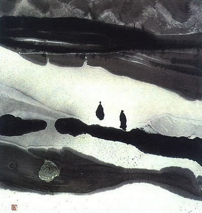
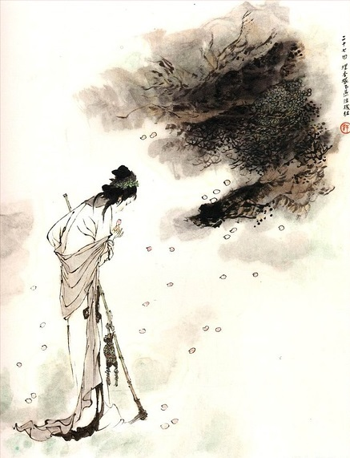

# 生是命死是运

一

你不知道为什么会在车上想起小时候读林黛玉进贾府的情景，许是跌跌撞撞的车厢跟你当时躺在床上看到的灯光很像，一曳一曳地摇摇晃晃。你记得当时表姐在你面前津津乐道，用诗一般的语言回味红楼梦中人物的对白，咿咿呀呀的老旧留声机的唱片像陶红瓷器的光隙一闪而过，不间断的音符弹跳在你夹着一枚又一枚书页发黄的细密画里，丹凤眼的簪花仕女与你画着淡淡梅妆的表姐一一对应，就像贾宝玉遇见甄宝玉的梦境。

你记得你当时在完成老师布置的家庭作业，不得不听大病初愈的表姐给你絮叨。当然，如果现在还能有那个机会能为说着一口吴侬软语的表姐画眉，你不介意自己被无尽的论文不断埋葬。你当时隐隐记得你表姐毫无正经地跟你说，不要用考据癖的眼光来读红楼梦，那你看到的只是一个又一个无法被证伪的历史故事。要看，就要用精神病的视角来看待这本书，因为我们这个世界就是未得病的小红楼梦。你当时对此不感兴趣，也不想感兴趣，但你犯不着与被狐媚子魇了心的表姐争论，因为你的私房钱攥在她手心里。你记得你最后是与她闹成一团，在好人儿好人儿别挠我痒的嬉戏里平安度过一夜。

后来你重新回顾林黛玉进贾府的时候，才发现表姐其实说的一点不差。当时你在一个脸蛋像林黛玉，气质像王熙凤的学姐面前提起往事，你学姐嘻嘻地笑道，给你一个新的视角：与其说红楼梦隐喻的是一个王朝的覆灭，不如说是人永远都在身不由己，被雨打风吹去，这道理放诸四海而皆准。你学姐觉得刘心武的所谓秦学很会讲故事，但她可不认为红楼梦就是宫闺秽史便能讲清楚的。你现在坐在去医院的车上，想起她的话，无聊地翻阅着高中语文课本，洗的发白的牛仔裤像贾母万事皆休的皱纹，拉开纠缠数千人命运的历史戏剧。你踞起脚在想，倘若你也被狐媚子魇了心，你会将红楼梦看成是什么？接受过正统中文系教育的你脑海里立刻浮想起教科书上的答案，这是一场悲剧。

这确乎是一场悲剧，但是，什么是悲剧？《水浒传》、《三国演义》彼此争斗的所谓英雄最终都雨打风吹去是悲剧吗？你想，事实上，这都只是闹剧。《红楼梦》、《西游记》才是真正的悲剧。鲁迅说所谓的悲剧，就是把好的事物毁灭给人看。这未免过于肤浅。所谓的悲剧指的是由因果报应实现的正义或者说无可奈何的命运的必然性，与在必然性前给予人一定程度选择的自由意志之间的激烈冲突。人们在日常里所言说的悲剧弱化了悲剧的严肃性，好的事物被毁灭，可能是因为偶然，也可能是献给了某个重大的事业而被赋予意义，而不是被必然性的枷锁永无止境地循环下去最终一片虚无。什么是悲剧？好人被坏人打死了不是悲剧，这是理所当然，因为坏人将好人打死了而使自己完成了坏人这一社会角色，坏人在此种善恶冲突的关系里因而成为坏人。好人将好人打死了，才是悲剧，因为不论从哪个角度来看，这对这个世界都毫无意义。悲剧的本质是在命运的必然性前人的选择，更深一步说人向着真善美的努力毫无意义，一如同闹剧的本质是在无所定规的世界里人沉溺于畏烦闷的选择毫无意义。

你突然想起你的学姐跟你口胡过：尼采在他的日神与酒神这两个譬喻里指出人生在痛苦与悲戚中相互徘徊，日神精神将这种状态遮掩起，使其呈现出美的外观，让人在世界的凄美之中安然栖息。而酒神冲动则把人生悲惨的现实真实地揭示出来，告诉我们现下所以为美的生活那摇摇欲坠的根基，使个体在痛苦与消亡中回归世界的本体，从而形成一个永劫回归。虚假表象的努力与揭露真实的努力永远的循环下去，曾经一次性消失的过去生活与现在纠缠不休，并无止境地延续下去。你知道这种偏叔本华式的尼采的解读是在说，倘若被我们所珍视的往事永无止境地重复发生，那么谁也无法承受这生命中不能承受之轻。

因此悲剧也好，闹剧也好，最终都会走向虚无。你发现悲剧的可悲之处在于，无论人怎样做出向善的努力，到最后都毫无意义，反而被价值的虚无所吞噬。《红楼梦》是悲剧，木石前盟也好，金玉良缘也罢，在大观园里诗意栖居的男孩女孩主人侍从到最后的结果都是“落得白茫茫一片真干净”，毫无例外别无二致。就像《西游记》也是悲剧，当初富有生机的猴头，被岁月消磨得只剩下顺从与谦卑，原以为自己不会屈服于任何囚笼，最终却是从一个囚笼里自愿地选择另一个牢笼。更遑论真实的原型里，那个矢志不拔的大唐圣僧在文本里却是一个诺诺弱弱的滥好人，不被尊重也不值得尊重。都说《西游记》是中国人的童话，可这童话又太沉重太成人化太奸邪诡诈，仿佛圣棺里的木乃伊，一接触现实便烟消云散。与这两幕悲剧相比，《三国演义》、《金瓶梅》着实玩闹地可笑，而非可悲。一个是为了权欲军阀混战，视人命为草芥，一个是为了性欲浪子秋思，视女性为玩物。在喧嚣与骚动之中，闹剧也同样虚无，对世界来说毫无意义。

二

同样是毫无意义，悲剧让人更加沉重，因为人是寻找意义的动物，“善”（good）如饮食呼吸一般重要。没有人想说自己毫无意义，这也正是作家急切留下自己作品的缘故。你记得宇文所安说过，代际相传的中国文人，存在一个时间性的承诺，优秀的作家借助于文本，可以获得不朽。立德、立功、立言，谓为三不朽。与作家借言语的文本获得不朽相似，有道德的人凭借道德的文本，有事功的人凭借事功的文本同样获得不朽。但是，争夺不朽的人太多了，不仅仅是中国人，但能流传下来的只是几个文本的只言片语，就像古雅典的智术师高尔吉亚、普罗塔哥拉智珠在握，可倘若不是依靠死敌柏拉图的记载，又如何能够流传下来？

你不知道林黛玉初进贾府的时候，有没有这种时间性的焦虑。与她今后长大成人时公认的尖酸刻薄不同，不幸丧母的林黛玉此时也不得不打起小意曲意逢迎，你读的时候就感觉前后仿佛换了一个人似的。你眯着眼睛，在通往医院的车上忍不住地在想，这种性格上的变化或许正是因为在贾府居久了的漂泊感。贾府虽然是亲戚，但是对于一个父亲不久就死去的孤女来，毕竟还是异乡。漂泊感催生出焦虑，焦虑绵延着向死而生的凄婉。扭曲的心灵世界无法回归家园，到那曾经有父有母的故乡，就不得不在诗文中予以宣泄。某种意义上来说，林黛玉是大观园里的孩子们第一个也可能是唯一一个存在对不朽的渴望的人，这是对安全感的希冀与向往。与“好风凭借力，送我上青云”的宝钗、“维太平不易之元，蓉桂竞芳之月，无可奈何之日”的宝玉等人不同，写就“尔今死去侬收葬，未卜侬身何日丧？侬今葬花人笑痴，他年葬侬知是谁”的黛玉是如此深刻地洞察到自己作为个体本质上的无根性。

对于一个接受了完整的中国古典诗词训练的人来说，在接受了古典诗词的技巧的同时，其实也接受了对不朽承诺的认同感。人类的历史越是久远，不朽的承诺也就越发引人入胜。这种承诺唤起的期望越大，引起的焦虑感也就越重，带来的困难也就越难克服，一代又一代人的层累让脱颖而出的难度一点点增大。与林黛玉的焦虑相似，近代文人之所以有那么多人成为公共知识分子，成为革命者，就是尝试以革命者的身份一同书写立德立功立言的文本，从而争取不朽的可能，而不仅是在这个世界上依稀点缀的只零片语。老去的时间无法追回，光走过你迈出的身影，就再无踪迹。如果说人是向······而生存的动物，当一个人真正具有自觉意识的时候，或许首先是为了向死而生。制作《葬花吟》的黛玉在伤春悲秋的背后，隐含着对孤苦无依的死亡的背弃。

于是你想起亚里士多德《诗学》，此书原名的意思是“论诗的技艺”(Poietike Techne)。从希腊文的词源意义来说，“诗”有“创制”的含义。创制的技艺本来也包括制作实用物品。而“诗”的创制，则泛指一切艺术创作。意图不朽的诗人创造艺术形象，不同于实用事物，只存在于作品之中，而是无所不在。诗即艺术创造。艺术属于创制知识，它不同于理论知识、实践知识，是以塑造形象方式，再现特殊事物，从中显示普遍的活动、情感和意义。而诗学就是研究艺术即创制知识的学问。人们之所以研制诗歌，是为了从诗歌里追问真实的本质，因为诗歌与命运一般无常而又繁复，具有大恐怖。诗歌是文学最偏爱的嫡女，海德格尔解读柏拉图的时候，一再提醒我们留意，哲学家和诗人一样处于探询真理的路上，这些路在根本上又与语言相关，他在《通往语言的途中》说神从语言中走来，“走来的神”大势至，而预感者愈困顿，意味着预感者救赎的暗示越遥远。

照海德格尔这一思路，语言里走不出神的人，是无法从现实中呼唤出轻灵

与梦的。言辞不够有力，证明不了存在（existere），证明的是我们缺乏存在。基督教的旧观念认为，存在是本质的实现，是本质在实在界中真实的出现，因为在实现之前，本质原是一个可能性而已。当本质从可能性的层面进入实现的时候，它才真正地存在了。这本质就是神，就是基督耶稣，神的灵无法被感召，自然也就无法形成圣灵降临后的叙事。你记得荷尔德林的诗歌：“大多数情况下，诗人总是形长于历史时代的开端或终结。通过吟唱，一个民族离开了它的童年的天空，走进行动的生活，进入文化的国度，通过吟唱，它又回到它原初的生活。”你想起古代的诗人从星空下的万邦中走来，带着神的谕旨，独自走向不朽。诗人是圣灵感召的承载者，是借不朽（Immortal）而不朽（enduring/live）之物，是作家中的作家。

你又想起了《诗经》里的话：“上帝板板，下民卒瘅，出话不然，为犹不远。靡非管管，不实于亶，犹之未远，是用大谏。”这句话的意思是：“上帝昏乱背离常道，下民受苦多病辛劳。旁人有善言却不采纳，君王作决策而无依靠。无视圣贤刚愎自用，不念旧约是非混淆。你执政行事太没远见，所以我要用诗来劝告。”诗三百，一言以蔽之，曰思无邪。当君王昏聩的行为扰乱了天地和谐，让上帝的生灵也无法降世，那么诗人就有义务让神从被你扭曲的真实里走出来。你觉得与西方一样，中国古人也认为诗人是神灵的承载体，《诗经》里有一个最好的词汇来形容他，那就是“尸”。

《诗经》中出现“尸”的文字符号，共有7篇，凡17见。这7篇是：《召南·采裁》、《小雅·祈父》、《小雅·楚茨》、《小雅·信南山》、《大雅·既醉》、《大雅·鬼臀》和《大雅·板》。 王国维的《宋元戏曲史》有言：“古之祭也必有尸。宗庙之尸，以子弟为之。至天地百神之祀，用尸与否，虽不可考，然《晋语》载：“晋祀夏郊，以董伯为尸。”则非宗庙之祀，固亦用之。《楚辞》之灵，殆以巫而兼尸之用者也。其词谓巫曰灵，谓神亦曰灵；盖群巫之中，必有象神之衣服形貌动作者，而视为神之所冯依；故谓之曰灵，或谓之灵保。《东君》曰：“思灵保兮贤姱。”王逸《章句》：“训灵为神，训保为安。”“尸”在《楚辞》里谓之“灵”，先秦祭祀之时，会有人作为“尸”象征着历代帝王天下神鬼祖宗先贤，享受着凡人们的祭品，下达神旨，上传民意，自颛顼绝天地通以来，起着沟通人神意志的中介作用。先王先君既借着“尸”之口，做出指正不肖子孙，还原真实的训诫，又发出祝福，其善言也，为天下而嘉告。“尸”本是无人格的抽象，但在祭祀中圣灵降身，作神道而教之，你称为素王。文章本天成，妙手偶得之，诗人同样是命运无人格的抽象，他不是为自己说话，他是替神说话，神的灵/道/逻各斯从他口中宣泄，事就这样成了。他是作家中的作家，是三不朽之一的支配者与创造者。作家是命运的书写者，而诗歌是文学的嫡女，受其偏爱，更是成为神的代言人。所谓的《诗经》，其实是《尸经》，是《祝祷歌》，是《葬魂曲》。诗人将现实与祭礼并同，以赋比兴的方式，凭素王之身，将现实中的无数隐喻用语言将神说出来。那“走来的神”从身体里出来，事就这样成了。

三

你记得在传统的西方文学里，披着面纱的真实，是文学的象征。亚里士多德在他的《诗学》里，优雅地口胡道，世界上一切文学都不过是对现实的描摹(mimesis)，而现实不过是对真理的描摹。记得厄尔·迈纳说过，就算是处处与柏拉图争锋相对的亚里士多德，也必须为自己的诗学理论在传统中找到一个伟大的思想后盾，于是为了完成他的诗学，他不得不沿用柏拉图的模仿概念，这表明他与老师对抗的终结。由是观之，我们手上的作品，被新批评文学称作文本的事物，是作家借可有可无的语言，对命运必然性所做的隐喻。成文的作品与他表达的意义之间总存在一道壕沟，一个距离，仿佛淑女的衣裳，为想象勾勒出身段体态，却遮蔽了姣好肉体。因此同一个语句，同一段话，同一个隐喻，既向我们显示，又为我们遮蔽，既告诉我们真理，又诉诸我们谎言。

但这跳跃而又暴躁的思维如果继续想下去，是否又会惊而恍觉，作家只是命运的书写者，而非自然正当的代言人，因为命运显而易见而又渺不可闻，文学是现实的一个隐喻，现实又是真理的一个隐喻，隐喻意义多变，又不能论证别的隐喻。“诸位可否记得斯瓦姆默丹的话: ‘我借解剖跳蚤，向你证明神的存在。’ ”马克思·韦伯在《以学术为业》的演讲里引用荷兰博物学家的名言艳羡与追忆那个理性与信仰合作无间，理性提供它所能提供的部分，而信仰提供其余一切的年代。然而你解剖开跳蚤，见到的只是你眼中的上帝，不是我眼中的上帝。至于谁能得救，谁也不知道。文本一旦敞开，作家就已经死去，对文本所承载的现象，只能在圣棺里与其他读者享有一样而不会更多的解释权。

诗人自命是神的代言人，可这神，说到底其实是他一个人的上帝，他创制的诗歌，说到底是为自己写一个人的《圣经》。就像尼采说上帝死了以后，马克思·韦伯在《以学术为业》接下来的演讲里黯然提到，这是一个上帝被乌云遮蔽，从此众神与众神相争的年代。我们能够感知的现实只有一个，在现实里发生的事实不增不减不垢不净也只有一个，但是对这唯一的事实的解读却有无数个。你可以模仿加尔文说：道在我们心中，却开出无数个神，但是谁能得救，谁也不知道，我只知道上帝选中的人肯定能得救。在祭礼里，圣灵有没有降临到“尸”的身上，还是只是一个命运的抽象，谁也不知道，我们只知道圣灵会降在被他选中的“尸”上，就像上帝会救赎他选中的诗人。这样猜疑的后果是，所有人都自信自己是上帝的选中者，不自信的人肯定不是上帝的选中者，因为被选中的人是完美的，是可以不朽的。

无数作家在描摹命运的文本里构建一套叙事秩序，进而寻觅自己诗学的正，现实中无法得到，我就用笔为你写下来，代替上帝完成因果报应。所谓的诗学的正义，按照王德威的观点，指的是叙事序列中一种想象的部署，当这一文学部署与想当然尔的“正义”携手并肩时，作者及读者的意愿便得以在纸上实现。所谓叙事秩序，指的是一种修辞的形塑，这一修辞形塑使叙事行为显得合情合理，从而也透视出社会和意识形态的话语的秩序。诗学的正义与叙事秩序在文学“再现的律令”与“律令的再现”的辩证关系里，均为核心要素。诗学的正义与公众的正义不同，在于这是作家的臆想而非现实。林黛玉仅仅在叩问死亡，没有那个精力也没有那个视野去追问诗学的正义。然而红楼梦的作者曹雪芹创造了不朽著作的本意其实就是在追问人类秩序在腐朽之后，心灵世界可否有出路。

** **

表面上看，曹雪芹所创造的世界与我们日常所能想象的正义毫无瓜葛，但是大观园与贾府其他地区的对比，本身就是在毁灭旧信经，曹雪芹创造的是一个非正义的正义，是一个不选择的选择。然而在追问向死而生的路上，就像耶稣基督在旷野中的呼喊，曹雪芹充满了迷茫，他只是自己文本当中的上帝，并不是现实的上帝，因此后事终难继。所以红楼梦中道绝，你觉得其实曹雪芹所面临的尴尬处境极其相似。不论是风月宝鉴照耀下的太虚幻境，还是贾宝玉在梦境中所对应的甄宝玉，一个富有生机的个体被权力所束缚最终无法承受现实的重担，訇然倒塌。你眼前闪过林黛玉进贾府时的种种映象，再确定不过这是一个悲剧，故事的两位主人公在此第一次登场，迎接他们今后不得不面对的宿命。人的自由意志与无可避免的宿命的抗争我们称之为悲剧，你之所以会对林黛玉进贾府这一段落念念不忘，就是从此开始悲剧的主人公们开始源源不断地登场面对悲剧，生命在此之中变得毫无意义。许多人不喜欢薛宝钗，不喜欢袭人，乃至有一连串的不喜欢，可是又有谁意识到对于他们来说根本就没有多少选择的自由可言，每一个人都是被必然性的车轮碾压而过去。你想起许多人抱怨高鹗对红楼的续文是点金成铁，狗尾续貂，然而你觉得其实很多人是在悲剧的感伤下对高鹗的迁怒。高鹗本其实忠实地反映出曹雪芹心底最深处的绝望，如果换成只懂得大团圆的人接手反而更加让人难以忍受。很多时候，命运永远无法躲避，如果说人间的喜剧是将无意义的事情撕破给人看，那么历史的喜剧便是将无意义的实现给人看。悲剧给人悲壮，而喜剧则只有荒诞可言。痛苦将门槛变成石头，避无可避。生是命死是运，人被抛到这个世界上避无可避，不论是选择抗争的悲壮还是顺从的荒诞，最终来都毫无意义。“但你一定要活着。”

你在通往医院的车上想起小时候读林黛玉进贾府的情景，跌跌撞撞的车厢跟你当时躺在床上看到的灯光很像，一曳一曳地摇摇晃晃。你还记得当时大病初愈的表姐在你面前津津乐道，用诗一般的语言回味红楼梦中人物的对白，咿咿呀呀的老旧留声机的唱片像陶红瓷器的光隙一闪而过，不间断的音符弹跳在你夹着一枚又一枚书页发黄的细密画里，丹凤眼的簪花仕女与你画着淡淡梅妆的表姐一一对应，就像贾宝玉遇见甄宝玉的梦境。你想起陈毓秀的那句话：“人们所历之遇沉淀为记忆，等待迟早那天被唤醒，走出身体。”

（《林黛玉进贾府》，曹雪芹，江苏教育出版社，高中语文必修二）

(采编：曹雨晨；责编：曹雨晨；配图：曹雨晨)

[【北斗语文课】《在地铁车站》新作](/?p=36115)

[【北斗语文课】《游园惊梦》：头足倒置的故国魂梦 ](/archives/33530)

[【北斗语文课】《泊船瓜州》：京口瓜洲一水间](/archives/33521)

[【北斗语文课】《夜雨寄北》家书 ](/archives/33543)

[【北斗语文课】《逍遥游》：独与天地精神往来 ](/archives/35013)

[【北斗语文课】《五人墓碑记》：彼五人者 ](/archives/35572)

[【北斗语文课】《孔雀东南飞》：沉默的好爱情 ](/archives/37460)

[【13年高考同题作文】](/?s=%E9%AB%98%E8%80%83%E5%90%8C%E9%A2%98%E4%BD%9C%E6%96%87)

褪去学业的负担、“正确性”的压力，回首记忆中的语文课，是否有了和当年不一样的触动与感受？与北斗一起重读当年语文课，期待你的参与，期待你的声音。欢迎投稿至[coldline@ibeidou.org](mailto:coldline@ibeidou.org)
