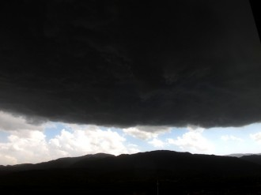

# 他们是来接我的

上周某天，黄昏将至时，突然狂风大作，向窗外望了一眼，被骇了一跳，整个天空被一团圆形的巨大黑云笼罩，黑云的形状酷似科幻片里外星人的母舰，而黑云之外的地方，还看得见一线蓝天，云白得耀眼。我想起《飞碟探索》杂志上那些与不明飞行物有关的“常识”，其中之一，就是它们常常借助一块云来掩护自己，但云的形状就非常可疑。我心里出现了一个声音：别装成一朵云了，你一定是来接我的，快啊，快啊，我在这！我在这！！

这种差点被接走的机会，我遇到过三次。

第一次是在1991年10月。那时还在上高二，下了夜自习，大概十点，无意间回头一望，远处的天空，很高很远的地方，出现一团巨大的白色光涡，十分钟后，那团光消失了。没敢跟同学讲，怕被认为是为了吸引人注意的编造。就在此时，我的初中同学放假回家，告诉我，那天晚上，在他就读的铁路技校，大家下了夜自习，正在操场上锻炼，突然，四周亮如白昼，抬头一看，夜空中悬挂着一个脸盆大小的物体，大放白光，这事还上了报纸。时间，方位，全都吻合，他们学校，就在我看到白光的那个方向。

第二次是在1996年8月14日，为什么记得这样清楚？因为我把它写进了16号的日记：“前天夜里全城停电，包括一向不会断电的供电局和医院……那个东西突然出现了，在西北方向，像一个发光的、毛毛的眼睛，起初以为是云层后的月亮，忽然反应过来，月亮不会出现在那个方向，飞快地去拿眼镜。戴上眼镜后，大概一分钟时间，那个发光的东西开始变暗，光圈缩小了一些，突然向下猛地一坠，又定住，然后平行移动了一阵，最后突然消失。”这团光，也有人看到，同样上了报纸。

第三次是在2011年3月16日，那天九点左右，从兰州大学打车回家，中间有一段是荒野，几乎是无人区，月亮和星星都特别亮，荒野里一片白亮，像盖着雪，突然，一个直径二十米左右的灰黄色的大圆盘突然从低空飞过去，圆盘中间还有红灯在闪。赶紧让司机停车，下车去看，那东西似乎很不高端，飞得像个风筝，软弱乏力，颤颤悠悠，但速度很快，一分钟后消失在东南方。起初并没当那是不明飞行物，因为附近有个机场，也许是新式飞机？第二天上网查了很久，跟飞机迷们各种咨询，得到的回答是，现在还没有这种形状的飞机。

哦，他们都是来接我的，我这样想。肯定是我哪里做得不够好，没有按时抵达九又四分之三车站，他们于是昂然离去了。易求无价宝，难得被接走。中彩票易，被接走难。

人类不是一开始就敢于认定“他们是来接我的”。即便在八九十年代，气功、特异功能、不明飞行物最热的年代，不明飞行物也被当做一种恐怖的存在，在我们本地出品的著名杂志《飞碟探索》上，许多案例中的外星来客，都是怀着恶意的，要把人绑去插管子。九十年代开播的美剧《X档案》，把这种恐惧心理延续了下去，贯穿整整九季电视剧的，就是穆德对妹妹的寻找，她在幼年神秘失踪，穆德相信她是被外星人绑架了，中间有一集，他得到的信息是，军方高层和外星人达成协议，将自己的妻女们送给外星人，以便生产出拥有超能力的混血人，但这个计划失败了，而他的父亲就是高层之一。整个剧情，只要到了这里，就阴森可怖。

什么时候，不明飞行物变萌了呢？变成每个人心目中的接送工具了呢？“他们是来接我的”变成傲娇的流行语了呢？已经不可考了。赫伯特·乔治·威尔斯的时代，科幻小说描写外星人带来的末日，会引起恐慌，而2012年，言之凿凿的世界末日来临时，却差点成了狂欢节。这显然不能推给体制，就推给现代生活吧，现代生活那种无处不在的压迫感，那种极尽其能事的压榨，让我们变得无所畏惧，对被接走充满了期待。

也许，还因为我们的现代生活，已经越来越接近科幻小说的未来场景了，让这种恐惧被冲淡，甚至被改装成期待了。现在的我们，对过去的我们而言，就是外星人嘛！对外星人的恐惧自然没有了。这种心态的微妙转换，真值得好好探讨。

但我还是愿意想象这样一个场景：我站在飞行器的眩窗前，俯视着地球上的灯火，看着它越来越远，一个声音在背后响起：欢迎回家。而地球上的过去呢，统统被我毫不留情地丢弃。再也不用留心房价了，再也不用跟官僚、医生周旋了。洛阳亲友如相问，就说我已被接走。

(采编: 万若涵，王卜玄 责编: 王卜玄)

[【半日闲】馒头之思](/archives/40207)——这世间有不少的鲜花着锦，有不少的钟鼓馔玉。会有很多时刻你疯狂的渴望某种精致的美食，可更多时候，你只需要这样一个养胃暖心、平实温暖的馒头。

[【半日闲】花事](/zh-cn/archives/40239)——花之为事, 不虚伪，不做作，充满生气，也充满矛盾,它寄语相思,也能给人捏造未来的遐想。看花讲求缘法，而我始终只是一个看花的俗人。

[【半日闲】故乡食话·茄饼](/archives/40272)——许多小时候不爱吃的东西，慢慢都能接受下来，并且尝得出滋味。

[【半日闲】世界的清晨](/archives/40387)——老槐树叶盛满了晨光，斑斑驳驳地照花了匆匆赶路的男女，就好像精气神都被打散了，一脸狼狈。 这样的清晨，你肯不肯停留。
