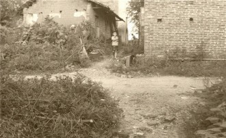
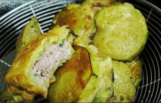

# 故乡食话·茄饼

从什么时候起，在吃食上面有一个体悟。许多小时候不爱吃的东西，慢慢都能接受下来，并且尝得出滋味。我小时候，我记得每年有一两个月，天天都吃炒茄子，要么韭菜炒茄子，要么茄子炒青豆，中午吃了晚上还是它，总是吃总是吃，吃的人又是好气又是委屈——有一次放中学回家，一看桌上两个菜，一大盆豇豆茄子和一海碗丝瓜茄子汤，顿时气哭了，朝奶奶大喊：是不是要吃到明年啊！然后极悲愤地把瓷碗砸到白果树下去了，放声嚎啕，那个时候，确乎感到日子没办法过下去了，自己一定不是这家人家亲生的，不然怎么能这么个法子吃茄子？砸碗在沙乡里是很大的罪过，奶奶来揪我的耳朵，狠狠地揍屁股，可怜的孩子哭得更加伤心，饭也不吃了，吚吚呜呜的上学去。第二天中午回来，桌上的烧茄子冒着热气，旁边炖了一小碗鸡蛋。

我记得那时候家里有个装草的大篮子，一到了夏天就装满了茄子，到了冬天就装青菜，我想，这俩一定是世界上最贱的东西，既不值钱还难吃，想不通怎么会有人种它们。发现这两种东西可以吃的人真是愚蠢，而且，可恨。所以那么多年节中有一个我顶不欢喜，就是七月半，因为这一天既要吃茄饼，还要吃菜馄饨，简直无法可想。

沙乡里过七月半，都是到日子才敬祖宗，老岸人家一般是过节前的礼拜天，我母亲是老岸上人，过节需回娘家，这样，我们就要过两次节。这可遭了罪啦！我不止一次哭着问妈妈，为什么过年不过两次，七月半就要挨这个苦？也连着好几年咬着嘴边子威胁她们，等将来我当了当家了，七月半改吃米饭，还要吃红烧肉！她们或者不理不睬，或是感到奇怪，过节的两样东西，都是香的不得了，怎么有人不喜欢吃！她们说香，是不错的，尤其是茄饼。

挑好的嫩茄子去头尾，留下身子切成薄厚均匀的茄片，每两片中间夹的是剁细的五花肉和韭菜（又是一样极讨人厌的东西），夹好了之后浸到厚稠的面糊里，整个都泡过了，用长筷子夹到油锅里炸，不时翻面，炸到两面金黄即可起锅。以前吃的油都是人家户上自己的菜籽或者黄豆榨出来的，一点儿不掺假，又清又香，面糊和茄子又都吃油，炸出来的茄饼拿手一捏都滋滋地冒油，怎么能够不香呢？但是闻起来再香它也是茄子啊，吃到嘴里那股软趴趴的味儿，真叫人咬不下去第二口。

逢到吃茄饼或是馄饨，我都是把包着的皮挑开，把馅儿吃完算了。有时吃到一块肥肉或是一大块韭菜，还要吐在台面上，大人们轻则喝骂两句，有时直接上筷子敲脑门，我为吃这两样东西，真是遭了大殃。大家吃油都还节俭的年月，如果有什么菜放好多油还是不觉着好吃，那是真不喜欢。更何况平时家里的老人炒菜，哪舍得放多少香油。豇豆茄子干巴巴的炒出来，又缺调料，有时纯是水煮了来的，怎么咽得下去！

过节的食物，不管好不好吃，一年也就一遭——平常要吃，也没人愿意弄。我父亲爱吃这个，吃的满嘴流油的时候感叹，东西吃起来又香又快，忙起来难忙死了。我大学有一年回家，到小镇上公车站等家里人来接，旁边有卖茄饼的，鬼使神差，买一个尝了。饼要比我们家里做得大，也圆，跟亮月子似的，炸得不老，没有家里茄饼硬硬脆脆的面皮，油的颜色有点儿浅。吃一个就饱了。肚里有了油水，闻起来没以前那么香了。 今年过七月半，我和父亲去老岸过节，两个人吃了一小盆茄饼。说不上多好吃，茄饼就是这个味道，但也不如过去难吃，吃顺了嘴也适宜。关于这一样吃食，父亲应当要比我珍惜且遗憾的。我们以前，一代一代人传下来，吃的也随着传下来，如今年轻人不学这些，家里头会忙的人没了，也就没得吃了。今年还是过两次节，只吃到一回饼，我们家里终于改吃饭了，我和父亲沉默着，吃米吃肉，谁也不吱声。

现在，下到馆子里常常不知道要点点儿什么，那就来一盘香菇青菜，一盘豇豆茄子，不管吃酒下饭，有这两个新蔬也下得快。逢到吃烧烤，也必得来几串儿韭菜。假使一个人对他曾经厌恶吃的菜，起了些怀恋或是善意，那么起码说明两点，一是这人的年岁开始长了，再就是他心里头，有了柔柔和和的，生活的温存。

（采编:万若涵；责编:王卜玄）

[【半日闲】馒头之思](/archives/40207)——这世间有不少的鲜花着锦，有不少的钟鼓馔玉。会有很多时刻你疯狂的渴望某种精致的美食，可更多时候，你只需要这样一个养胃暖心、平实温暖的馒头。

[【半日闲】花事](/zh-cn/archives/40239)——花之为事, 不虚伪，不做作，充满生气，也充满矛盾,它寄语相思,也能给人捏造未来的遐想。看花讲求缘法，而我始终只是一个看花的俗人。

[【半日闲】世界的清晨/a>——老槐树叶盛满了晨光，斑斑驳驳地照花了匆匆赶路的男女，就好像精气神都被打散了，一脸狼狈。 这样的清晨，你肯不肯停留。](/archives/40387)

[【半日闲】故乡食话·茄饼](/archives/40272)——许多小时候不爱吃的东西，慢慢都能接受下来，并且尝得出滋味。
