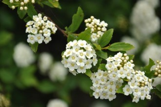
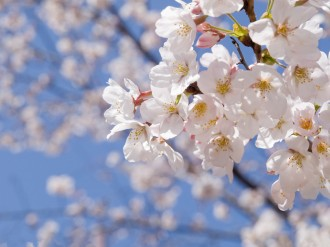

# 花事

花之为物，其实几乎是近于妖的。

生殖器永远有着一股自然的美，不虚伪，不做作，充满生气，也充满矛盾。流淌的蜜汁不知谁来采撷，而易碎的美好只在青春里绽放。

花自然也是如此，其实说到看花之事，我倒是没有什么发言权。说到底，自己是个俗人，虽然喜欢花，但是并不认识许多。虽然从小家中的院子阳台之类的地方，都是父亲栽种的满满的植物，然而自己到底和这些是有所隔膜的。

然而大学学农，却是个微妙的契机，在教授几乎声泪俱下地讲诉耕地面积到了红线、重金属污染多么严重时，我看着窗外的花儿，真实意识到她们是一种短暂而与我真实相关的存在，这令我遐想和动容。

那是一次体育课之前，母校的品字楼前有几颗晚樱，我和另外两位同学不知何故迟到了，那是高二，上课铃声已响，我们悠悠地向远隔万里的操场走去。逸夫楼、胡文虎楼与品字楼间的空地静默无人，然而品字楼的顶上却传来嘈杂，几位校工整理那些历史过于悠久的瓦片，结果一不小心，一位工人似乎滑到，不幸地将一块碎瓦片掉在楼下的樱花树上。

当时风并不大， 微妙地向东刮着，瓦片毫无声响地惊破樱花的绮丽。

抗日战争时期，树人堂被征用作日军司令部，他们出城巡游，到了仙女庙，在一个无名村落，似乎发现了抗日组织的存在，带队的日本军人愤怒地打算用杀人的手段找出组织成员。当所有人聚到村子的政府院子里时，日军小队长踏入院子，即将派发死亡的通知，然而一些熟悉的味道传来，一些熟悉的花镜反射着陌生国家的阳光，这位小队长斜乜看院子的角落，激动地走上前去，用听不懂的话激动地说些什么。士兵出去叫来了所有日本军人，他们拿着枪却在笑，似乎证实了杀人不眨眼的传闻，可是他们并没有看院子里的村民，却围着角落的一棵树激动地流下泪水。伪军翻译说，这是一棵日本种的染井吉野樱花，有了一百年的历史，小日本看到就思乡了，没心思杀人了。

想来这些思乡的地方显然不太对的人在树人堂下同样也思乡了，品字楼前的那两株樱花或许正是他们所种，可能1952年重修品字楼时移栽吧。那些军人早已失败死去，树木永远是胜利者。每一个春天，这两株樱花都和校园内无数水杉，无数梧桐，许多琼花，一起占领人们的关注。

当时那片大小不过三寸的墨绿色旧瓦轻轻地从屋顶边缘滑落，光亮的玻璃反射出布满苔藓的影子，斜晖投射在教室靠窗倒数第二排女学生眼上，一阵刺痛，她眯起眼睛看到外面异物落下，她惊讶地睁大眼睛，只见一树花。

瓦片还在无情地落下，彼时彼刻，一切回忆已经不复存在，从任意角度抚过的风已经无法扭转瓦片的步伐，樱花树枝迎接不速之客的到来，震颤地，不得已地，满面羞惭地。

下午2点50分的阳光并不特别，然而因为是在高中的回忆显得特别美好，所谓回忆，就是曾经很喜欢却很久没有再用过的钢笔里面的最后一点旧墨水，以为还能挤出来一滴半滴，最后却只会咕嘟嘟冒出一堆蓝灰色半透明的泡泡，然后不小心滴到衣服前襟，怎么洗也洗不掉的那种东西。

于是我和另外两位迟到的同学站立当地，屏息静气摆出一种神圣洁净的表情，倒数着秒数，期待未来的回忆的降落。

此时此刻，我在北京的深夜，默默挥洒着记忆中的碎片。朱自清在清华大学时曾经写文章说，北平看花需要赶着看，因为春光太短，狂风太大，然而他认为，“北平看花，比别处有意思，也正在此。”所以朱自清的美学是讲究珍惜与缘法的，当你去见花，花已不再，当你刻意赏花，花与你同消亡。我简直可以想象到过几天我在贵阳郊区的阳明洞，看着先哲遗迹心中如何默念此花颜色，一时明白。

捏造的未来足够自己回想，而瓦片已经击落第一朵花。

樱花身为蔷薇科的代表人物，先花后叶，缺乏叶子遮挡的第一朵花，因为太高的缘故，被故意的迷途小鸟摘取了花瓣，又经无心的路过蚊蝇掳走了花蕊，已经惨败，只剩下四瓣，在空中随即散开。

一朵樱花的散开，构筑了未来庞大的樱花散开的基石，混沌中的力量冥冥之间创造了一幅画卷缓缓拉开，有缘分看到的人并不多：两位同学，楼顶三名校工，靠窗的女孩，我。

摇落之间，最见情怀，瓦片轰然倒地，本当四散缓落的樱花花朵脱离了自己的轨迹，闭着眼以为自己将零落，可命运并不愿放过她们，她们将在此时被一阵忽如其来无人知晓的大风洒向天空，一切花瓣全部散开，每一片与每一片之间互相折射阳光，每一片樱花花瓣周围都围绕着一圈眩光，柔和而媚丽，一瞬间天空被粉色光泽布满，秒速五厘米的飘动停止在这一刻，永生永世，花的鳞片间仿佛有世间最美的粉色鲤鱼俶尔闪过，留下一串瑰妙的粉红色涟漪，再一次在魅蓝天空的背景前，折射粉光。

目眩山樱然，神迷，无话可说。

（采编: 万若涵 ；责编: 王卜玄）

[【半日闲】馒头之思](/archives/40207)——这世间有不少的鲜花着锦，有不少的钟鼓馔玉。会有很多时刻你疯狂的渴望某种精致的美食，可更多时候，你只需要这样一个养胃暖心、平实温暖的馒头。

[【半日闲】故乡食话·茄饼](/archives/40272)——许多小时候不爱吃的东西，慢慢都能接受下来，并且尝得出滋味。

[【半日闲】世界的清晨/a>——老槐树叶盛满了晨光，斑斑驳驳地照花了匆匆赶路的男女，就好像精气神都被打散了，一脸狼狈。 这样的清晨，你肯不肯停留。

[【半日闲】他们是来接我的](/archives/40205)——洛阳亲友如相问，就说我已被接走
