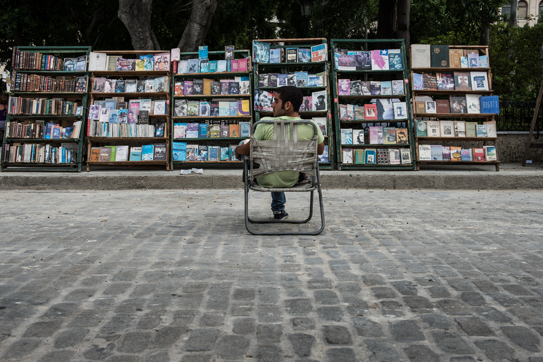

# 【南方】书店

导语：思绪又回到那让我魂牵梦萦的书店生活，某一天晚上，外面下着雨，我在书店中捧着一本书憨读，等待着想知道天上有多少颗星星的孩童，青春期中欲火焚身的少年，下班后疲惫的中年男人和在夜晚批作业的老师……

** 一**

04年的时候我爸和他朋友在人民公园后面开了一家店，店名叫“朗洁墨盒”，是给打印机加墨水的。不过一般人都是直接换墨盒，那个店的生意并不景气，大部分时间是白天我爸那个朋友躺在店里睡觉，我爸晚上下班后睡在店里。我去公园玩的时候偶尔会去那个店里，如果我爸的朋友在睡觉，我就会悄悄打开收钱的柜子，拿几个硬币去买吃的。用一块钱买两根肉串，一块钱买一瓶劣质汽水，然后用一块钱买一张游乐园的门票，坐在滑梯的最高处看天上的云。那时候公园周围都是卖肉串煎饼的摊子，现在已经不多了。我现在回靖江都会特地去找煎饼摊子，我觉得靖江的肉串煎饼比我在其他地方吃过的都要好吃。

“朗洁墨盒” 的旁边是一家书店，名字叫“青青书店”，是一对老夫妻开的。夫妻二人都快七十岁了,在过去的漫长岁月中，那个书店曾经服务于想知道天上有多少颗星星的孩童 青春期中欲火焚身的少年 下班后疲惫的中年男人 在夜晚批作业的老师....也许是想让书店继续服务下去，也许是觉得书店的事情比较难处理，那对老夫妻把书店里的大部分书给了我爸，一分钱都没要。不过他们走的时候带走了金庸全集古龙全集托尔斯泰全集等一堆XXX全集，这件事我爸一直耿耿于怀，以至于多年以后书店关门时他还自言自语道：“那两个老东西把好书都带走了。”

从那以后，“朗洁墨盒”变成了一个租书的加墨水的奇怪的东西，后来我爸还搞了一堆文具放在店里卖，那个店就更加奇怪了。不过由于墨盒生意不是特别好，大家还是把它称为书店，就是书店，没有名字。从那以后，我去的时候除了偷几枚硬币还会拿几只笔和几本漫画书。然后我还有了在同学面前吹嘘的资本，“我家是开书店的，我家是开文具店的。”“你家到底是开啥的？”“都开！”“好厉害啊！”

05年的某一天，我在家里发现了我爸妈的离婚协议书。我知道这一天迟早要来的，他们已经吵了好多年了。那阵子我爷爷总是说啊这父母离婚受影响最大的是小孩子，可是我觉得我没受啥影响，依然没心没肺地活着，该吃吃该玩玩该抄作业做作业该不做作业不做作业。不过我发现情况在发生改变，我妈让我和我爸住一块去。当然，这我也是有准备的，我妈喜欢去书店和我爸吵架，去的时候呢都带着我，吵到一半就说“你留下来跟你爸过吧”把我往我爸那儿推，我爸就把我往我妈那儿推，他们推来推去我觉得特别好玩。最后我终于被推到我爸那里了。

那天，我忘了是哪一天了，放学后我骑车回家。骑到一半我意识到我走错方向了，我不住渔婆北路了，我要住在支河沿路了。于是我推着自行车往回走，我从一年级开始就自己骑车上学，那条路也走了两三年年了，在以后的几年里我再也没有在那条熟悉的路上骑车。

**二**

我爸在外面并没有房子，我们只能住在书店里。书店生活并不舒服，却很有趣。有些知道我这段经历的朋友表示住书店里太浪漫了，浪漫你妈逼，以为是某些文艺小清新书店还能约个炮呢？我原来住四层的房子，那之后我只能住在小小的书店里。这是个不大的书店，进门能看到卖文具的柜子，书架，一台电脑。里面还有一个小房间，房间里有两张床，一上一下的那种，以及一台电视机和书桌。没有卫生间，上厕所要去不远处的公共场所。这不是问题，我喜欢晚上做作业做到一半以上厕所为借口跑出去玩。那一带相当有趣，老房子比较多，巷子像迷宫一样。我就到处瞎逛，去观察那些野猫野狗以及老鼠。那里的老鼠非常大，那里的猫咪特别瘦，那里的猫咪死也不吃老鼠。那里的野狗都是公的，每当春天来临它们就到处寻找交配对象，绝对不放过任何一条出来溜达的宠物狗，然后被狗主人怒斥。现在想来，那儿每天都在上演屌丝觊觎白富美而不得的悲剧。后来那儿的猫咪都饿死了，那儿的狗都无法传宗接代慢慢消失了。散发着破败和古老气息的地方并不适合孕育生命。

我不仅在那些巷子里瞎逛，我还去公园里瞎逛，有时会遇到人野合，有时会遇到人打架，有时呢会遇到情侣吵架打架最后又抱在一起热泪盈眶。我觉得大人啊真奇怪。一开始我爸看我不回来还会去找我，半年后就不找我了，让我瞎逛去。我会玩到很晚才回去，然后做作业。第二天上学总是迟到，然后在课上睡觉，老师表示这么爱打瞌睡的小学生真是亘古罕见。在书店里也不能洗澡。当然，这也不是问题，我可以去浴室洗，不过动辄十块钱实在是奢侈。于是天气暖和的时候我就接根水管，在夜深人静的时候站在店外面洗。零点以后那条路上真是一个人都没有，我感觉整条街都是属于我的。上了初中后我就不这么干了。我怕我洗着洗着就开始撸，撸着撸着就被学习到深夜出来觅食的姑娘看见了。

我们做饭吃饭也都是在书店里完成的，书店太小放不下煤气灶油烟机，于是我们买了一台电磁炉。那时候用电磁炉的还不是特别多，我觉得很屌。如今想起来，用那种低功率的地摊电磁炉很屌丝。一开始我们有专门的厨师，就是我爸那个朋友，我爸称他小肖。这个人挺有趣的，我很小的时候就见他整天和我爸呆一块儿，目测没有工作，不知道是干啥的。我爸开店后他就一直呆在店里，不回家就住那里，貌似他也没有家。所以在我去书店生活的一开始那一阵子，那个小小的房子里住着三个人，我爸平时上班就让他在店里帮忙，每个月给他发工资，这种关系用现在的话来说就是好基友啊。一开始我睡上铺，他和我爸睡下铺，这算搞过基了么？

我一闲就喜欢乱动东西，经常把那些给打印机加墨水的玩意儿弄坏，然后那个小肖就说我扫把星，我说他傻逼。在很长一段时间里我们互相看不惯对方，不过他做的饭是真好吃。他做过最聪明的一件事情就是在书店里大量引进武侠玄幻言情小说，好长一段时间店里都是中学生的身影。他做过最蠢的一件事件就是某一天我说我想喝可乐了，他就打电话给超市叫了一瓶可乐的外卖。可乐两块半，配送费10块。

05年下半年的某一天我对小肖说：“你看看你，这么大了也没正经工作。”不知道是28岁的他自尊心发作还是想起了曾经和他离婚的老婆，他一气之下不干了，去超市做了一阵子保安。后来就没见到他，再次见到他已经是13年的夏天了。他突然出现在我家那块儿，人比以前胖了，没有精神，感觉经历了很多。他想找我爸投资一个饭店，听说他在安徽开了家饭店，听说他过去这么多年什么都干过，听说他有了老婆，但老婆肚子里的孩子不是他的。

他见到我爸时泪流满面地说：“老哥你知道吗，在书店那两年是我人生中最舒服的一段时光。”

听说人活着都不容易。

**三**

小肖走后没人帮看店了，我爸要是休息就会呆在店里，不休息就会请朋友帮忙。晚上则是我在店里，平时我爸晚上也是出去打牌。我记得我第一次接待的顾客是一个阿姨，她是来还书的。她借的书是地摊爱情小说，好几本，标题是《出轨的家庭主妇》《出轨的男人》《出轨的诱惑》。这个我印象特别深，我还问了句：“阿姨你是要出轨吗？”当时她脸色就变了。之前没有人告诉我这个借书的流程，她给了我三块钱，我以为就完事了，就一直盯着她看，琢磨怎样的女人才会出轨。她也盯着我看，估计在想这二逼孩子是谁。过了半天她才说：“你不应该还我三十块押金吗？”这我真不知道，我赶忙给她三十块钱，她瞪了我一眼不知道嘴里嘀咕着什么转身扭着腰走了。当时我觉得这样的女人比较容易出轨。后来这个顾客再也没有出现过。

一开始书店里社科人文类的书是占大多数的，顾客也是固定的那几个。不过在引进了大量地摊文学后，顾客就多了起来，尤其是高中生。当时那些盗版玄幻小说都是套个“黄易先生授权”的封皮，我觉得那些小说比黄易写的牛逼多啦，尤其是色情描写。每月一号我爸会去书商那里拿新书，当他晚上回来时店里已经聚集了一批饥渴难耐的高中生了。虽然月月有新书，但最受欢迎的还是那几本，什么《金鳞岂是池中物》《阿里不达年代记》，每天都有人借。后来发展到直接有人来偷这两套书，当时我不知道为什么啊，现在我知道了。那些高中生偷书的本领是很厉害的，他们中的一个人会跑过来和我搭讪，和我讲什么新出的网游，另外一个人呢就在后面偷书。我和我爸都觉得偷黄书格调太低了，也没说他们什么。有些高中生更狠，书借出去的时候是好好的，还回来的时候里面那些有精彩色情描写的都被撕掉了。

有一次我在店里，来了两个高中生，是常来的，我们很熟，他们借书我们都不收押金的。在他们选书的时候我想上厕所了，于是我就去上厕所了，回来时他们人已经不见了，抽屉里的几百块钱也不见了。他们再也没有出现。

有一天来了两个不远处工地上的民工，非常淳朴的样子。他们问我有没有那种书，他们想买。我说我不懂啊，然后他们就随手抽了几本书，都是那种书。其中一人给了我一百块，旁边就有验钞机，我没用，直接找了他们八十。后来证实那是假钞。

还有一天很晚了，来了一个二十多岁的姑娘。她头发染得五颜六色的，穿着非常暴露，身上有好多纹身。作为一个小孩子，我对这样的人是没好感的。她借了好几本安妮宝贝的书，说自己钱没带够，我就没收她押金。一个礼拜两个礼拜一个月，她都没来还书。我觉得真是不能相信这些成年人啊。不过过了好久好久她居然跑过来还书了，我在记录本上费力地寻找到了那几本书的名字，我收了她五块钱。那时我们书店已经快停业关门了。

**四**

当然，书店里也不都是那种不健康的书。我记得有很多描写文革的书，还有世界名著。不过我记忆中好像没有郭敬明韩寒的书，也从来没有顾客问过我们有没有他们的书。0506年的时候他们不是很火么？

你可以想像一下，左边是一本色情小说，右边是一本波德莱尔的诗，你就能想象出我是在怎样的人文环境中成长起来的。话说我觉得王小波的色情描写是最纯洁的。

**五**

我刚住进去的时候，书店左边是一家音像店，右边是一家美容店，对面是一家理发店，不远处还有一家洗头房。其他的我不记得了。音像店的老板很帅，他老婆很漂亮。美容店的姐姐很漂亮。理发师姓马，长得也像马，不过他老婆和女儿都很漂亮。洗头房的姐姐也很漂亮，我爸经常光顾，然后有一天我和我爸路过洗头房，那姐姐啊就和我爸打招呼，我爸就假装四处看风景。其实我心里什么都知道。

大家和我们的关系都很好。我常去音像店借碟，那老板戴着金丝眼镜，头发梳得一丝不苟，不苟言笑地坐着等待顾客。只有那些顾客问“有没有那种货”时他才会露出猥琐的笑容。大部分时间他是一个人孤独地在店里看片，都是很文艺的片子，那时的我觉得诗人就是这样的吧。我借碟从来不用给押金，借多少天都只要一块钱。

07年的时候音像店关门了，关门那天那个戴着金丝眼镜的男人给我爸点了支烟说：“老哥我们做邻居的时间不长，以后估计也没机会再见了。”他给自己点了支烟说：“现在没人看碟了。”我爸说：“也没人看书了。”两个男人就这么在风中抽烟。

后来我们真的再没见过。

**六**

龚叔是我爸的多年好友，他没事就喜欢来店里和我爸闲聊，然后抽几本书看看。我觉得他像一个知识分子，长得像陈丹青，说话的风格也像陈丹青，戴着眼睛抽着烟嘴里咕哝着共产党不是东西。不过他和我爸一样是个高中生，也就是书读的多了点。

第一次见到他是在05年的夏天，我爸好像也很久没见过他了，他们两个人谈了很久，我记得最清楚的是我爸说：“虽然我们很多年没见了，但我觉得真的朋友是不需要经常见面的，我们互相都懂对方。”龚叔点头道：“君子之交淡如水。”那时的我认为这就是真朋友应该有的样子，我现在和我的那些好朋友也是这个样子。

龚叔每次来都会调侃我，说我又玩游戏了，又变丑了，又他妈看奥特曼了。我英语学得不好，他还让我帮他女儿补英语。我爸没有车，办事什么的经常坐他的车去，一辆黄色的东风，去年那车转给我爸开了。龚叔喜欢听老歌，在他车上经常听到老摇滚，他曾经问我知不知道黄家驹，“他的词写的很好”。我觉得我的音乐品味的形成和他也有点关系。

我爸偶尔会感叹钱不好赚，龚叔则会安慰他说“你儿子将来肯定有出息”。我觉得他是我爸最好的朋友了。去年五月听说龚叔查出了肺癌。寒假的时候我才知道他已经去世好长时间了，他去世时我爸在徐州，连夜赶回靖江，听我妈说我爸哭的像个孩子。

我现在坐在我爸的车上就会想起龚叔。

07年开始书店就没什么生意了，我上初中了，我爸也想在外面弄个房子，“有个家的感觉”。虽然书店没什么生意了，却出现了一群有趣的人。

有个叫被我爸称为九叔的人开始频繁出现在书店里，听说他是混黑社会的，不过戴着眼睛长相斯文的他不太像啊。他喜欢看军事类的书籍，经常指着我对他儿子说：“儿子诶，多学学他，他什么书都看。”我觉得这是在黑我。印象最深刻的是某次和他去排档吃饭，我们点了鱼香肉丝和香菇青菜，上来的香菇青菜里没有香菇，当时他就拍桌子大吼道：“这他妈的叫香菇青菜？”怒目圆睁，吓得老板赶忙换了盘。换完他又叫道：“这他妈的叫鱼香肉丝？”老板吓得不敢说话，支支吾吾地说：“要不我们给你多加点肉丝？”九叔说：“这他妈不是肉丝的问题，味道不对啊！”我饿得不行，刚拿起筷子他就指着我说：“别他妈动筷子，我们不吃了。”真他妈的是混黑社会的啊。

还有一个人叫小胡，听说是个画家，开了一家古玩店，兼卖字画。他经常拿着字画到书店里问我爸买不买，“这都是大家的真迹啊”，我们都知道是模仿的，但他每次都这么说，我每次都拿自己的美术作业说：“这也是大家真迹。”书店内外充满了欢快的气氛。

就这样，九叔，我爸，小胡，还有其他乱七八糟的人就喜欢在书店里谈笑风生。上至天文地理国家政治，下至街道新闻男女之事，他们什么都谈。谈到深夜便去烧烤店吃腰子。当时书店给我的感觉就像江湖，各种三教九流在这里逗留，这现象成为了书店最后岁月中的一点荣光。

**七**

我读初二的时候书店已经彻底没了生意，九叔什么的都好像突然间消失了，他们也许是忙于生计，也许是去了远方，不过是人生中的过客。我记忆中的最后一个顾客是一个妹子。那是九月的最后一天，我已经关门，半夜有人敲门，我打开一看一个高中生模样的姑娘。她借了一本《简爱》，然后问我：”你们放几天啊？“我说：“七天啊。”她说：“你们初中生真幸福，拜拜。”她身上散发着一种清香，让处于青春期的我心旷神怡。后来，我爸租了一间小套，我们得搬家了。书店中的书都被卖给收废品的了，我记得很清楚，那收废品的看到我们卖的是书便特地提高了价格，“这些是书啊。”真是有趣。

从书店搬出后，我们搬进了一间小屋，那屋子就位于那我曾经瞎逛过的巷子中。我在那小屋中生活了半年，后来搬去和我妈住，彻底告别了那块地方。生活继续下去，后来又发生了许多事情，书店生活我也渐渐忘记。大一寒假路过那里我才记起。什么都变了，没有书店，没有理发店，没有音像店，那些人那些事存在过的证据都消失不见，唯有那条街还叫支河沿路。近来经常想起那段经历，坏的回忆我留在心底，好的有趣的我便写了出来，希望以后不再经常想起。我知道很多细节我是想不起来了，也许将来它们会突然出现在我的脑海,将我拉回那段时光。到时候我对它们的出现定是非常欢迎的。

我曾经不止一次说过我想开一家书店，“有书有茶有志同道合的朋友，门外偶尔路过春天一样的姑娘”。朋友们不理解我对书店的这份执念，这些不算好的文字便是原因吧。写到这里已经是凌晨两点多，我望向窗外，窗外下着小雨。思绪又回到那让我魂牵梦萦的书店生活，某一天晚上，外面下着雨，我在书店中捧着一本书憨读，等待着想知道天上有多少颗星星的孩童，青春期中欲火焚身的少年，下班后疲惫的中年男人和在夜晚批作业的老师……

(采编：朱燚；责编：刘铮)