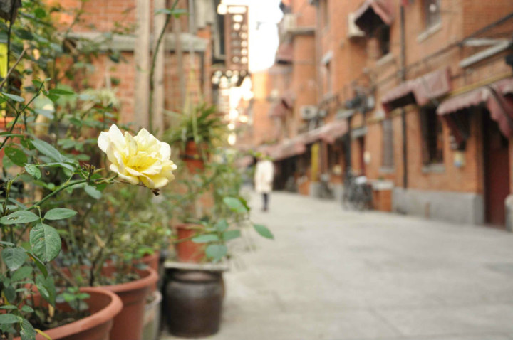
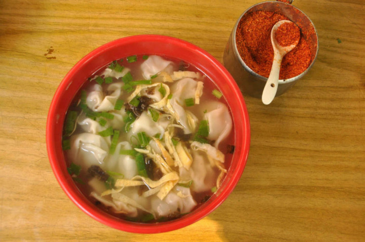
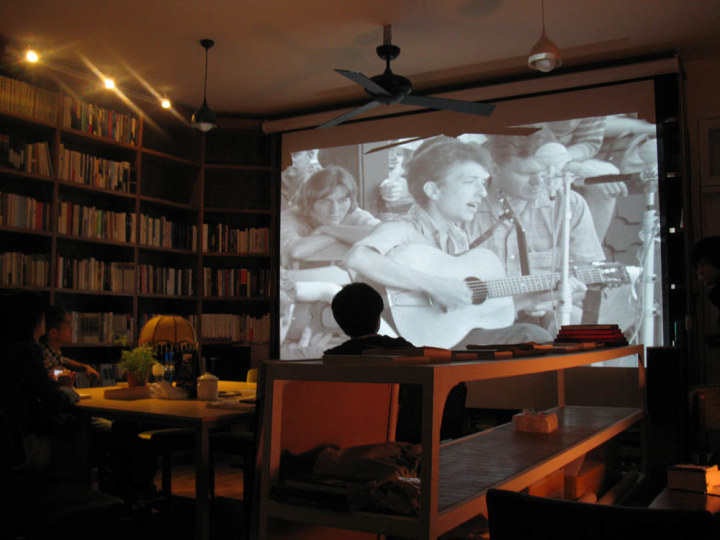
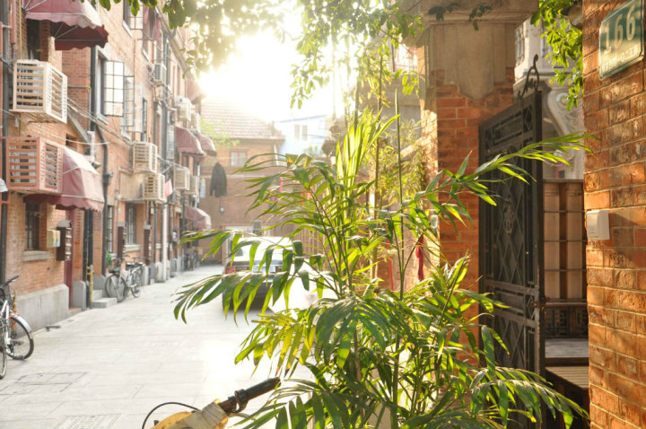

# 弄堂

一

它几乎是上海最著名的弄堂。南京西路1025号，静安别墅。 

上世纪二十年代，南浔富商买下这块地，建起了十二排三层红砖洋房。雕花地砖，花园庭院，阳台带巴洛克风格的纹饰。租金贵得离谱，要用金条支付，因此第一代居民大多是洋行上班的高级白领。张爱玲在《色戒》中写到的“印度珠宝店”、“西比利亚皮货店”和“凯司令咖啡馆”，就开在弄堂口。 

三四十年代，这里往来着诸多名门望族和社会名流，蔡元培、于右任、郑小秋都曾在此小住。当然也不乏众多姨太太、交际花，以及国际间谍。孔祥熙在1942年购得大部分静安别墅产业。小时候有老人跟我讲，房子是孔先生的，将来等台湾统一，要还给孔家的。 

锣鼓声中，工人阶级搬进了静安别墅。一栋小楼硬塞进去八九户人家。公用浴室，公用阳台，公用灶披间（厨房），甚至每一只水龙头都是公用。家家建阁楼、搭棚户，各显神通，十几平米愣是可以住四代人。六六年，原来美新老板屋里厢抽水马桶堵塞，房管所来人一捅，下水管里捅出一卷卷美钞。

九十年代起，附近的老弄堂一个接一个拆了，相继建起了波特曼、梅龙镇、中兴泰富、恒隆这样的摩天大楼。静安别墅的居民心动了。多年来，他们受够了早起抢马桶的日子，眼馋那些煤卫独用的两室一厅，又不情愿搬到彭浦、江桥这些“下只角”。“坍台伐？”住在静安别墅再有诸多不便，讲出去多少是个身份。他们无比期待着拆迁的那天，潜意识又在抗拒。一时间，小道新闻漫天飞，阿婆们见面不再是小黄鱼几钿一斤，而是“有撒讲法伐？”。晚饭后弄堂里走一圈，能听到七八种“内部消息”。2002年，静安别墅名列上海市历史保护建筑，确定不会拆。有些人难掩失望，有些人却松了一口气。几分惆怅，几分自豪。他们自嘲，这回想当乡下人都当不上了，每天仍旧为谁家霸占厕所太久，谁家自来水多用了争吵不休。 

我在这里出生，在这里长大。这是我的弄堂，也是我关于这座城市的最初记忆。 

弄堂里，曾有家卖玩具的小铺子让我流连忘返。我最眼馋那个大擎天柱，天天跑去看。可我知道，四十块钱，相当于爹妈小半个月的工资，当年只有个体户家的小孩能玩得起。于是我揣着三毛钱一包的划炮，回头望一眼，恨恨而去。 

除此之外，记忆中的童年没有阴霾，仿佛天天阳光灿烂，快乐地不真实。

二

大舅舅身高一米八，那时体院刚毕业，阳光俊朗肌肉发达，算得上美男子。大舅舅跟一位姓林的小学老师谈朋友，下班回家匆匆扒几口饭，丢下饭碗就急着出门“轧马路”。周末去“国泰”看外国电影，黑暗里偷偷香记面孔。到了谈婚论嫁的阶段，小林老师家里提出要有房子。大舅舅刚工作不久，等单位分房不现实。家里三十多平米，外公外婆外加两个舅舅，实在挤不出地方。几番谈判，对方家人终究不肯让步，两人无奈分手。小林老师离职去了日本。大舅舅消沉了一年多，娶了同一条弄堂的胖姑娘。胖姑娘家房子宽裕，可以搬过去住，不算入赘。家里的房子正好隔出一间，给小舅舅结婚用。 

小时候，我经常从弄堂这头穿到那头，去大舅舅家找表妹玩。玩累了，我盯着墙上的结婚照发呆。大舅舅那么好看，浓眉大眼鼻梁挺拔，周润发一样。有一回我撞见大舅妈气咻咻甩门而去，屋内一片狼藉，四岁大的表妹坐在地上哭，大舅舅脸色铁青，一言不发。原来是小林老师从日本回来了。她用打工的钱买下一套公寓，然后找到大舅舅，要跟他结婚。 

大舅舅没有离婚，他舍不得大妹妹。小林老师哭着走了，我再也没有见过她。印象中她是一个时髦的女子，给我买过糖炒栗子和彩色橡皮，眉毛浓浓的，像钟楚红。 

大舅舅后来跟人做生意，赔得倾家荡产。又借钱炒股，被债主追上门。最窘迫的时候他去教小孩子游泳，一天十个小时泡在水里，得了严重的风湿性关节炎。这些年他终于攒了点钱。有一次他喝了点酒，恶狠狠地对我说，我累死累活，就是想给你妹妹买套房。以后她可以找她喜欢的男生，不用考虑人家有没有房子。

三

小时候弄堂里有家小小的幼儿园。有时我放学早，去幼儿园接表妹回家。表妹正在吃面，远远看见我，扔下小面碗往我怀里扑。 

幼儿园的小伙伴大多也住在这条弄堂里，一路陪伴着上小学、升初中。谁又挨打了，谁喜欢过谁，谁家爸妈在闹离婚，大家都知道。表妹有个男同学，喜欢抠鼻子，绰号“鼻头污”（鼻屎）。小伙伴捣蛋，经常是一堆人在他家楼下齐声喊，“鼻头污，鼻头污，上课去哉”。喊完一哄而散，嘻嘻哈哈无比开心。鼻头污的妈在楼上骂山门，小赤佬，讨打对伐？ 

四年级时，鼻头污因心脏病去世，表妹哭得差点晕过去。走过他家楼下，窗开着，竹竿上晾着棉毛裤，丝瓜藤在风里开花。一个男孩不在了。表妹低下头，肩膀微微颤动。我听见她喃喃地说，“鼻头污，上课去哉”。 

表妹爱哭，动不动就泪眼滂沱梨花带雨，据说是因为眼角长了颗滴泪痣。她继承了母亲的身材，多次减肥未果。有一次好像下定了决心，宣布不吃饭了，饿了只吃苹果。一周后见到表妹，红光满面，仿佛又胖了一圈。两大筐苹果被她吃没了，最高纪录是一天十六个。 

高三时，她喜欢同班一个男生。表妹去操场看男生打篮球，给他拿外套，递饮料。男生成绩不好，表妹给他讲题。晚上等舅舅和舅妈睡了，偷偷煲电话粥。那是她最快乐的日子。高考前几天，鬼使神差的，她向男生表白，被拒绝。表妹魂不守舍，想哭又不敢哭，高考自然一塌糊涂。一志愿报了复旦的表妹，最后连一本线都没上。 

表妹把自己关在房间，谁都不见。那个男生来找她，敲了半天门不开。我在楼下堵住男生，一拳一拳揍。男生满脸是血，倒在地上求饶，阿哥放了我，阿哥放了我。我恨恨地骂，谁是你阿哥。表妹突然从楼上冲下来，披头散发，一把推开我，你神经病啊！滚！ 

我气坏了，一个多月没去她家。等我再见到表妹时，她瘦了，完全是一个窈窕的姑娘。那颗滴泪痣也不见了。 

我转过头去，不理她。 

哥，还生我气啊？ 

四

107号有家馄饨摊，开了30年。老板50多岁，天生跛足，打小被弄堂邻居唤作“阿跷”，馄饨摊也暴得大名——跷脚馄饨。 

馄饨氽熟，搁在海碗里，撒上葱花、紫菜、虾米、蛋皮，骨头汤一浇，18只馄饨像18名花样游泳队员一样齐齐浮起。撒一把胡椒粉，点几滴麻油，热腾腾，香喷喷。再要碗葱油拌面，拌上八宝辣酱，加酱蛋或是红烧大排。十几块钱，肚子滚圆。 

每到周末，静安别墅人懒得做早饭，睡到太阳晒屁股，穿着睡衣趿着拖鞋，慢悠悠踱过来往阿跷店里一坐。一碗热气腾腾的馄饨下肚，再普通的日子也会觉得美好。 

阿跷很上路，客人吃完馄饨自己往月饼盒里放钱找钱，他看都不看一眼；阿跷很庸俗，专门喜欢跟漂亮小姑娘调笑，还主动帮人家拌面；阿跷很大方，加面不要钱，心情好的时候再送一份八宝辣酱；阿跷脾气坏，店里的阿姨做事情不利索，他当着客人的面骂山门，有客人看不过去，跟他对骂；阿跷很辛苦，每天四五点亲自去菜场买肉，专挑最好的猪腿肉；阿跷很刺头，每次弄堂整顿无证商铺，他都是最难搞的一个；阿跷很狡猾，前只脚刚和朋友讨论换宝马几系，后只脚就跟记者哭穷，说过不下去。总而言之，这是一个勤劳的人，一个精明的人，一个脱离不了低级趣味的人，一个有益于人民的人。 

馄饨摊的名字越来越响，一到饭点就人潮汹涌。大多是年轻人，馄饨端上来先拍照，一边吃一边发微博。还有人刚下飞机就拖着拉杆箱找来，阿跷一见拉杆箱就高兴，趟趟送酱蛋。老邻居不高兴排队，提先给阿跷打个招呼，拎一份生馄饨回家，辅料都配好，下锅一煮就能吃。 

这些年，房价翻了两三倍，阿跷家的馄饨还是五块。不少人劝阿跷，“可以涨价来”，要么是“阿跷，开家分店吧”。阿跷笑笑，混混么好了呀。

五

光头爷叔在阿跷店里帮忙。跟爷叔混熟了，他会悄悄在我的拌面底下塞一块大排，不收钱。 

爷叔是个有故事的人，闯荡过天南海北。前几年，朋友从新疆给他带来一只鹰。鹰通人性，可脾气倔强，得熬。熬鹰，说白了就是不让鹰睡觉，消磨掉它的野性。鹰不睡，人也不睡。光头爷叔每天灌五大杯咖啡，实在撑不住就打个盹，脚上绑绳子连着鹰架，几分钟晃一下。熬到第七天，爷叔撑不住，睡死过去，醒来时一双鹰眼正挑衅地盯着他。 

第一次没熬成，双方打了个平手。一年后，爷叔借了朋友家郊区的大房子，再熬。鹰终于服帖，认了这个主人。 

爷叔喜欢这只鹰，叫它囡囡。爷叔对囡囡真不错，三天两头买麻雀肉鸽子肉兔子肉，还到处托朋友买活蛇。有时爷叔熬夜打游戏，囡囡觉得打扰自己休息，不开心了，飞过去两爪一伸，拍一声把笔记本合上，像扑兔子一样利索。爷叔告饶，再玩会再玩会。好吧，那就一会。十分钟不结束，囡囡又飞过去合上。有一次爷叔正玩在兴头上，打了囡囡一下。囡囡气极，愤而离家出走，也不飞远，就在窗台前晃荡，不吃不喝不理不睬。到了第三天，爷叔心疼了，买了鸽子肉切成细条，趴在窗口招呼。囡囡不睬。爷叔赔不是，囡囡不生气啦，爷叔错啦，错啦好不好，再也不打你啦。半响，囡囡掉转过头，飞过来一口把肉叼走。于是爷俩重归于好。 

囡囡常在静安别墅上空盘旋，肚子饿了自己回家，附近的居民吓得不敢养鸽子。下午是囡囡的散步时间，站在爷叔肩膀上，一副睥睨众生的模样，引来众多姑娘怯生生搭话。爷叔大出风头。一次遇见某晚报小胖记者，相聊甚欢。交换数根烟后，小胖记者端起相机，为爷叔拍了多张威风凛凛的照片。报道登出，多家媒体跟进，爷叔火了。有关部门也出来说话，说居民区不能养鹰，得送动物园。接着消防城管居委会纷纷上门。爷叔意识到，囡囡大概保不住了。爷叔大哭了一场，囡囡不声不响地看着他。 

那一天终于到来，囡囡被关进铁笼，凄厉地嘶叫。爷叔面如死灰，拉住动物园饲养员的手不肯放，“对它好点，对它好点”。一连数天，爷叔闭门不出，茶饭不思。正躺着生闷气，有人笃笃敲门，原来是小胖记者来做后续报道。爷叔大吼一声“还我的鸟！”，操起一把菜刀，撵得小胖记者满弄堂乱窜。

六

年轻人发现了静安别墅。寸土寸金摩登时尚的南京西路，居然有这么一处安谧的所在。 

128号开了家丝袜奶茶铺，许老伯亲手调制，三花淡奶和太古砂糖的比例拿捏地刚刚好。慢慢的小铺有了口碑，不少白领中午特地赶来，买杯奶茶捧着去上班。生意兴隆时，一天能卖出四百杯。后来弄堂里又冒出三四家“丝袜奶茶”。有人不辨真假，干脆一家一家喝过来，“味道好像都不错”。 

文艺青年纷至沓来。最早是162号的格子咖啡，随后各家茶舍、咖啡馆、画廊、青瓷店、手工工作室、服饰店、寿司屋雨后春笋般冒出来。居然还开了家青年旅舍，提供八个床位和一间小小的阳光房。 

它们藏身于肋骨般的支弄里，夹杂在普通民居之间，靠黑色铁门上的小招牌才能认出它们。这里是十年前的田子坊，是生活着的新天地。没那么时尚，没那么商业。像走在童年的记忆里，空气中是老上海的味道。 

我喜欢144号的“茶事”，布置简单素雅，墙上的挂钟永远指向两点半。午后两点半是喝茶的最好时间。 

136号是有名的“2666图书馆”，老板钱小昆不太愿意解释店名的来历，“哎呀太弱了，不要问我这个问题”。 

2666是智利作家罗贝托·波拉尼奥一部小说的名字，老板推崇这部小说，也希望这家私人图书馆能走得更远，“比如开到2666年”。房间不大，木头家具，暖色灯光，四个直达天花板的大书橱。每周末这里举办文学讲座、读书沙龙、旅行分享、深夜电影、迷你音乐会，人气旺盛。工作日则一般生意清淡，我常去看书，店里就我一人，点杯咖啡就可以坐一下午。咖啡味道一般，老板自己都承认。好在书不错，看店的女孩子也漂亮。 

静安别墅不缺漂亮女孩。这里的十几家咖啡馆，每家坐着一个声称“不爱上班”的姑娘。姑娘们瘦，森，冷，上班就是对着苹果笔记本，不怎么理人。她们抽ESSE，穿小碎花布裙子，戴大耳环。你若夸她文艺，她白你一眼，你才文艺，你全家都是文艺女青年。 

抓米在法国学习花艺，当初为了一段“奋不顾身”的感情，“说走就走”来到上海。在静安别墅觅得个门面，开了家“抓米的花作坊”。感情不在了，作坊还在。 

抓米习惯熬夜，睡几个小时，爬起来去花市挑选最新鲜的花。回家补个觉，下午做花。门开着，朋友们随时过来坐。晚上的活动丰富多彩，party，舞会，各式饭局，跟闺蜜看电影。细细打扮一番，花枝招展出门。 

这类文艺小店，真正能赚钱的不多。“如果怀着功利心，还是不要来这里了”，81号“小鸡啄米”的老板娘Season说。老板们好像没把盈利太当回事，过得去就好。他们更在意这种慵懒的日子，和浓浓的弄堂生活气息。有人羡慕他们的勇气，也有人说他们装逼。

 
七

日子久了，店铺和居民间的矛盾逐渐凸显。不断有居民投诉油烟太大、找不到停车位以及深夜的喧哗。这里开了87家店，几乎全是无证经营的“黑商铺”。倒不是老板都愿意开黑商铺，阿跷申请了好几次，营业执照一直批不下来。弄堂是民居，不批准商业用途。 

风声紧了，据说某位高层发了话，弄堂里一夜之间装了几十只摄像头。种种迹象表明，这回要动真格了。 

八月底，众多咖啡馆齐齐关门，奶茶铺和馄饨摊一道打烊。抓米和她小伙伴们几乎一夜间搬走，弄堂冷清了许多。 

九月的一天，工商、城管、食药监、消防、公安等多部门组成的几百多人联合工作组开进静安别墅。剃头师傅“小扬州”出门避风头，回来发现大门洞开，理发工具全被端走。 

阿跷的馄饨摊是重点整顿对象。凉棚被拆掉，阿跷被两个武警押着，眼睁睁看着锅碗瓢盆、桌子椅子、找零钱的月饼盒，一件件被搬走。店里的老伙计指着摄影记者的鼻子骂，“拍什么拍，你也是个走狗！”

八

弄堂前后大门安装了电子门禁系统，进出需刷卡。这等于彻底断了“黑商铺”的活路。一些附近的居民颇不习惯，“走了几十年的弄堂，怎么就不让走了？” 

我有个诗人朋友，开店三年，赔了个底朝天。离开时他写到： 

你在心上加了锁

对每一个试图往里张望的人说

不许进来

除非住在这里

——致静安别墅

抓米搬到兴国路，继续开她的花作坊。2666倒闭，没能开到2666年。“丝袜奶茶”去吴江路租了个门面，月租一万七，生意也不如从前。跷脚馄饨挪到弄堂后门的威海路上，阿跷和老婆每天在家里包馄饨，煎大排，三轮车一趟趟送到店里。店面小得可怜，生意依旧火爆。路人停住脚步，“老早静安别墅那家对伐？” 

静安别墅恢复了往日的模样。秋天的午后，桂花静静地开，阿婆坐在阳光下打瞌睡。黄昏，家家忙着收衣服，公用灶披间飘出煎带鱼的焦香。谁家的孩子在练小提琴，琴声如诉。 

或许曾经，我们在这条弄堂里擦肩而过。 

夜里，万籁俱寂。贴着床板，能听见地铁二号线在地下穿行的轰鸣。老房子跟着轻轻摇晃，像摇篮，像叹息。

(采编：朱燚；责编：刘铮)