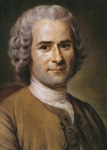

# 生即带枷锁，如何返自由？——读卢梭《社会契约论》

卢梭在《社会契约论》的开头，用一句优美的“人生来自由，却无往不在枷锁之中”打动了无数的读者。既然我们生而自由，天赋人权，枷锁又从何而来？我们如何打破这些枷锁去获得我们的自由？卢梭勾画出了他所认为的政治乌托邦，影响了整个世界，却又为何被人指责为自由的最大背叛者？卢梭思想的真面目究竟是什么？我们又如何去看待？

在卢梭眼里，什么是自由呢？他所谓的乌托邦政治又是怎样的呢？

****

** **

**【****主题****】**生即带枷锁，如何返自由？

******【时间】 **4月13号（周六）14:00-17:00

**【地点】 **706青年空间（五道口华清嘉园13号楼1607室）

**【主持人**】 黄晓静 ** 【活动流程】 **研读文本：《社会契约论》，卢梭著 

寻晶晶：卢梭的真假“契约”

刘 彬：什么是人民？

朱晨宇：公意下的自由

姜昊骞：自由即平等：卢梭的政治乌托邦

** 【主办方】 **706青年空间

【**入场条件**】10元/人

【**报名方式**】** **您只需在只用在和706青年空间相关的人人日志、人人状态、豆瓣同城、 飞信回复和新浪微博中的其实一个里面报名就可以了。

【**活动链接**】[请点击这里]( http://page.renren.com/601261629/note/900193426)

(采编：杨昀洲，责编：周凌希）
